data\_exploration
================
Weiheng Zhang
2021/11/28

``` r
library(tidyverse)
library(lubridate)
library(dplyr)
library(p8105.datasets)
library(leaflet)

theme_set(theme_minimal() + theme(legend.position = "bottom"))

options(
  ggplot2.continuous.colour = "viridis",
  ggplot2.continuous.fill = "viridis"
)

scale_colour_discrete = scale_color_viridis_d
scale_fill_discrete = scale_fill_viridis_d
```

## Data cleaning

``` r
cdi =
  read_csv("./data/cdi.csv") %>% 
  mutate(
    cty = as.factor(cty),
    state = as.factor(state),
    region = factor(region, levels = c("1", "2", "3", "4"),
                    labels = c("Northeast", "North_Central", "South", "West")),
    CRM_1000 = 1000*crimes/pop #每1000人中的犯罪数量(county level)
  ) %>% 
  relocate(CRM_1000)

cdi
```

    ## # A tibble: 440 x 18
    ##    CRM_1000    id cty   state  area    pop pop18 pop65  docs  beds crimes hsgrad
    ##       <dbl> <dbl> <fct> <fct> <dbl>  <dbl> <dbl> <dbl> <dbl> <dbl>  <dbl>  <dbl>
    ##  1     77.7     1 Los_~ CA     4060 8.86e6  32.1   9.7 23677 27700 688936   70  
    ##  2     85.6     2 Cook  IL      946 5.11e6  29.2  12.4 15153 21550 436936   73.4
    ##  3     90.0     3 Harr~ TX     1729 2.82e6  31.3   7.1  7553 12449 253526   74.9
    ##  4     69.6     4 San_~ CA     4205 2.50e6  33.5  10.9  5905  6179 173821   81.9
    ##  5     60.0     5 Oran~ CA      790 2.41e6  32.6   9.2  6062  6369 144524   81.2
    ##  6    296.      6 Kings NY       71 2.30e6  28.3  12.4  4861  8942 680966   63.7
    ##  7     83.7     7 Mari~ AZ     9204 2.12e6  29.2  12.5  4320  6104 177593   81.5
    ##  8     91.9     8 Wayne MI      614 2.11e6  27.4  12.5  3823  9490 193978   70  
    ##  9    126.      9 Dade  FL     1945 1.94e6  27.1  13.9  6274  8840 244725   65  
    ## 10    116.     10 Dall~ TX      880 1.85e6  32.6   8.2  4718  6934 214258   77.1
    ## # ... with 430 more rows, and 6 more variables: bagrad <dbl>, poverty <dbl>,
    ## #   unemp <dbl>, pcincome <dbl>, totalinc <dbl>, region <fct>

## Descriptive Statistics.

``` r
summary(cdi)
```

    ##     CRM_1000             id              cty          state    
    ##  Min.   :  4.601   Min.   :  1.0   Jefferso:  7   CA     : 34  
    ##  1st Qu.: 38.102   1st Qu.:110.8   Montgome:  6   FL     : 29  
    ##  Median : 52.429   Median :220.5   Washingt:  5   PA     : 29  
    ##  Mean   : 57.286   Mean   :220.5   Cumberla:  4   TX     : 28  
    ##  3rd Qu.: 72.597   3rd Qu.:330.2   Jackson :  4   OH     : 24  
    ##  Max.   :295.987   Max.   :440.0   Lake    :  4   NY     : 22  
    ##                                    (Other) :410   (Other):274  
    ##       area              pop              pop18           pop65       
    ##  Min.   :   15.0   Min.   : 100043   Min.   :16.40   Min.   : 3.000  
    ##  1st Qu.:  451.2   1st Qu.: 139027   1st Qu.:26.20   1st Qu.: 9.875  
    ##  Median :  656.5   Median : 217280   Median :28.10   Median :11.750  
    ##  Mean   : 1041.4   Mean   : 393011   Mean   :28.57   Mean   :12.170  
    ##  3rd Qu.:  946.8   3rd Qu.: 436064   3rd Qu.:30.02   3rd Qu.:13.625  
    ##  Max.   :20062.0   Max.   :8863164   Max.   :49.70   Max.   :33.800  
    ##                                                                      
    ##       docs              beds             crimes           hsgrad     
    ##  Min.   :   39.0   Min.   :   92.0   Min.   :   563   Min.   :46.60  
    ##  1st Qu.:  182.8   1st Qu.:  390.8   1st Qu.:  6220   1st Qu.:73.88  
    ##  Median :  401.0   Median :  755.0   Median : 11820   Median :77.70  
    ##  Mean   :  988.0   Mean   : 1458.6   Mean   : 27112   Mean   :77.56  
    ##  3rd Qu.: 1036.0   3rd Qu.: 1575.8   3rd Qu.: 26280   3rd Qu.:82.40  
    ##  Max.   :23677.0   Max.   :27700.0   Max.   :688936   Max.   :92.90  
    ##                                                                      
    ##      bagrad         poverty           unemp           pcincome    
    ##  Min.   : 8.10   Min.   : 1.400   Min.   : 2.200   Min.   : 8899  
    ##  1st Qu.:15.28   1st Qu.: 5.300   1st Qu.: 5.100   1st Qu.:16118  
    ##  Median :19.70   Median : 7.900   Median : 6.200   Median :17759  
    ##  Mean   :21.08   Mean   : 8.721   Mean   : 6.597   Mean   :18561  
    ##  3rd Qu.:25.32   3rd Qu.:10.900   3rd Qu.: 7.500   3rd Qu.:20270  
    ##  Max.   :52.30   Max.   :36.300   Max.   :21.300   Max.   :37541  
    ##                                                                   
    ##     totalinc                region   
    ##  Min.   :  1141   Northeast    :103  
    ##  1st Qu.:  2311   North_Central:108  
    ##  Median :  3857   South        :152  
    ##  Mean   :  7869   West         : 77  
    ##  3rd Qu.:  8654                      
    ##  Max.   :184230                      
    ## 

``` r
sapply(cdi, function(x) sum(is.na(x)))
```

    ## CRM_1000       id      cty    state     area      pop    pop18    pop65 
    ##        0        0        0        0        0        0        0        0 
    ##     docs     beds   crimes   hsgrad   bagrad  poverty    unemp pcincome 
    ##        0        0        0        0        0        0        0        0 
    ## totalinc   region 
    ##        0        0

No missing values were found.

## Identify counties with unusual crime rates.

``` r
upper = quantile(cdi$CRM_1000, 0.75)
lower = quantile(cdi$CRM_1000, 0.25)
IQR = upper - lower

cdi %>% 
  filter(CRM_1000 > upper + 1.5*IQR,
         CRM_1000 > lower - 1.5*IQR) %>% 
  dplyr::select(cty, CRM_1000) %>%
  knitr::kable(digits = 2)
```

| cty       | CRM\_1000 |
|:----------|----------:|
| Kings     |    295.99 |
| Dade      |    126.34 |
| Fulton    |    143.35 |
| St.\_Loui |    161.60 |

``` r
cdi %>% 
  ggplot(aes(x = "", y = CRM_1000))+
  geom_boxplot() + 
  labs(title = "Counties' CRM_1000 Values",)
```

<!-- -->

## Group by states and check for outliers again.

## This part may require updates to include other variables.

``` r
cdi_state = 
  cdi %>% 
  group_by(state) %>% 
  summarise(state_pop = sum(pop),
            state_crimes = sum(crimes)) %>% 
  mutate(state_CRM_1000 = 1000*state_crimes/state_pop) %>% 
  relocate(state_CRM_1000)

cdi_state
```

    ## # A tibble: 48 x 4
    ##    state_CRM_1000 state state_pop state_crimes
    ##             <dbl> <fct>     <dbl>        <dbl>
    ##  1           71.6 AL      1844764       132007
    ##  2          105.  AR       463069        48526
    ##  3           80.2 AZ      3119969       250285
    ##  4           69.3 CA     28917875      2002790
    ##  5           65.8 CO      2625950       172695
    ##  6           50.9 CT      3287116       167208
    ##  7          106.  DC       606900        64393
    ##  8           60.7 DE       552939        33563
    ##  9           86.2 FL     11744171      1011989
    ## 10           93.0 GA      2913394       270900
    ## # ... with 38 more rows

``` r
upper = quantile(cdi_state$state_CRM_1000, 0.75)
lower = quantile(cdi_state$state_CRM_1000, 0.25)
IQR = upper - lower

cdi_state %>% 
  filter(state_CRM_1000 > upper + 1.5*IQR,
         state_CRM_1000 > lower - 1.5*IQR) %>% 
  dplyr::select(state, state_CRM_1000) %>%
  knitr::kable(digits = 2)
```

| state | state\_CRM\_1000 |
|:------|-----------------:|

``` r
cdi_state %>% 
  ggplot(aes(x = "", y = state_CRM_1000))+
  geom_boxplot() + 
  labs(title = "States' CRM_1000 Values",)
```

<!-- -->

Surprisingly, if we look at the CRM\_1000 at state level, no outlier was
found.

## Check if counties’ CRM\_1000 Distribution is skewed

``` r
cdi %>% 
  ggplot(aes(x = CRM_1000)) +
  geom_histogram(color="white", aes(y = ..density..)) + 
  geom_density() +
  labs(
    title = "Histogram of CRM_1000" ,
    x = "Crimes per 1000 people",
    y = "Density"
  )
```

    ## `stat_bin()` using `bins = 30`. Pick better value with `binwidth`.

<!-- -->

Seems that this is not that skewed. Do we need a log transformation?

## Perform log transformation and redraw the histogram.

``` r
cdi_trans = 
  cdi %>% 
  mutate(CRM_1000 = log(CRM_1000))

cdi_trans %>% 
  ggplot(aes(x = CRM_1000)) +
  geom_histogram(color="white", aes(y = ..density..)) + 
  geom_density() +
  labs(
    title = "Histogram of CRM_1000" ,
    x = "Crimes per 1000 people",
    y = "Density"
  )
```

    ## `stat_bin()` using `bins = 30`. Pick better value with `binwidth`.

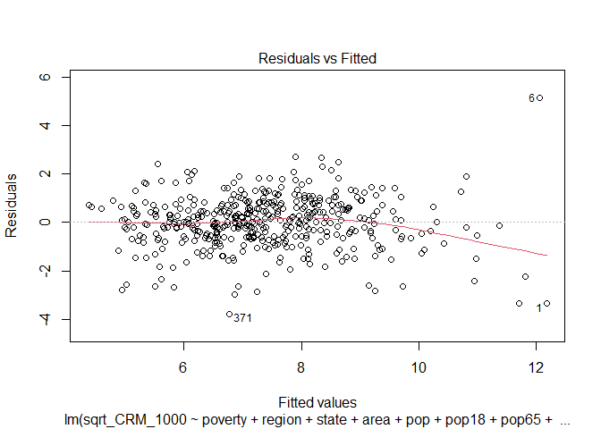<!-- -->

这看上去怎么感觉还不如不搞transformation…等周一上完课再看吧。

## Initial Exploration of correlation between counties’ CRM\_100 and all variables, With untransformed outcome (CRM\_1000)

## 好像除了poverty之外都看不出什么明显关联（捂脸）

``` r
cdi %>% ggplot(aes(x = area, y = CRM_1000)) + geom_point()
```

<!-- -->

``` r
cdi %>% ggplot(aes(x = pop, y = CRM_1000)) + geom_point()
```

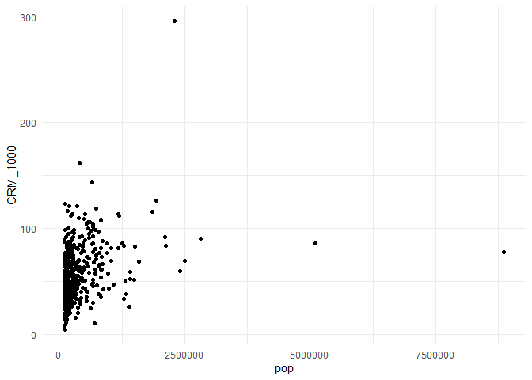<!-- -->

``` r
cdi %>% ggplot(aes(x = pop18, y = CRM_1000)) + geom_point()
```

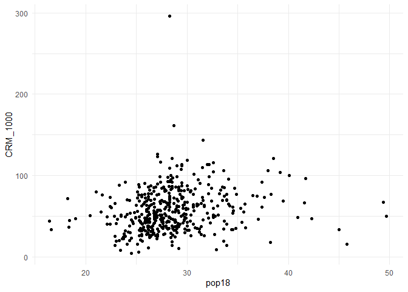<!-- -->

``` r
cdi %>% ggplot(aes(x = pop65, y = CRM_1000)) + geom_point()
```

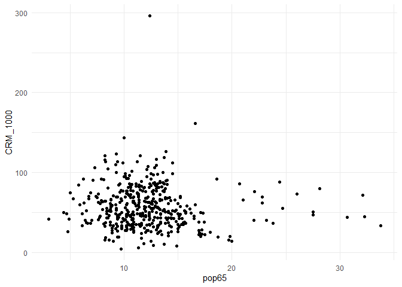<!-- -->

``` r
cdi %>% ggplot(aes(x = docs, y = CRM_1000)) + geom_point()
```

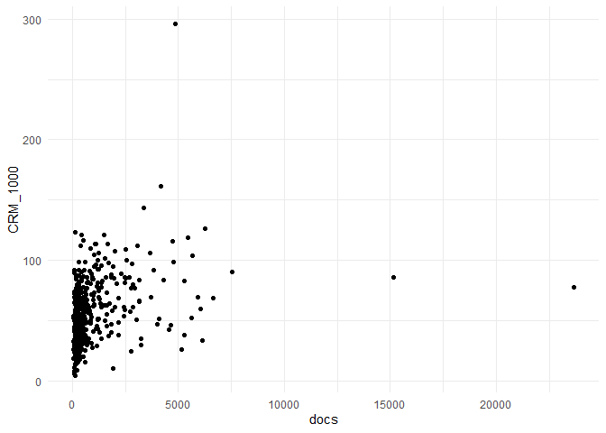<!-- -->

``` r
cdi %>% ggplot(aes(x = beds, y = CRM_1000)) + geom_point()
```

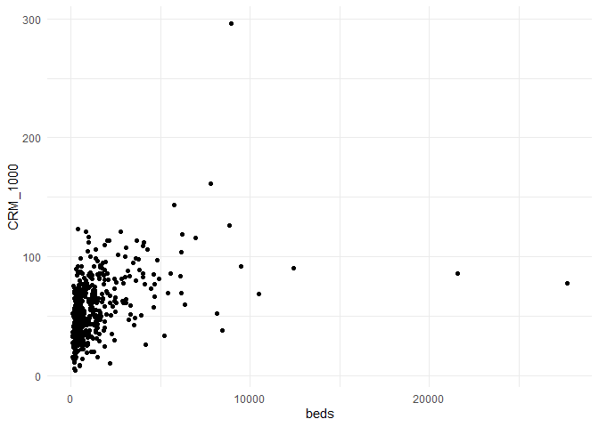<!-- -->

``` r
cdi %>% ggplot(aes(x = hsgrad, y = CRM_1000)) + geom_point()
```

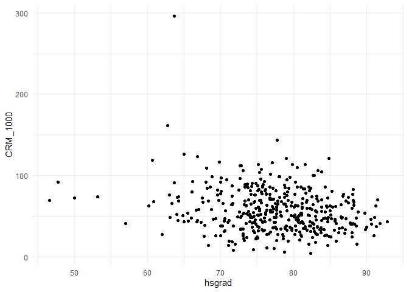<!-- -->

``` r
cdi %>% ggplot(aes(x = bagrad, y = CRM_1000)) + geom_point()
```

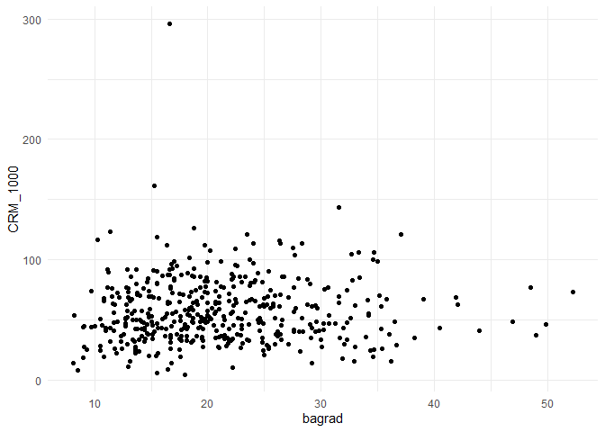<!-- -->

``` r
cdi %>% ggplot(aes(x = poverty, y = CRM_1000)) + geom_point()
```

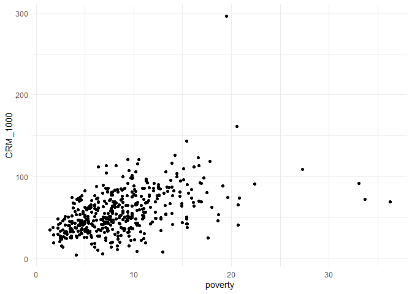<!-- -->

``` r
cdi %>% ggplot(aes(x = unemp, y = CRM_1000)) + geom_point()
```

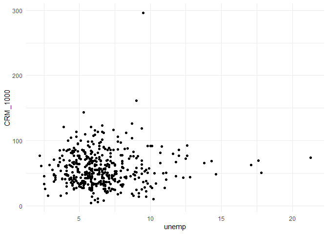<!-- -->

``` r
cdi %>% ggplot(aes(x = pcincome, y = CRM_1000)) + geom_point()
```

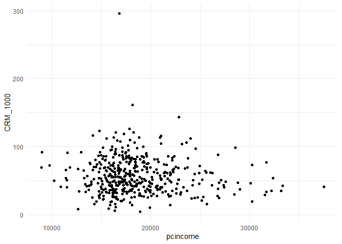<!-- -->

``` r
cdi %>% ggplot(aes(x = totalinc, y = CRM_1000)) + geom_point()
```

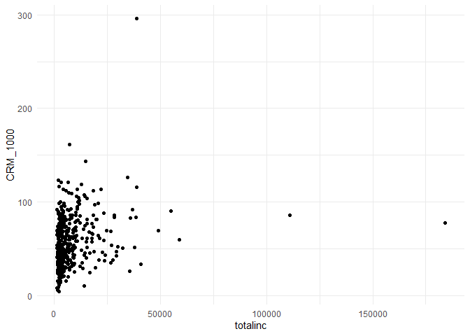<!-- -->

``` r
cdi %>% ggplot(aes(x = region, y = CRM_1000)) + geom_boxplot()
```

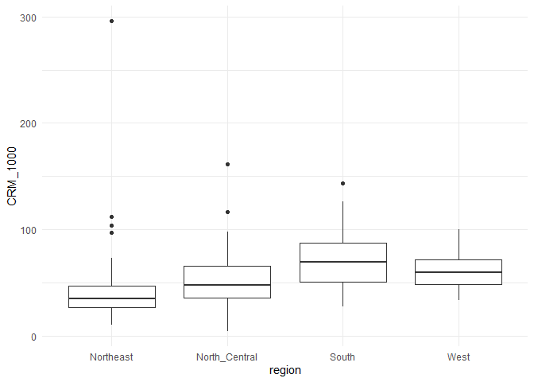<!-- -->
