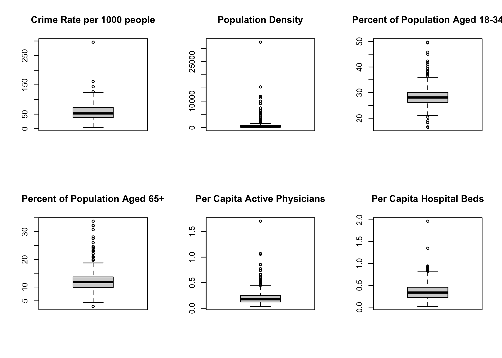
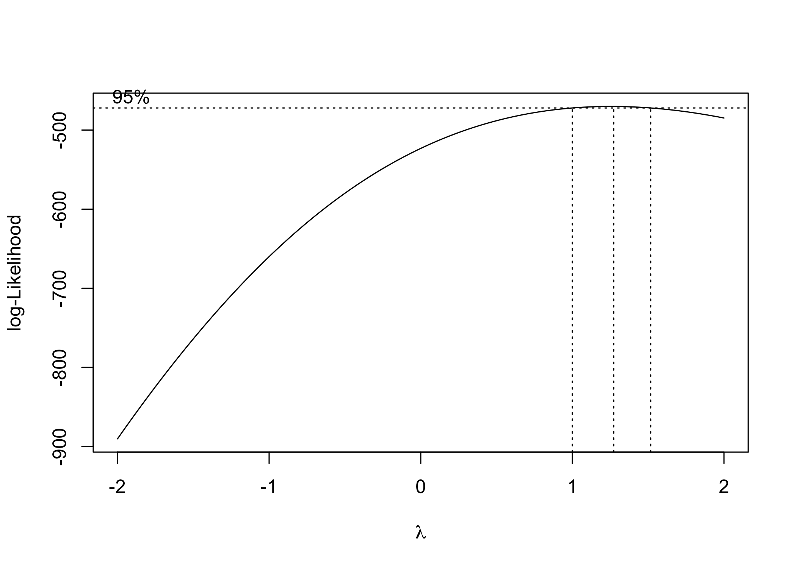
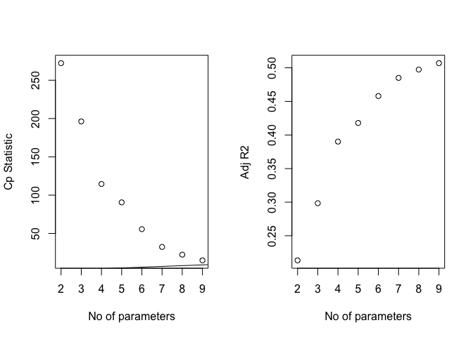

data\_exploration
================
Weiheng Zhang
2021/11/28

``` r
library(tidyverse)
library(lubridate)
library(dplyr)
library(p8105.datasets)
library(leaflet)
library(mgcv)
library(modelr)
library(corrplot)
library(MASS)
library(leaps)


theme_set(theme_minimal() + theme(legend.position = "bottom"))

options(
  ggplot2.continuous.colour = "viridis",
  ggplot2.continuous.fill = "viridis"
)

scale_colour_discrete = scale_color_viridis_d
scale_fill_discrete = scale_fill_viridis_d
```

## Data cleaning

``` r
cdi =
  read_csv("./data/cdi.csv") %>% 
  mutate(
    cty = as.factor(cty),
    state = as.factor(state),
    region = factor(region, levels = c("1", "2", "3", "4"),
                    labels = c("Northeast", "North_Central", "South", "West")),
    CRM_1000 = 1000*crimes/pop) %>% 
  relocate(CRM_1000)

cdi
```

    ## # A tibble: 440 × 18
    ##    CRM_1000    id cty   state  area    pop pop18 pop65  docs  beds crimes hsgrad
    ##       <dbl> <dbl> <fct> <fct> <dbl>  <dbl> <dbl> <dbl> <dbl> <dbl>  <dbl>  <dbl>
    ##  1     77.7     1 Los_… CA     4060 8.86e6  32.1   9.7 23677 27700 688936   70  
    ##  2     85.6     2 Cook  IL      946 5.11e6  29.2  12.4 15153 21550 436936   73.4
    ##  3     90.0     3 Harr… TX     1729 2.82e6  31.3   7.1  7553 12449 253526   74.9
    ##  4     69.6     4 San_… CA     4205 2.50e6  33.5  10.9  5905  6179 173821   81.9
    ##  5     60.0     5 Oran… CA      790 2.41e6  32.6   9.2  6062  6369 144524   81.2
    ##  6    296.      6 Kings NY       71 2.30e6  28.3  12.4  4861  8942 680966   63.7
    ##  7     83.7     7 Mari… AZ     9204 2.12e6  29.2  12.5  4320  6104 177593   81.5
    ##  8     91.9     8 Wayne MI      614 2.11e6  27.4  12.5  3823  9490 193978   70  
    ##  9    126.      9 Dade  FL     1945 1.94e6  27.1  13.9  6274  8840 244725   65  
    ## 10    116.     10 Dall… TX      880 1.85e6  32.6   8.2  4718  6934 214258   77.1
    ## # … with 430 more rows, and 6 more variables: bagrad <dbl>, poverty <dbl>,
    ## #   unemp <dbl>, pcincome <dbl>, totalinc <dbl>, region <fct>

## Descriptive Statistics.

``` r
summary(cdi)
```

    ##     CRM_1000             id              cty          state    
    ##  Min.   :  4.601   Min.   :  1.0   Jefferso:  7   CA     : 34  
    ##  1st Qu.: 38.102   1st Qu.:110.8   Montgome:  6   FL     : 29  
    ##  Median : 52.429   Median :220.5   Washingt:  5   PA     : 29  
    ##  Mean   : 57.286   Mean   :220.5   Cumberla:  4   TX     : 28  
    ##  3rd Qu.: 72.597   3rd Qu.:330.2   Jackson :  4   OH     : 24  
    ##  Max.   :295.987   Max.   :440.0   Lake    :  4   NY     : 22  
    ##                                    (Other) :410   (Other):274  
    ##       area              pop              pop18           pop65       
    ##  Min.   :   15.0   Min.   : 100043   Min.   :16.40   Min.   : 3.000  
    ##  1st Qu.:  451.2   1st Qu.: 139027   1st Qu.:26.20   1st Qu.: 9.875  
    ##  Median :  656.5   Median : 217280   Median :28.10   Median :11.750  
    ##  Mean   : 1041.4   Mean   : 393011   Mean   :28.57   Mean   :12.170  
    ##  3rd Qu.:  946.8   3rd Qu.: 436064   3rd Qu.:30.02   3rd Qu.:13.625  
    ##  Max.   :20062.0   Max.   :8863164   Max.   :49.70   Max.   :33.800  
    ##                                                                      
    ##       docs              beds             crimes           hsgrad     
    ##  Min.   :   39.0   Min.   :   92.0   Min.   :   563   Min.   :46.60  
    ##  1st Qu.:  182.8   1st Qu.:  390.8   1st Qu.:  6220   1st Qu.:73.88  
    ##  Median :  401.0   Median :  755.0   Median : 11820   Median :77.70  
    ##  Mean   :  988.0   Mean   : 1458.6   Mean   : 27112   Mean   :77.56  
    ##  3rd Qu.: 1036.0   3rd Qu.: 1575.8   3rd Qu.: 26280   3rd Qu.:82.40  
    ##  Max.   :23677.0   Max.   :27700.0   Max.   :688936   Max.   :92.90  
    ##                                                                      
    ##      bagrad         poverty           unemp           pcincome    
    ##  Min.   : 8.10   Min.   : 1.400   Min.   : 2.200   Min.   : 8899  
    ##  1st Qu.:15.28   1st Qu.: 5.300   1st Qu.: 5.100   1st Qu.:16118  
    ##  Median :19.70   Median : 7.900   Median : 6.200   Median :17759  
    ##  Mean   :21.08   Mean   : 8.721   Mean   : 6.597   Mean   :18561  
    ##  3rd Qu.:25.32   3rd Qu.:10.900   3rd Qu.: 7.500   3rd Qu.:20270  
    ##  Max.   :52.30   Max.   :36.300   Max.   :21.300   Max.   :37541  
    ##                                                                   
    ##     totalinc                region   
    ##  Min.   :  1141   Northeast    :103  
    ##  1st Qu.:  2311   North_Central:108  
    ##  Median :  3857   South        :152  
    ##  Mean   :  7869   West         : 77  
    ##  3rd Qu.:  8654                      
    ##  Max.   :184230                      
    ## 

``` r
sapply(cdi, function(x) sum(is.na(x)))
```

    ## CRM_1000       id      cty    state     area      pop    pop18    pop65 
    ##        0        0        0        0        0        0        0        0 
    ##     docs     beds   crimes   hsgrad   bagrad  poverty    unemp pcincome 
    ##        0        0        0        0        0        0        0        0 
    ## totalinc   region 
    ##        0        0

``` r
map(cdi, ~sum(is.na(.)))
```

    ## $CRM_1000
    ## [1] 0
    ## 
    ## $id
    ## [1] 0
    ## 
    ## $cty
    ## [1] 0
    ## 
    ## $state
    ## [1] 0
    ## 
    ## $area
    ## [1] 0
    ## 
    ## $pop
    ## [1] 0
    ## 
    ## $pop18
    ## [1] 0
    ## 
    ## $pop65
    ## [1] 0
    ## 
    ## $docs
    ## [1] 0
    ## 
    ## $beds
    ## [1] 0
    ## 
    ## $crimes
    ## [1] 0
    ## 
    ## $hsgrad
    ## [1] 0
    ## 
    ## $bagrad
    ## [1] 0
    ## 
    ## $poverty
    ## [1] 0
    ## 
    ## $unemp
    ## [1] 0
    ## 
    ## $pcincome
    ## [1] 0
    ## 
    ## $totalinc
    ## [1] 0
    ## 
    ## $region
    ## [1] 0

No missing values were found.

## Boxplot for each variable

``` r
par(mfrow = c(2, 3))
boxplot(cdi$CRM_1000, main = 'Crime Rate per 1000 people') # an obvious outlier around 300
boxplot(cdi$area, main = 'Land Area')
boxplot(cdi$pop,main = 'Total Population')
boxplot(cdi$pop18, main = 'Percent of Population Aged 18-34')
boxplot(cdi$pop65, main = 'Percent of Population Aged 65+')
boxplot(cdi$docs, main = 'Number of Active Physicians')
```

<!-- -->

``` r
par(mfrow = c(2,4), dpi = 300)
```

    ## Warning in par(mfrow = c(2, 4), dpi = 300): "dpi" is not a graphical parameter

``` r
boxplot(cdi$beds, main = 'Number of Hospital Beds')
boxplot(cdi$hsgrad, main = 'Percent High School Graduates')
boxplot(cdi$bagrad, main = 'Percent Bachelor’s Degrees')
boxplot(cdi$poverty, main = 'Percent Below Poverty Level')
boxplot(cdi$unemp, main = 'Percent Unemployment')
boxplot(cdi$pcincome, main = 'Per Capita Income')
boxplot(cdi$totalinc, main = 'Total Personal Income')
```

<!-- -->

## Marginal correlation with CRM\_1000 of each variable

``` r
cdi %>% ggplot(aes(x = area, y = CRM_1000)) + geom_point(alpha = 0.3) + geom_smooth(method = 'lm', se = TRUE, color = 'red')
```

    ## `geom_smooth()` using formula 'y ~ x'

<!-- -->

``` r
cdi %>% ggplot(aes(x = pop, y = CRM_1000)) + geom_point(alpha = 0.3) + geom_smooth(method = 'lm', se = TRUE, color = 'red')
```

    ## `geom_smooth()` using formula 'y ~ x'

<!-- -->

``` r
cdi %>% ggplot(aes(x = pop18, y = CRM_1000)) + geom_point(alpha = 0.3) + geom_smooth(method = 'lm', se = TRUE, color = 'red') # positive correlation
```

    ## `geom_smooth()` using formula 'y ~ x'

<!-- -->

``` r
cdi %>% ggplot(aes(x = pop65, y = CRM_1000)) + geom_point(alpha = 0.3) + geom_smooth(method = 'lm', se = TRUE, color = 'red')
```

    ## `geom_smooth()` using formula 'y ~ x'

<!-- -->

``` r
cdi %>% ggplot(aes(x = docs, y = CRM_1000)) + geom_point(alpha = 0.3) + geom_smooth(method = 'lm', se = TRUE, color = 'red')
```

    ## `geom_smooth()` using formula 'y ~ x'

<!-- -->

``` r
cdi %>% ggplot(aes(x = beds, y = CRM_1000)) + geom_point(alpha = 0.3) + geom_smooth(method = 'lm', se = TRUE, color = 'red')
```

    ## `geom_smooth()` using formula 'y ~ x'

<!-- -->

``` r
cdi %>% ggplot(aes(x = hsgrad, y = CRM_1000)) + geom_point(alpha = 0.3) + geom_smooth(method = 'lm', se = TRUE, color = 'red') #negative correlation
```

    ## `geom_smooth()` using formula 'y ~ x'

<!-- -->

``` r
cdi %>% ggplot(aes(x = bagrad, y = CRM_1000)) + geom_point(alpha = 0.3) + geom_smooth(method = 'lm', se = TRUE, color = 'red')
```

    ## `geom_smooth()` using formula 'y ~ x'

<!-- -->

``` r
cdi %>% ggplot(aes(x = poverty, y = CRM_1000)) + geom_point(alpha = 0.3) + geom_smooth(method = 'lm', se = TRUE, color = 'red') # positive correlation
```

    ## `geom_smooth()` using formula 'y ~ x'

<!-- -->

``` r
cdi %>% ggplot(aes(x = unemp, y = CRM_1000)) + geom_point(alpha = 0.3) + geom_smooth(method = 'lm', se = TRUE, color = 'red')
```

    ## `geom_smooth()` using formula 'y ~ x'

<!-- -->

``` r
cdi %>% ggplot(aes(x = pcincome, y = CRM_1000)) + geom_point(alpha = 0.3) + geom_smooth(method = 'lm', se = TRUE, color = 'red')
```

    ## `geom_smooth()` using formula 'y ~ x'

<!-- -->

``` r
cdi %>% ggplot(aes(x = totalinc, y = CRM_1000)) + geom_point(alpha = 0.3) + geom_smooth(method = 'lm', se = TRUE, color = 'red')
```

    ## `geom_smooth()` using formula 'y ~ x'

<!-- -->

``` r
cdi %>% ggplot(aes(x = region, y = CRM_1000)) + geom_point(alpha = 0.3) + geom_smooth(method = 'lm', se = TRUE, color = 'red')
```

    ## `geom_smooth()` using formula 'y ~ x'

<!-- -->

## Identify counties with unusual crime rates.

``` r
upper = quantile(cdi$CRM_1000, 0.75)
lower = quantile(cdi$CRM_1000, 0.25)
IQR = upper - lower

cdi %>% 
  filter(CRM_1000 > upper + 1.5*IQR,
         CRM_1000 > lower - 1.5*IQR) %>% 
  dplyr::select(cty, CRM_1000) %>%
  knitr::kable(digits = 2)
```

| cty       | CRM\_1000 |
|:----------|----------:|
| Kings     |    295.99 |
| Dade      |    126.34 |
| Fulton    |    143.35 |
| St.\_Loui |    161.60 |

``` r
boxplot(cdi$CRM_1000, main = 'Crime Rate per 1000 people') 
```

<!-- -->

## Group by states and check for outliers again.

``` r
cdi_state = 
  cdi %>% 
  group_by(state) %>% 
  summarise(state_pop = sum(pop),
            state_crimes = sum(crimes)) %>% 
  mutate(state_CRM_1000 = 1000*state_crimes/state_pop) %>% 
  relocate(state_CRM_1000)

cdi_state
```

    ## # A tibble: 48 × 4
    ##    state_CRM_1000 state state_pop state_crimes
    ##             <dbl> <fct>     <dbl>        <dbl>
    ##  1           71.6 AL      1844764       132007
    ##  2          105.  AR       463069        48526
    ##  3           80.2 AZ      3119969       250285
    ##  4           69.3 CA     28917875      2002790
    ##  5           65.8 CO      2625950       172695
    ##  6           50.9 CT      3287116       167208
    ##  7          106.  DC       606900        64393
    ##  8           60.7 DE       552939        33563
    ##  9           86.2 FL     11744171      1011989
    ## 10           93.0 GA      2913394       270900
    ## # … with 38 more rows

``` r
upper = quantile(cdi_state$state_CRM_1000, 0.75)
lower = quantile(cdi_state$state_CRM_1000, 0.25)
IQR = upper - lower

cdi_state %>% 
  filter(state_CRM_1000 > upper + 1.5*IQR,
         state_CRM_1000 > lower - 1.5*IQR) %>% 
  dplyr::select(state, state_CRM_1000) %>%
  knitr::kable(digits = 2)
```

| state | state\_CRM\_1000 |
|:------|-----------------:|

``` r
boxplot(cdi_state$state_CRM_1000, main = 'State Crime Rate per 1000 people') 
```

<!-- -->

Surprisingly, if we look at the CRM\_1000 at state level, no outlier was
found.

## Check for transformation

``` r
# fit multivariate model
cdi_pred = 
  cdi %>% 
  dplyr::select(-id, -cty, -crimes)

mult.fit1 = lm(CRM_1000 ~ ., data = cdi_pred) 
summary(mult.fit1)
```

    ## 
    ## Call:
    ## lm(formula = CRM_1000 ~ ., data = cdi_pred)
    ## 
    ## Residuals:
    ##     Min      1Q  Median      3Q     Max 
    ## -50.097  -9.790   0.000   8.267 155.531 
    ## 
    ## Coefficients: (3 not defined because of singularities)
    ##                       Estimate Std. Error t value Pr(>|t|)    
    ## (Intercept)         -9.531e+01  3.260e+01  -2.923  0.00367 ** 
    ## stateAR              2.800e+01  1.447e+01   1.935  0.05375 .  
    ## stateAZ              1.620e+01  1.197e+01   1.354  0.17668    
    ## stateCA              7.767e-01  8.347e+00   0.093  0.92591    
    ## stateCO              1.185e+01  9.355e+00   1.267  0.20610    
    ## stateCT             -1.933e+01  9.984e+00  -1.936  0.05365 .  
    ## stateDC              1.119e+01  1.972e+01   0.567  0.57095    
    ## stateDE              4.132e+00  1.462e+01   0.283  0.77755    
    ## stateFL              1.591e+01  8.279e+00   1.922  0.05536 .  
    ## stateGA              1.898e+01  9.173e+00   2.069  0.03923 *  
    ## stateHI              1.735e+01  1.264e+01   1.372  0.17079    
    ## stateID              1.228e+00  1.945e+01   0.063  0.94966    
    ## stateIL             -6.824e+00  8.448e+00  -0.808  0.41972    
    ## stateIN             -1.356e+01  8.488e+00  -1.598  0.11087    
    ## stateKS              2.592e+01  1.147e+01   2.259  0.02443 *  
    ## stateKY             -9.538e+00  1.247e+01  -0.765  0.44493    
    ## stateLA             -1.963e+00  9.338e+00  -0.210  0.83361    
    ## stateMA             -2.324e+01  9.886e+00  -2.351  0.01925 *  
    ## stateMD              1.447e+00  9.400e+00   0.154  0.87774    
    ## stateME             -8.488e+00  1.086e+01  -0.781  0.43513    
    ## stateMI             -8.156e-01  8.692e+00  -0.094  0.92529    
    ## stateMN             -5.205e+00  1.001e+01  -0.520  0.60327    
    ## stateMO              5.294e+00  9.514e+00   0.556  0.57820    
    ## stateMS              2.891e+00  1.257e+01   0.230  0.81822    
    ## stateMT             -9.677e+00  1.950e+01  -0.496  0.62004    
    ## stateNC              8.165e+00  8.184e+00   0.998  0.31904    
    ## stateND             -1.455e+01  1.948e+01  -0.747  0.45563    
    ## stateNE              5.087e+00  1.274e+01   0.399  0.68994    
    ## stateNH             -1.769e+01  1.181e+01  -1.498  0.13496    
    ## stateNJ             -1.102e+01  8.735e+00  -1.262  0.20787    
    ## stateNM              1.546e+01  1.469e+01   1.052  0.29325    
    ## stateNV              2.112e+01  1.562e+01   1.353  0.17699    
    ## stateNY             -6.141e+00  8.162e+00  -0.752  0.45229    
    ## stateOH             -1.560e+01  7.981e+00  -1.955  0.05136 .  
    ## stateOK              1.313e+01  1.148e+01   1.143  0.25364    
    ## stateOR              1.373e+01  1.044e+01   1.315  0.18938    
    ## statePA             -2.537e+01  7.945e+00  -3.193  0.00152 ** 
    ## stateRI             -8.004e+00  1.296e+01  -0.618  0.53724    
    ## stateSC              1.686e+01  8.773e+00   1.922  0.05537 .  
    ## stateSD             -4.665e+00  1.941e+01  -0.240  0.81015    
    ## stateTN              1.756e+00  9.362e+00   0.188  0.85130    
    ## stateTX              1.041e+01  7.729e+00   1.346  0.17898    
    ## stateUT              1.256e+01  1.195e+01   1.051  0.29378    
    ## stateVA              1.515e+00  9.488e+00   0.160  0.87320    
    ## stateVT             -1.849e+01  1.946e+01  -0.950  0.34264    
    ## stateWA              1.162e+01  9.434e+00   1.232  0.21873    
    ## stateWI             -3.755e+00  9.042e+00  -0.415  0.67819    
    ## stateWV             -1.138e+01  1.930e+01  -0.590  0.55564    
    ## area                -2.020e-03  8.139e-04  -2.482  0.01348 *  
    ## pop                  9.439e-05  1.636e-05   5.770 1.65e-08 ***
    ## pop18                1.631e+00  3.704e-01   4.403 1.39e-05 ***
    ## pop65                3.553e-01  3.694e-01   0.962  0.33674    
    ## docs                -7.759e-04  2.666e-03  -0.291  0.77115    
    ## beds                 4.825e-03  1.914e-03   2.521  0.01211 *  
    ## hsgrad               9.941e-02  3.198e-01   0.311  0.75612    
    ## bagrad              -6.196e-01  3.183e-01  -1.947  0.05231 .  
    ## poverty              2.710e+00  4.407e-01   6.150 1.96e-09 ***
    ## unemp                1.998e-01  7.054e-01   0.283  0.77714    
    ## pcincome             4.300e-03  6.370e-04   6.750 5.55e-11 ***
    ## totalinc            -4.865e-03  7.606e-04  -6.397 4.66e-10 ***
    ## regionNorth_Central         NA         NA      NA       NA    
    ## regionSouth                 NA         NA      NA       NA    
    ## regionWest                  NA         NA      NA       NA    
    ## ---
    ## Signif. codes:  0 '***' 0.001 '**' 0.01 '*' 0.05 '.' 0.1 ' ' 1
    ## 
    ## Residual standard error: 17.98 on 380 degrees of freedom
    ## Multiple R-squared:  0.6251, Adjusted R-squared:  0.5669 
    ## F-statistic: 10.74 on 59 and 380 DF,  p-value: < 2.2e-16

``` r
# check diagnostics
plot(mult.fit1)
```

    ## Warning: not plotting observations with leverage one:
    ##   73, 232, 233, 339, 356, 388, 429

<!-- --><!-- --><!-- --><!-- -->

``` r
boxcox(mult.fit1)
```

<!-- -->

## a = 1/2. Perform sqrt transformation.

``` r
cdi_sqrt = 
  cdi_pred %>% 
  mutate(sqrt_CRM_1000 = sqrt(CRM_1000)) %>% 
  dplyr::select(-CRM_1000) %>% 
  relocate(sqrt_CRM_1000)

cdi_sqrt
```

    ## # A tibble: 440 × 15
    ##    sqrt_CRM_1000 state  area     pop pop18 pop65  docs  beds hsgrad bagrad
    ##            <dbl> <fct> <dbl>   <dbl> <dbl> <dbl> <dbl> <dbl>  <dbl>  <dbl>
    ##  1          8.82 CA     4060 8863164  32.1   9.7 23677 27700   70     22.3
    ##  2          9.25 IL      946 5105067  29.2  12.4 15153 21550   73.4   22.8
    ##  3          9.48 TX     1729 2818199  31.3   7.1  7553 12449   74.9   25.4
    ##  4          8.34 CA     4205 2498016  33.5  10.9  5905  6179   81.9   25.3
    ##  5          7.74 CA      790 2410556  32.6   9.2  6062  6369   81.2   27.8
    ##  6         17.2  NY       71 2300664  28.3  12.4  4861  8942   63.7   16.6
    ##  7          9.15 AZ     9204 2122101  29.2  12.5  4320  6104   81.5   22.1
    ##  8          9.58 MI      614 2111687  27.4  12.5  3823  9490   70     13.7
    ##  9         11.2  FL     1945 1937094  27.1  13.9  6274  8840   65     18.8
    ## 10         10.8  TX      880 1852810  32.6   8.2  4718  6934   77.1   26.3
    ## # … with 430 more rows, and 5 more variables: poverty <dbl>, unemp <dbl>,
    ## #   pcincome <dbl>, totalinc <dbl>, region <fct>

``` r
mult.fit2 = lm(sqrt_CRM_1000 ~ ., data = cdi_sqrt) 

# check diagnostics
summary(mult.fit2) ##region returned NA, why?
```

    ## 
    ## Call:
    ## lm(formula = sqrt_CRM_1000 ~ ., data = cdi_sqrt)
    ## 
    ## Residuals:
    ##     Min      1Q  Median      3Q     Max 
    ## -3.6324 -0.5860  0.0349  0.6156  5.5298 
    ## 
    ## Coefficients: (3 not defined because of singularities)
    ##                       Estimate Std. Error t value Pr(>|t|)    
    ## (Intercept)         -2.272e+00  2.023e+00  -1.123  0.26204    
    ## stateAR              1.552e+00  8.978e-01   1.728  0.08471 .  
    ## stateAZ              9.277e-01  7.425e-01   1.249  0.21228    
    ## stateCA              7.341e-02  5.179e-01   0.142  0.88736    
    ## stateCO              8.356e-01  5.805e-01   1.440  0.15081    
    ## stateCT             -1.680e+00  6.195e-01  -2.712  0.00699 ** 
    ## stateDC              4.657e-01  1.224e+00   0.381  0.70375    
    ## stateDE              3.268e-01  9.069e-01   0.360  0.71875    
    ## stateFL              9.127e-01  5.137e-01   1.777  0.07640 .  
    ## stateGA              1.134e+00  5.692e-01   1.992  0.04710 *  
    ## stateHI              1.174e+00  7.844e-01   1.496  0.13545    
    ## stateID              1.147e-01  1.207e+00   0.095  0.92432    
    ## stateIL             -4.896e-01  5.241e-01  -0.934  0.35081    
    ## stateIN             -1.103e+00  5.266e-01  -2.094  0.03690 *  
    ## stateKS              1.542e+00  7.118e-01   2.166  0.03090 *  
    ## stateKY             -5.150e-01  7.739e-01  -0.665  0.50618    
    ## stateLA             -1.099e-01  5.794e-01  -0.190  0.84962    
    ## stateMA             -1.849e+00  6.134e-01  -3.014  0.00276 ** 
    ## stateMD              4.401e-02  5.833e-01   0.075  0.93989    
    ## stateME             -6.771e-01  6.741e-01  -1.004  0.31582    
    ## stateMI              3.770e-03  5.393e-01   0.007  0.99443    
    ## stateMN             -4.113e-01  6.209e-01  -0.662  0.50813    
    ## stateMO              5.483e-02  5.903e-01   0.093  0.92605    
    ## stateMS              9.845e-02  7.799e-01   0.126  0.89961    
    ## stateMT             -8.346e-01  1.210e+00  -0.690  0.49079    
    ## stateNC              4.749e-01  5.078e-01   0.935  0.35030    
    ## stateND             -1.214e+00  1.208e+00  -1.005  0.31560    
    ## stateNE              2.347e-01  7.905e-01   0.297  0.76676    
    ## stateNH             -1.366e+00  7.325e-01  -1.865  0.06296 .  
    ## stateNJ             -8.372e-01  5.420e-01  -1.545  0.12324    
    ## stateNM              1.070e+00  9.115e-01   1.174  0.24132    
    ## stateNV              1.270e+00  9.690e-01   1.311  0.19071    
    ## stateNY             -7.817e-01  5.064e-01  -1.544  0.12353    
    ## stateOH             -1.313e+00  4.952e-01  -2.651  0.00837 ** 
    ## stateOK              8.820e-01  7.125e-01   1.238  0.21653    
    ## stateOR              8.658e-01  6.480e-01   1.336  0.18231    
    ## statePA             -1.997e+00  4.930e-01  -4.051 6.18e-05 ***
    ## stateRI             -5.273e-01  8.042e-01  -0.656  0.51241    
    ## stateSC              1.134e+00  5.443e-01   2.083  0.03795 *  
    ## stateSD             -3.331e-01  1.204e+00  -0.277  0.78223    
    ## stateTN              1.399e-01  5.809e-01   0.241  0.80978    
    ## stateTX              7.070e-01  4.795e-01   1.474  0.14123    
    ## stateUT              8.379e-01  7.413e-01   1.130  0.25905    
    ## stateVA              1.325e-01  5.887e-01   0.225  0.82204    
    ## stateVT             -1.316e+00  1.208e+00  -1.089  0.27663    
    ## stateWA              7.732e-01  5.853e-01   1.321  0.18731    
    ## stateWI             -2.777e-01  5.610e-01  -0.495  0.62095    
    ## stateWV             -6.431e-01  1.197e+00  -0.537  0.59150    
    ## area                -9.844e-05  5.050e-05  -1.949  0.05199 .  
    ## pop                  4.682e-06  1.015e-06   4.613 5.44e-06 ***
    ## pop18                1.121e-01  2.298e-02   4.879 1.58e-06 ***
    ## pop65                3.455e-02  2.292e-02   1.507  0.13261    
    ## docs                -6.981e-05  1.654e-04  -0.422  0.67322    
    ## beds                 3.264e-04  1.188e-04   2.748  0.00628 ** 
    ## hsgrad               7.790e-03  1.984e-02   0.393  0.69488    
    ## bagrad              -4.108e-02  1.975e-02  -2.080  0.03818 *  
    ## poverty              1.617e-01  2.734e-02   5.914 7.45e-09 ***
    ## unemp                1.330e-02  4.377e-02   0.304  0.76133    
    ## pcincome             2.556e-04  3.952e-05   6.466 3.09e-10 ***
    ## totalinc            -2.485e-04  4.719e-05  -5.265 2.35e-07 ***
    ## regionNorth_Central         NA         NA      NA       NA    
    ## regionSouth                 NA         NA      NA       NA    
    ## regionWest                  NA         NA      NA       NA    
    ## ---
    ## Signif. codes:  0 '***' 0.001 '**' 0.01 '*' 0.05 '.' 0.1 ' ' 1
    ## 
    ## Residual standard error: 1.116 on 380 degrees of freedom
    ## Multiple R-squared:  0.6431, Adjusted R-squared:  0.5877 
    ## F-statistic:  11.6 on 59 and 380 DF,  p-value: < 2.2e-16

``` r
boxcox(mult.fit2) 
```

<!-- -->

## Checking to Outliers and Influential Points

``` r
# residuals vs leverage plot
plot(mult.fit1, which = 4)
```

<!-- -->

``` r
# remove influential points
cdi_predOut = cdi_pred[-c(1, 6),]

# plot with and without influential points
plot(cdi_pred$poverty, cdi_pred$CRM_1000)
```

<!-- -->

``` r
plot(cdi_predOut$poverty, cdi_predOut$CRM_1000)
```

<!-- -->

``` r
# fit model with and without influential points
with = lm(CRM_1000 ~ ., data = cdi_pred) 

without = lm(CRM_1000 ~ ., data = cdi_predOut)

summary(with); summary(without) ##比较p value和r squared
```

    ## 
    ## Call:
    ## lm(formula = CRM_1000 ~ ., data = cdi_pred)
    ## 
    ## Residuals:
    ##     Min      1Q  Median      3Q     Max 
    ## -50.097  -9.790   0.000   8.267 155.531 
    ## 
    ## Coefficients: (3 not defined because of singularities)
    ##                       Estimate Std. Error t value Pr(>|t|)    
    ## (Intercept)         -9.531e+01  3.260e+01  -2.923  0.00367 ** 
    ## stateAR              2.800e+01  1.447e+01   1.935  0.05375 .  
    ## stateAZ              1.620e+01  1.197e+01   1.354  0.17668    
    ## stateCA              7.767e-01  8.347e+00   0.093  0.92591    
    ## stateCO              1.185e+01  9.355e+00   1.267  0.20610    
    ## stateCT             -1.933e+01  9.984e+00  -1.936  0.05365 .  
    ## stateDC              1.119e+01  1.972e+01   0.567  0.57095    
    ## stateDE              4.132e+00  1.462e+01   0.283  0.77755    
    ## stateFL              1.591e+01  8.279e+00   1.922  0.05536 .  
    ## stateGA              1.898e+01  9.173e+00   2.069  0.03923 *  
    ## stateHI              1.735e+01  1.264e+01   1.372  0.17079    
    ## stateID              1.228e+00  1.945e+01   0.063  0.94966    
    ## stateIL             -6.824e+00  8.448e+00  -0.808  0.41972    
    ## stateIN             -1.356e+01  8.488e+00  -1.598  0.11087    
    ## stateKS              2.592e+01  1.147e+01   2.259  0.02443 *  
    ## stateKY             -9.538e+00  1.247e+01  -0.765  0.44493    
    ## stateLA             -1.963e+00  9.338e+00  -0.210  0.83361    
    ## stateMA             -2.324e+01  9.886e+00  -2.351  0.01925 *  
    ## stateMD              1.447e+00  9.400e+00   0.154  0.87774    
    ## stateME             -8.488e+00  1.086e+01  -0.781  0.43513    
    ## stateMI             -8.156e-01  8.692e+00  -0.094  0.92529    
    ## stateMN             -5.205e+00  1.001e+01  -0.520  0.60327    
    ## stateMO              5.294e+00  9.514e+00   0.556  0.57820    
    ## stateMS              2.891e+00  1.257e+01   0.230  0.81822    
    ## stateMT             -9.677e+00  1.950e+01  -0.496  0.62004    
    ## stateNC              8.165e+00  8.184e+00   0.998  0.31904    
    ## stateND             -1.455e+01  1.948e+01  -0.747  0.45563    
    ## stateNE              5.087e+00  1.274e+01   0.399  0.68994    
    ## stateNH             -1.769e+01  1.181e+01  -1.498  0.13496    
    ## stateNJ             -1.102e+01  8.735e+00  -1.262  0.20787    
    ## stateNM              1.546e+01  1.469e+01   1.052  0.29325    
    ## stateNV              2.112e+01  1.562e+01   1.353  0.17699    
    ## stateNY             -6.141e+00  8.162e+00  -0.752  0.45229    
    ## stateOH             -1.560e+01  7.981e+00  -1.955  0.05136 .  
    ## stateOK              1.313e+01  1.148e+01   1.143  0.25364    
    ## stateOR              1.373e+01  1.044e+01   1.315  0.18938    
    ## statePA             -2.537e+01  7.945e+00  -3.193  0.00152 ** 
    ## stateRI             -8.004e+00  1.296e+01  -0.618  0.53724    
    ## stateSC              1.686e+01  8.773e+00   1.922  0.05537 .  
    ## stateSD             -4.665e+00  1.941e+01  -0.240  0.81015    
    ## stateTN              1.756e+00  9.362e+00   0.188  0.85130    
    ## stateTX              1.041e+01  7.729e+00   1.346  0.17898    
    ## stateUT              1.256e+01  1.195e+01   1.051  0.29378    
    ## stateVA              1.515e+00  9.488e+00   0.160  0.87320    
    ## stateVT             -1.849e+01  1.946e+01  -0.950  0.34264    
    ## stateWA              1.162e+01  9.434e+00   1.232  0.21873    
    ## stateWI             -3.755e+00  9.042e+00  -0.415  0.67819    
    ## stateWV             -1.138e+01  1.930e+01  -0.590  0.55564    
    ## area                -2.020e-03  8.139e-04  -2.482  0.01348 *  
    ## pop                  9.439e-05  1.636e-05   5.770 1.65e-08 ***
    ## pop18                1.631e+00  3.704e-01   4.403 1.39e-05 ***
    ## pop65                3.553e-01  3.694e-01   0.962  0.33674    
    ## docs                -7.759e-04  2.666e-03  -0.291  0.77115    
    ## beds                 4.825e-03  1.914e-03   2.521  0.01211 *  
    ## hsgrad               9.941e-02  3.198e-01   0.311  0.75612    
    ## bagrad              -6.196e-01  3.183e-01  -1.947  0.05231 .  
    ## poverty              2.710e+00  4.407e-01   6.150 1.96e-09 ***
    ## unemp                1.998e-01  7.054e-01   0.283  0.77714    
    ## pcincome             4.300e-03  6.370e-04   6.750 5.55e-11 ***
    ## totalinc            -4.865e-03  7.606e-04  -6.397 4.66e-10 ***
    ## regionNorth_Central         NA         NA      NA       NA    
    ## regionSouth                 NA         NA      NA       NA    
    ## regionWest                  NA         NA      NA       NA    
    ## ---
    ## Signif. codes:  0 '***' 0.001 '**' 0.01 '*' 0.05 '.' 0.1 ' ' 1
    ## 
    ## Residual standard error: 17.98 on 380 degrees of freedom
    ## Multiple R-squared:  0.6251, Adjusted R-squared:  0.5669 
    ## F-statistic: 10.74 on 59 and 380 DF,  p-value: < 2.2e-16

    ## 
    ## Call:
    ## lm(formula = CRM_1000 ~ ., data = cdi_predOut)
    ## 
    ## Residuals:
    ##     Min      1Q  Median      3Q     Max 
    ## -39.898  -8.461   0.000   8.213  50.148 
    ## 
    ## Coefficients: (3 not defined because of singularities)
    ##                       Estimate Std. Error t value Pr(>|t|)    
    ## (Intercept)         -8.468e+01  2.813e+01  -3.010  0.00279 ** 
    ## stateAR              2.612e+01  1.248e+01   2.093  0.03703 *  
    ## stateAZ              8.209e+00  1.036e+01   0.792  0.42877    
    ## stateCA             -1.956e+00  7.211e+00  -0.271  0.78637    
    ## stateCO              8.884e+00  8.073e+00   1.100  0.27182    
    ## stateCT             -2.331e+01  8.618e+00  -2.705  0.00714 ** 
    ## stateDC              9.246e+00  1.701e+01   0.544  0.58706    
    ## stateDE              1.168e+00  1.261e+01   0.093  0.92627    
    ## stateFL              1.310e+01  7.158e+00   1.830  0.06806 .  
    ## stateGA              1.935e+01  7.911e+00   2.446  0.01491 *  
    ## stateHI              1.357e+01  1.091e+01   1.244  0.21423    
    ## stateID             -2.253e+00  1.677e+01  -0.134  0.89321    
    ## stateIL             -9.938e+00  7.295e+00  -1.362  0.17389    
    ## stateIN             -1.561e+01  7.322e+00  -2.132  0.03369 *  
    ## stateKS              2.395e+01  9.895e+00   2.420  0.01598 *  
    ## stateKY             -1.011e+01  1.076e+01  -0.940  0.34807    
    ## stateLA              5.817e-02  8.056e+00   0.007  0.99424    
    ## stateMA             -2.794e+01  8.555e+00  -3.266  0.00119 ** 
    ## stateMD             -2.364e+00  8.125e+00  -0.291  0.77124    
    ## stateME             -1.281e+01  9.377e+00  -1.366  0.17286    
    ## stateMI             -2.929e+00  7.506e+00  -0.390  0.69663    
    ## stateMN             -1.027e+01  8.641e+00  -1.189  0.23533    
    ## stateMO              3.375e+00  8.208e+00   0.411  0.68115    
    ## stateMS              2.059e+00  1.084e+01   0.190  0.84949    
    ## stateMT             -1.473e+01  1.683e+01  -0.875  0.38187    
    ## stateNC              5.915e+00  7.061e+00   0.838  0.40274    
    ## stateND             -1.989e+01  1.681e+01  -1.183  0.23745    
    ## stateNE              1.686e+00  1.099e+01   0.153  0.87819    
    ## stateNH             -2.086e+01  1.019e+01  -2.048  0.04121 *  
    ## stateNJ             -1.147e+01  7.535e+00  -1.523  0.12863    
    ## stateNM              1.305e+01  1.268e+01   1.030  0.30390    
    ## stateNV              1.509e+01  1.349e+01   1.119  0.26377    
    ## stateNY             -1.845e+01  7.119e+00  -2.591  0.00994 ** 
    ## stateOH             -1.796e+01  6.889e+00  -2.607  0.00949 ** 
    ## stateOK              1.119e+01  9.906e+00   1.129  0.25946    
    ## stateOR              8.918e+00  9.023e+00   0.988  0.32361    
    ## statePA             -2.845e+01  6.862e+00  -4.146 4.18e-05 ***
    ## stateRI             -1.070e+01  1.119e+01  -0.956  0.33943    
    ## stateSC              1.544e+01  7.567e+00   2.040  0.04205 *  
    ## stateSD             -7.964e+00  1.674e+01  -0.476  0.63458    
    ## stateTN              7.696e-01  8.074e+00   0.095  0.92411    
    ## stateTX              1.143e+01  6.684e+00   1.710  0.08800 .  
    ## stateUT              7.468e+00  1.034e+01   0.722  0.47058    
    ## stateVA              5.644e-01  8.183e+00   0.069  0.94505    
    ## stateVT             -2.184e+01  1.679e+01  -1.301  0.19407    
    ## stateWA              6.212e+00  8.169e+00   0.760  0.44751    
    ## stateWI             -7.264e+00  7.805e+00  -0.931  0.35260    
    ## stateWV             -1.194e+01  1.664e+01  -0.718  0.47344    
    ## area                -1.129e-03  7.182e-04  -1.573  0.11663    
    ## pop                  6.195e-05  1.542e-05   4.019 7.07e-05 ***
    ## pop18                1.616e+00  3.199e-01   5.052 6.81e-07 ***
    ## pop65                4.497e-01  3.197e-01   1.407  0.16034    
    ## docs                 3.251e-03  2.382e-03   1.364  0.17322    
    ## beds                 3.363e-03  1.780e-03   1.889  0.05967 .  
    ## hsgrad               2.594e-01  2.762e-01   0.939  0.34835    
    ## bagrad              -7.078e-01  2.746e-01  -2.578  0.01033 *  
    ## poverty              2.219e+00  3.827e-01   5.798 1.42e-08 ***
    ## unemp                4.050e-01  6.089e-01   0.665  0.50641    
    ## pcincome             3.364e-03  5.564e-04   6.046 3.57e-09 ***
    ## totalinc            -3.472e-03  6.839e-04  -5.076 6.06e-07 ***
    ## regionNorth_Central         NA         NA      NA       NA    
    ## regionSouth                 NA         NA      NA       NA    
    ## regionWest                  NA         NA      NA       NA    
    ## ---
    ## Signif. codes:  0 '***' 0.001 '**' 0.01 '*' 0.05 '.' 0.1 ' ' 1
    ## 
    ## Residual standard error: 15.51 on 378 degrees of freedom
    ## Multiple R-squared:  0.6636, Adjusted R-squared:  0.6111 
    ## F-statistic: 12.64 on 59 and 378 DF,  p-value: < 2.2e-16

``` r
# check without diagnostics
plot(without)
```

    ## Warning: not plotting observations with leverage one:
    ##   230, 231, 337, 386, 427

<!-- --><!-- --><!-- -->

    ## Warning in sqrt(crit * p * (1 - hh)/hh): NaNs produced

    ## Warning in sqrt(crit * p * (1 - hh)/hh): NaNs produced

<!-- -->

## check for multicollinearity

``` r
cdi_cor = 
  cdi_sqrt %>%
  mutate(
    state = as.numeric(state),
    region = as.numeric(region)
  ) %>% 
  dplyr::select(-sqrt_CRM_1000)

pairs(cdi_cor)
```

<!-- -->

``` r
cor(cdi_cor) %>% 
  knitr::kable()
```

|          |      state |       area |        pop |      pop18 |      pop65 |       docs |       beds |     hsgrad |     bagrad |    poverty |      unemp |   pcincome |   totalinc |     region |
|:---------|-----------:|-----------:|-----------:|-----------:|-----------:|-----------:|-----------:|-----------:|-----------:|-----------:|-----------:|-----------:|-----------:|-----------:|
| state    |  1.0000000 | -0.2193458 | -0.1125653 |  0.0457216 | -0.1389523 | -0.1000916 | -0.0802159 | -0.0111607 | -0.0485452 |  0.0080234 | -0.1369558 | -0.1108479 | -0.1215698 | -0.2575748 |
| area     | -0.2193458 |  1.0000000 |  0.1730834 | -0.0548781 |  0.0057709 |  0.0780747 |  0.0730473 | -0.0985981 | -0.1372377 |  0.1713433 |  0.1992093 | -0.1877151 |  0.1270743 |  0.3628682 |
| pop      | -0.1125653 |  0.1730834 |  1.0000000 |  0.0783721 | -0.0290374 |  0.9402486 |  0.9237384 | -0.0174269 |  0.1468138 |  0.0380195 |  0.0053517 |  0.2356102 |  0.9867476 |  0.0694371 |
| pop18    |  0.0457216 | -0.0548781 |  0.0783721 |  1.0000000 | -0.6163096 |  0.1196992 |  0.0745319 |  0.2505843 |  0.4560970 |  0.0339755 | -0.2785271 | -0.0316484 |  0.0711615 |  0.0524141 |
| pop65    | -0.1389523 |  0.0057709 | -0.0290374 | -0.6163096 |  1.0000000 | -0.0031286 |  0.0532784 | -0.2682518 | -0.3392288 |  0.0065785 |  0.2363094 |  0.0185907 | -0.0227332 | -0.1732916 |
| docs     | -0.1000916 |  0.0780747 |  0.9402486 |  0.1196992 | -0.0031286 |  1.0000000 |  0.9504644 | -0.0042481 |  0.2367655 |  0.0641363 | -0.0505161 |  0.3161346 |  0.9481106 |  0.0246461 |
| beds     | -0.0802159 |  0.0730473 |  0.9237384 |  0.0745319 |  0.0532784 |  0.9504644 |  1.0000000 | -0.1119164 |  0.1004265 |  0.1727938 |  0.0075240 |  0.1948082 |  0.9020615 | -0.0031069 |
| hsgrad   | -0.0111607 | -0.0985981 | -0.0174269 |  0.2505843 | -0.2682518 | -0.0042481 | -0.1119164 |  1.0000000 |  0.7077867 | -0.6917505 | -0.5935958 |  0.5229961 |  0.0433557 | -0.0100551 |
| bagrad   | -0.0485452 | -0.1372377 |  0.1468138 |  0.4560970 | -0.3392288 |  0.2367655 |  0.1004265 |  0.7077867 |  1.0000000 | -0.4084238 | -0.5409069 |  0.6953619 |  0.2222301 |  0.0202990 |
| poverty  |  0.0080234 |  0.1713433 |  0.0380195 |  0.0339755 |  0.0065785 |  0.0641363 |  0.1727938 | -0.6917505 | -0.4084238 |  1.0000000 |  0.4369472 | -0.6017250 | -0.0387393 |  0.2709848 |
| unemp    | -0.1369558 |  0.1992093 |  0.0053517 | -0.2785271 |  0.2363094 | -0.0505161 |  0.0075240 | -0.5935958 | -0.5409069 |  0.4369472 |  1.0000000 | -0.3221444 | -0.0338763 | -0.0543786 |
| pcincome | -0.1108479 | -0.1877151 |  0.2356102 | -0.0316484 |  0.0185907 |  0.3161346 |  0.1948082 |  0.5229961 |  0.6953619 | -0.6017250 | -0.3221444 |  1.0000000 |  0.3476816 | -0.2224937 |
| totalinc | -0.1215698 |  0.1270743 |  0.9867476 |  0.0711615 | -0.0227332 |  0.9481106 |  0.9020615 |  0.0433557 |  0.2222301 | -0.0387393 | -0.0338763 |  0.3476816 |  1.0000000 |  0.0376855 |
| region   | -0.2575748 |  0.3628682 |  0.0694371 |  0.0524141 | -0.1732916 |  0.0246461 | -0.0031069 | -0.0100551 |  0.0202990 |  0.2709848 | -0.0543786 | -0.2224937 |  0.0376855 |  1.0000000 |

``` r
corrplot(cor(cdi_cor), type = "upper", diag = FALSE)
```

<!-- -->
Based on the correlation plot, pop is highly correlated with docs, beds,
and totalinc; totalinc is highly correlated with docs and beds; hsgrad
is highly correlated with bagrad and poverty.

``` r
new_cdi =
  cdi_sqrt %>% 
  mutate(
    state = as.factor(state),
    region = as.factor(region))


mult.fit = lm(sqrt_CRM_1000 ~ ., data = new_cdi)
summary(mult.fit)
```

    ## 
    ## Call:
    ## lm(formula = sqrt_CRM_1000 ~ ., data = new_cdi)
    ## 
    ## Residuals:
    ##     Min      1Q  Median      3Q     Max 
    ## -3.6324 -0.5860  0.0349  0.6156  5.5298 
    ## 
    ## Coefficients: (3 not defined because of singularities)
    ##                       Estimate Std. Error t value Pr(>|t|)    
    ## (Intercept)         -2.272e+00  2.023e+00  -1.123  0.26204    
    ## stateAR              1.552e+00  8.978e-01   1.728  0.08471 .  
    ## stateAZ              9.277e-01  7.425e-01   1.249  0.21228    
    ## stateCA              7.341e-02  5.179e-01   0.142  0.88736    
    ## stateCO              8.356e-01  5.805e-01   1.440  0.15081    
    ## stateCT             -1.680e+00  6.195e-01  -2.712  0.00699 ** 
    ## stateDC              4.657e-01  1.224e+00   0.381  0.70375    
    ## stateDE              3.268e-01  9.069e-01   0.360  0.71875    
    ## stateFL              9.127e-01  5.137e-01   1.777  0.07640 .  
    ## stateGA              1.134e+00  5.692e-01   1.992  0.04710 *  
    ## stateHI              1.174e+00  7.844e-01   1.496  0.13545    
    ## stateID              1.147e-01  1.207e+00   0.095  0.92432    
    ## stateIL             -4.896e-01  5.241e-01  -0.934  0.35081    
    ## stateIN             -1.103e+00  5.266e-01  -2.094  0.03690 *  
    ## stateKS              1.542e+00  7.118e-01   2.166  0.03090 *  
    ## stateKY             -5.150e-01  7.739e-01  -0.665  0.50618    
    ## stateLA             -1.099e-01  5.794e-01  -0.190  0.84962    
    ## stateMA             -1.849e+00  6.134e-01  -3.014  0.00276 ** 
    ## stateMD              4.401e-02  5.833e-01   0.075  0.93989    
    ## stateME             -6.771e-01  6.741e-01  -1.004  0.31582    
    ## stateMI              3.770e-03  5.393e-01   0.007  0.99443    
    ## stateMN             -4.113e-01  6.209e-01  -0.662  0.50813    
    ## stateMO              5.483e-02  5.903e-01   0.093  0.92605    
    ## stateMS              9.845e-02  7.799e-01   0.126  0.89961    
    ## stateMT             -8.346e-01  1.210e+00  -0.690  0.49079    
    ## stateNC              4.749e-01  5.078e-01   0.935  0.35030    
    ## stateND             -1.214e+00  1.208e+00  -1.005  0.31560    
    ## stateNE              2.347e-01  7.905e-01   0.297  0.76676    
    ## stateNH             -1.366e+00  7.325e-01  -1.865  0.06296 .  
    ## stateNJ             -8.372e-01  5.420e-01  -1.545  0.12324    
    ## stateNM              1.070e+00  9.115e-01   1.174  0.24132    
    ## stateNV              1.270e+00  9.690e-01   1.311  0.19071    
    ## stateNY             -7.817e-01  5.064e-01  -1.544  0.12353    
    ## stateOH             -1.313e+00  4.952e-01  -2.651  0.00837 ** 
    ## stateOK              8.820e-01  7.125e-01   1.238  0.21653    
    ## stateOR              8.658e-01  6.480e-01   1.336  0.18231    
    ## statePA             -1.997e+00  4.930e-01  -4.051 6.18e-05 ***
    ## stateRI             -5.273e-01  8.042e-01  -0.656  0.51241    
    ## stateSC              1.134e+00  5.443e-01   2.083  0.03795 *  
    ## stateSD             -3.331e-01  1.204e+00  -0.277  0.78223    
    ## stateTN              1.399e-01  5.809e-01   0.241  0.80978    
    ## stateTX              7.070e-01  4.795e-01   1.474  0.14123    
    ## stateUT              8.379e-01  7.413e-01   1.130  0.25905    
    ## stateVA              1.325e-01  5.887e-01   0.225  0.82204    
    ## stateVT             -1.316e+00  1.208e+00  -1.089  0.27663    
    ## stateWA              7.732e-01  5.853e-01   1.321  0.18731    
    ## stateWI             -2.777e-01  5.610e-01  -0.495  0.62095    
    ## stateWV             -6.431e-01  1.197e+00  -0.537  0.59150    
    ## area                -9.844e-05  5.050e-05  -1.949  0.05199 .  
    ## pop                  4.682e-06  1.015e-06   4.613 5.44e-06 ***
    ## pop18                1.121e-01  2.298e-02   4.879 1.58e-06 ***
    ## pop65                3.455e-02  2.292e-02   1.507  0.13261    
    ## docs                -6.981e-05  1.654e-04  -0.422  0.67322    
    ## beds                 3.264e-04  1.188e-04   2.748  0.00628 ** 
    ## hsgrad               7.790e-03  1.984e-02   0.393  0.69488    
    ## bagrad              -4.108e-02  1.975e-02  -2.080  0.03818 *  
    ## poverty              1.617e-01  2.734e-02   5.914 7.45e-09 ***
    ## unemp                1.330e-02  4.377e-02   0.304  0.76133    
    ## pcincome             2.556e-04  3.952e-05   6.466 3.09e-10 ***
    ## totalinc            -2.485e-04  4.719e-05  -5.265 2.35e-07 ***
    ## regionNorth_Central         NA         NA      NA       NA    
    ## regionSouth                 NA         NA      NA       NA    
    ## regionWest                  NA         NA      NA       NA    
    ## ---
    ## Signif. codes:  0 '***' 0.001 '**' 0.01 '*' 0.05 '.' 0.1 ' ' 1
    ## 
    ## Residual standard error: 1.116 on 380 degrees of freedom
    ## Multiple R-squared:  0.6431, Adjusted R-squared:  0.5877 
    ## F-statistic:  11.6 on 59 and 380 DF,  p-value: < 2.2e-16

``` r
mult.fit %>% 
  broom::tidy() %>% 
  knitr::kable(digits = 3)
```

| term                 | estimate | std.error | statistic | p.value |
|:---------------------|---------:|----------:|----------:|--------:|
| (Intercept)          |   -2.272 |     2.023 |    -1.123 |   0.262 |
| stateAR              |    1.552 |     0.898 |     1.728 |   0.085 |
| stateAZ              |    0.928 |     0.743 |     1.249 |   0.212 |
| stateCA              |    0.073 |     0.518 |     0.142 |   0.887 |
| stateCO              |    0.836 |     0.580 |     1.440 |   0.151 |
| stateCT              |   -1.680 |     0.619 |    -2.712 |   0.007 |
| stateDC              |    0.466 |     1.224 |     0.381 |   0.704 |
| stateDE              |    0.327 |     0.907 |     0.360 |   0.719 |
| stateFL              |    0.913 |     0.514 |     1.777 |   0.076 |
| stateGA              |    1.134 |     0.569 |     1.992 |   0.047 |
| stateHI              |    1.174 |     0.784 |     1.496 |   0.135 |
| stateID              |    0.115 |     1.207 |     0.095 |   0.924 |
| stateIL              |   -0.490 |     0.524 |    -0.934 |   0.351 |
| stateIN              |   -1.103 |     0.527 |    -2.094 |   0.037 |
| stateKS              |    1.542 |     0.712 |     2.166 |   0.031 |
| stateKY              |   -0.515 |     0.774 |    -0.665 |   0.506 |
| stateLA              |   -0.110 |     0.579 |    -0.190 |   0.850 |
| stateMA              |   -1.849 |     0.613 |    -3.014 |   0.003 |
| stateMD              |    0.044 |     0.583 |     0.075 |   0.940 |
| stateME              |   -0.677 |     0.674 |    -1.004 |   0.316 |
| stateMI              |    0.004 |     0.539 |     0.007 |   0.994 |
| stateMN              |   -0.411 |     0.621 |    -0.662 |   0.508 |
| stateMO              |    0.055 |     0.590 |     0.093 |   0.926 |
| stateMS              |    0.098 |     0.780 |     0.126 |   0.900 |
| stateMT              |   -0.835 |     1.210 |    -0.690 |   0.491 |
| stateNC              |    0.475 |     0.508 |     0.935 |   0.350 |
| stateND              |   -1.214 |     1.208 |    -1.005 |   0.316 |
| stateNE              |    0.235 |     0.791 |     0.297 |   0.767 |
| stateNH              |   -1.366 |     0.733 |    -1.865 |   0.063 |
| stateNJ              |   -0.837 |     0.542 |    -1.545 |   0.123 |
| stateNM              |    1.070 |     0.911 |     1.174 |   0.241 |
| stateNV              |    1.270 |     0.969 |     1.311 |   0.191 |
| stateNY              |   -0.782 |     0.506 |    -1.544 |   0.124 |
| stateOH              |   -1.313 |     0.495 |    -2.651 |   0.008 |
| stateOK              |    0.882 |     0.713 |     1.238 |   0.217 |
| stateOR              |    0.866 |     0.648 |     1.336 |   0.182 |
| statePA              |   -1.997 |     0.493 |    -4.051 |   0.000 |
| stateRI              |   -0.527 |     0.804 |    -0.656 |   0.512 |
| stateSC              |    1.134 |     0.544 |     2.083 |   0.038 |
| stateSD              |   -0.333 |     1.204 |    -0.277 |   0.782 |
| stateTN              |    0.140 |     0.581 |     0.241 |   0.810 |
| stateTX              |    0.707 |     0.480 |     1.474 |   0.141 |
| stateUT              |    0.838 |     0.741 |     1.130 |   0.259 |
| stateVA              |    0.133 |     0.589 |     0.225 |   0.822 |
| stateVT              |   -1.316 |     1.208 |    -1.089 |   0.277 |
| stateWA              |    0.773 |     0.585 |     1.321 |   0.187 |
| stateWI              |   -0.278 |     0.561 |    -0.495 |   0.621 |
| stateWV              |   -0.643 |     1.197 |    -0.537 |   0.591 |
| area                 |    0.000 |     0.000 |    -1.949 |   0.052 |
| pop                  |    0.000 |     0.000 |     4.613 |   0.000 |
| pop18                |    0.112 |     0.023 |     4.879 |   0.000 |
| pop65                |    0.035 |     0.023 |     1.507 |   0.133 |
| docs                 |    0.000 |     0.000 |    -0.422 |   0.673 |
| beds                 |    0.000 |     0.000 |     2.748 |   0.006 |
| hsgrad               |    0.008 |     0.020 |     0.393 |   0.695 |
| bagrad               |   -0.041 |     0.020 |    -2.080 |   0.038 |
| poverty              |    0.162 |     0.027 |     5.914 |   0.000 |
| unemp                |    0.013 |     0.044 |     0.304 |   0.761 |
| pcincome             |    0.000 |     0.000 |     6.466 |   0.000 |
| totalinc             |    0.000 |     0.000 |    -5.265 |   0.000 |
| regionNorth\_Central |       NA |        NA |        NA |      NA |
| regionSouth          |       NA |        NA |        NA |      NA |
| regionWest           |       NA |        NA |        NA |      NA |

Backward Elimination

``` r
# No region
step1 = update(mult.fit, . ~ . -region)
summary(step1)
```

    ## 
    ## Call:
    ## lm(formula = sqrt_CRM_1000 ~ state + area + pop + pop18 + pop65 + 
    ##     docs + beds + hsgrad + bagrad + poverty + unemp + pcincome + 
    ##     totalinc, data = new_cdi)
    ## 
    ## Residuals:
    ##     Min      1Q  Median      3Q     Max 
    ## -3.6324 -0.5860  0.0349  0.6156  5.5298 
    ## 
    ## Coefficients:
    ##               Estimate Std. Error t value Pr(>|t|)    
    ## (Intercept) -2.272e+00  2.023e+00  -1.123  0.26204    
    ## stateAR      1.552e+00  8.978e-01   1.728  0.08471 .  
    ## stateAZ      9.277e-01  7.425e-01   1.249  0.21228    
    ## stateCA      7.341e-02  5.179e-01   0.142  0.88736    
    ## stateCO      8.356e-01  5.805e-01   1.440  0.15081    
    ## stateCT     -1.680e+00  6.195e-01  -2.712  0.00699 ** 
    ## stateDC      4.657e-01  1.224e+00   0.381  0.70375    
    ## stateDE      3.268e-01  9.069e-01   0.360  0.71875    
    ## stateFL      9.127e-01  5.137e-01   1.777  0.07640 .  
    ## stateGA      1.134e+00  5.692e-01   1.992  0.04710 *  
    ## stateHI      1.174e+00  7.844e-01   1.496  0.13545    
    ## stateID      1.147e-01  1.207e+00   0.095  0.92432    
    ## stateIL     -4.896e-01  5.241e-01  -0.934  0.35081    
    ## stateIN     -1.103e+00  5.266e-01  -2.094  0.03690 *  
    ## stateKS      1.542e+00  7.118e-01   2.166  0.03090 *  
    ## stateKY     -5.150e-01  7.739e-01  -0.665  0.50618    
    ## stateLA     -1.099e-01  5.794e-01  -0.190  0.84962    
    ## stateMA     -1.849e+00  6.134e-01  -3.014  0.00276 ** 
    ## stateMD      4.401e-02  5.833e-01   0.075  0.93989    
    ## stateME     -6.771e-01  6.741e-01  -1.004  0.31582    
    ## stateMI      3.770e-03  5.393e-01   0.007  0.99443    
    ## stateMN     -4.113e-01  6.209e-01  -0.662  0.50813    
    ## stateMO      5.483e-02  5.903e-01   0.093  0.92605    
    ## stateMS      9.845e-02  7.799e-01   0.126  0.89961    
    ## stateMT     -8.346e-01  1.210e+00  -0.690  0.49079    
    ## stateNC      4.749e-01  5.078e-01   0.935  0.35030    
    ## stateND     -1.214e+00  1.208e+00  -1.005  0.31560    
    ## stateNE      2.347e-01  7.905e-01   0.297  0.76676    
    ## stateNH     -1.366e+00  7.325e-01  -1.865  0.06296 .  
    ## stateNJ     -8.372e-01  5.420e-01  -1.545  0.12324    
    ## stateNM      1.070e+00  9.115e-01   1.174  0.24132    
    ## stateNV      1.270e+00  9.690e-01   1.311  0.19071    
    ## stateNY     -7.817e-01  5.064e-01  -1.544  0.12353    
    ## stateOH     -1.313e+00  4.952e-01  -2.651  0.00837 ** 
    ## stateOK      8.820e-01  7.125e-01   1.238  0.21653    
    ## stateOR      8.658e-01  6.480e-01   1.336  0.18231    
    ## statePA     -1.997e+00  4.930e-01  -4.051 6.18e-05 ***
    ## stateRI     -5.273e-01  8.042e-01  -0.656  0.51241    
    ## stateSC      1.134e+00  5.443e-01   2.083  0.03795 *  
    ## stateSD     -3.331e-01  1.204e+00  -0.277  0.78223    
    ## stateTN      1.399e-01  5.809e-01   0.241  0.80978    
    ## stateTX      7.070e-01  4.795e-01   1.474  0.14123    
    ## stateUT      8.379e-01  7.413e-01   1.130  0.25905    
    ## stateVA      1.325e-01  5.887e-01   0.225  0.82204    
    ## stateVT     -1.316e+00  1.208e+00  -1.089  0.27663    
    ## stateWA      7.732e-01  5.853e-01   1.321  0.18731    
    ## stateWI     -2.777e-01  5.610e-01  -0.495  0.62095    
    ## stateWV     -6.431e-01  1.197e+00  -0.537  0.59150    
    ## area        -9.844e-05  5.050e-05  -1.949  0.05199 .  
    ## pop          4.682e-06  1.015e-06   4.613 5.44e-06 ***
    ## pop18        1.121e-01  2.298e-02   4.879 1.58e-06 ***
    ## pop65        3.455e-02  2.292e-02   1.507  0.13261    
    ## docs        -6.981e-05  1.654e-04  -0.422  0.67322    
    ## beds         3.264e-04  1.188e-04   2.748  0.00628 ** 
    ## hsgrad       7.790e-03  1.984e-02   0.393  0.69488    
    ## bagrad      -4.108e-02  1.975e-02  -2.080  0.03818 *  
    ## poverty      1.617e-01  2.734e-02   5.914 7.45e-09 ***
    ## unemp        1.330e-02  4.377e-02   0.304  0.76133    
    ## pcincome     2.556e-04  3.952e-05   6.466 3.09e-10 ***
    ## totalinc    -2.485e-04  4.719e-05  -5.265 2.35e-07 ***
    ## ---
    ## Signif. codes:  0 '***' 0.001 '**' 0.01 '*' 0.05 '.' 0.1 ' ' 1
    ## 
    ## Residual standard error: 1.116 on 380 degrees of freedom
    ## Multiple R-squared:  0.6431, Adjusted R-squared:  0.5877 
    ## F-statistic:  11.6 on 59 and 380 DF,  p-value: < 2.2e-16

``` r
# No state
step2 = update(step1, . ~ . -state)
summary(step2)
```

    ## 
    ## Call:
    ## lm(formula = sqrt_CRM_1000 ~ area + pop + pop18 + pop65 + docs + 
    ##     beds + hsgrad + bagrad + poverty + unemp + pcincome + totalinc, 
    ##     data = new_cdi)
    ## 
    ## Residuals:
    ##     Min      1Q  Median      3Q     Max 
    ## -4.5255 -0.7597 -0.0023  0.8917  4.6285 
    ## 
    ## Coefficients:
    ##               Estimate Std. Error t value Pr(>|t|)    
    ## (Intercept) -7.897e-01  2.032e+00  -0.389  0.69775    
    ## area        -1.271e-05  4.722e-05  -0.269  0.78790    
    ## pop          5.083e-06  1.168e-06   4.353 1.69e-05 ***
    ## pop18        7.106e-02  2.419e-02   2.937  0.00349 ** 
    ## pop65        2.133e-02  2.191e-02   0.974  0.33082    
    ## docs        -1.800e-04  1.816e-04  -0.991  0.32202    
    ## beds         2.172e-04  1.293e-04   1.680  0.09373 .  
    ## hsgrad       8.964e-03  1.852e-02   0.484  0.62858    
    ## bagrad      -5.608e-03  2.148e-02  -0.261  0.79419    
    ## poverty      2.370e-01  2.715e-02   8.726  < 2e-16 ***
    ## unemp       -1.003e-01  3.737e-02  -2.683  0.00758 ** 
    ## pcincome     1.946e-04  4.018e-05   4.842 1.80e-06 ***
    ## totalinc    -2.351e-04  5.463e-05  -4.303 2.10e-05 ***
    ## ---
    ## Signif. codes:  0 '***' 0.001 '**' 0.01 '*' 0.05 '.' 0.1 ' ' 1
    ## 
    ## Residual standard error: 1.35 on 427 degrees of freedom
    ## Multiple R-squared:  0.4129, Adjusted R-squared:  0.3964 
    ## F-statistic: 25.03 on 12 and 427 DF,  p-value: < 2.2e-16

``` r
# No bagrad
step3 = update(step2, . ~ . -bagrad)
summary(step3)
```

    ## 
    ## Call:
    ## lm(formula = sqrt_CRM_1000 ~ area + pop + pop18 + pop65 + docs + 
    ##     beds + hsgrad + poverty + unemp + pcincome + totalinc, data = new_cdi)
    ## 
    ## Residuals:
    ##     Min      1Q  Median      3Q     Max 
    ## -4.5067 -0.7594 -0.0120  0.8925  4.6257 
    ## 
    ## Coefficients:
    ##               Estimate Std. Error t value Pr(>|t|)    
    ## (Intercept) -4.683e-01  1.615e+00  -0.290  0.77195    
    ## area        -1.241e-05  4.715e-05  -0.263  0.79261    
    ## pop          5.037e-06  1.153e-06   4.368 1.57e-05 ***
    ## pop18        6.788e-02  2.089e-02   3.249  0.00125 ** 
    ## pop65        2.116e-02  2.187e-02   0.968  0.33383    
    ## docs        -1.899e-04  1.774e-04  -1.070  0.28504    
    ## beds         2.262e-04  1.246e-04   1.816  0.07007 .  
    ## hsgrad       6.345e-03  1.555e-02   0.408  0.68340    
    ## poverty      2.337e-01  2.402e-02   9.729  < 2e-16 ***
    ## unemp       -9.772e-02  3.603e-02  -2.712  0.00696 ** 
    ## pcincome     1.873e-04  2.907e-05   6.444 3.14e-10 ***
    ## totalinc    -2.329e-04  5.395e-05  -4.317 1.96e-05 ***
    ## ---
    ## Signif. codes:  0 '***' 0.001 '**' 0.01 '*' 0.05 '.' 0.1 ' ' 1
    ## 
    ## Residual standard error: 1.349 on 428 degrees of freedom
    ## Multiple R-squared:  0.4128, Adjusted R-squared:  0.3977 
    ## F-statistic: 27.36 on 11 and 428 DF,  p-value: < 2.2e-16

``` r
# No area
step4 = update(step3, . ~ . -area)
summary(step4)
```

    ## 
    ## Call:
    ## lm(formula = sqrt_CRM_1000 ~ pop + pop18 + pop65 + docs + beds + 
    ##     hsgrad + poverty + unemp + pcincome + totalinc, data = new_cdi)
    ## 
    ## Residuals:
    ##     Min      1Q  Median      3Q     Max 
    ## -4.5014 -0.7651 -0.0097  0.8882  4.6712 
    ## 
    ## Coefficients:
    ##               Estimate Std. Error t value Pr(>|t|)    
    ## (Intercept) -4.277e-01  1.606e+00  -0.266  0.79008    
    ## pop          4.947e-06  1.099e-06   4.499 8.79e-06 ***
    ## pop18        6.818e-02  2.084e-02   3.271  0.00116 ** 
    ## pop65        2.079e-02  2.181e-02   0.954  0.34082    
    ## docs        -1.933e-04  1.767e-04  -1.094  0.27457    
    ## beds         2.350e-04  1.198e-04   1.962  0.05041 .  
    ## hsgrad       5.874e-03  1.543e-02   0.381  0.70359    
    ## poverty      2.327e-01  2.369e-02   9.822  < 2e-16 ***
    ## unemp       -9.865e-02  3.582e-02  -2.754  0.00614 ** 
    ## pcincome     1.871e-04  2.903e-05   6.446 3.09e-10 ***
    ## totalinc    -2.299e-04  5.266e-05  -4.366 1.59e-05 ***
    ## ---
    ## Signif. codes:  0 '***' 0.001 '**' 0.01 '*' 0.05 '.' 0.1 ' ' 1
    ## 
    ## Residual standard error: 1.347 on 429 degrees of freedom
    ## Multiple R-squared:  0.4127, Adjusted R-squared:  0.399 
    ## F-statistic: 30.15 on 10 and 429 DF,  p-value: < 2.2e-16

``` r
# No hsgrad
step5 = update(step4, . ~ . -hsgrad)
summary(step5)
```

    ## 
    ## Call:
    ## lm(formula = sqrt_CRM_1000 ~ pop + pop18 + pop65 + docs + beds + 
    ##     poverty + unemp + pcincome + totalinc, data = new_cdi)
    ## 
    ## Residuals:
    ##     Min      1Q  Median      3Q     Max 
    ## -4.5151 -0.7652 -0.0043  0.8847  4.6506 
    ## 
    ## Coefficients:
    ##               Estimate Std. Error t value Pr(>|t|)    
    ## (Intercept)  3.005e-02  1.063e+00   0.028  0.97746    
    ## pop          4.988e-06  1.093e-06   4.563 6.57e-06 ***
    ## pop18        6.940e-02  2.057e-02   3.373  0.00081 ***
    ## pop65        1.967e-02  2.158e-02   0.911  0.36264    
    ## docs        -1.901e-04  1.763e-04  -1.078  0.28163    
    ## beds         2.305e-04  1.191e-04   1.935  0.05360 .  
    ## poverty      2.288e-01  2.133e-02  10.726  < 2e-16 ***
    ## unemp       -1.035e-01  3.340e-02  -3.100  0.00206 ** 
    ## pcincome     1.895e-04  2.831e-05   6.696 6.72e-11 ***
    ## totalinc    -2.317e-04  5.238e-05  -4.424 1.23e-05 ***
    ## ---
    ## Signif. codes:  0 '***' 0.001 '**' 0.01 '*' 0.05 '.' 0.1 ' ' 1
    ## 
    ## Residual standard error: 1.346 on 430 degrees of freedom
    ## Multiple R-squared:  0.4125, Adjusted R-squared:  0.4002 
    ## F-statistic: 33.55 on 9 and 430 DF,  p-value: < 2.2e-16

``` r
# No pop65
step6 = update(step5, . ~ . -pop65)
summary(step6)
```

    ## 
    ## Call:
    ## lm(formula = sqrt_CRM_1000 ~ pop + pop18 + docs + beds + poverty + 
    ##     unemp + pcincome + totalinc, data = new_cdi)
    ## 
    ## Residuals:
    ##     Min      1Q  Median      3Q     Max 
    ## -4.4548 -0.7538 -0.0177  0.8454  4.6680 
    ## 
    ## Coefficients:
    ##               Estimate Std. Error t value Pr(>|t|)    
    ## (Intercept)  6.155e-01  8.470e-01   0.727 0.467790    
    ## pop          4.837e-06  1.080e-06   4.478 9.66e-06 ***
    ## pop18        5.845e-02  1.670e-02   3.501 0.000512 ***
    ## docs        -1.875e-04  1.763e-04  -1.064 0.288045    
    ## beds         2.538e-04  1.163e-04   2.183 0.029568 *  
    ## poverty      2.261e-01  2.113e-02  10.703  < 2e-16 ***
    ## unemp       -9.930e-02  3.307e-02  -3.003 0.002830 ** 
    ## pcincome     1.873e-04  2.820e-05   6.643 9.28e-11 ***
    ## totalinc    -2.285e-04  5.225e-05  -4.373 1.54e-05 ***
    ## ---
    ## Signif. codes:  0 '***' 0.001 '**' 0.01 '*' 0.05 '.' 0.1 ' ' 1
    ## 
    ## Residual standard error: 1.346 on 431 degrees of freedom
    ## Multiple R-squared:  0.4114, Adjusted R-squared:  0.4005 
    ## F-statistic: 37.66 on 8 and 431 DF,  p-value: < 2.2e-16

``` r
# No docs
step7 = update(step6, . ~ . -docs)
summary(step7)
```

    ## 
    ## Call:
    ## lm(formula = sqrt_CRM_1000 ~ pop + pop18 + beds + poverty + unemp + 
    ##     pcincome + totalinc, data = new_cdi)
    ## 
    ## Residuals:
    ##     Min      1Q  Median      3Q     Max 
    ## -4.4393 -0.7456 -0.0108  0.8602  4.7644 
    ## 
    ## Coefficients:
    ##               Estimate Std. Error t value Pr(>|t|)    
    ## (Intercept)  7.550e-01  8.369e-01   0.902 0.367516    
    ## pop          5.194e-06  1.027e-06   5.058 6.28e-07 ***
    ## pop18        5.478e-02  1.634e-02   3.353 0.000871 ***
    ## beds         1.672e-04  8.299e-05   2.015 0.044568 *  
    ## poverty      2.234e-01  2.098e-02  10.650  < 2e-16 ***
    ## unemp       -9.682e-02  3.299e-02  -2.935 0.003516 ** 
    ## pcincome     1.866e-04  2.819e-05   6.620 1.07e-10 ***
    ## totalinc    -2.556e-04  4.561e-05  -5.604 3.73e-08 ***
    ## ---
    ## Signif. codes:  0 '***' 0.001 '**' 0.01 '*' 0.05 '.' 0.1 ' ' 1
    ## 
    ## Residual standard error: 1.346 on 432 degrees of freedom
    ## Multiple R-squared:  0.4099, Adjusted R-squared:  0.4003 
    ## F-statistic: 42.86 on 7 and 432 DF,  p-value: < 2.2e-16

``` r
multi_fit1 = lm(sqrt_CRM_1000 ~ pop + pop18 + beds + poverty + unemp + pcincome + totalinc + pop * beds + pop * totalinc + beds * totalinc, data = new_cdi)
summary(multi_fit1)
```

    ## 
    ## Call:
    ## lm(formula = sqrt_CRM_1000 ~ pop + pop18 + beds + poverty + unemp + 
    ##     pcincome + totalinc + pop * beds + pop * totalinc + beds * 
    ##     totalinc, data = new_cdi)
    ## 
    ## Residuals:
    ##     Min      1Q  Median      3Q     Max 
    ## -4.2594 -0.7475 -0.0195  0.8385  5.2343 
    ## 
    ## Coefficients:
    ##                 Estimate Std. Error t value Pr(>|t|)    
    ## (Intercept)    9.954e-01  8.772e-01   1.135  0.25712    
    ## pop            8.490e-06  1.718e-06   4.941 1.11e-06 ***
    ## pop18          4.845e-02  1.590e-02   3.047  0.00246 ** 
    ## beds           3.539e-04  1.120e-04   3.161  0.00168 ** 
    ## poverty        2.050e-01  2.100e-02   9.760  < 2e-16 ***
    ## unemp         -9.517e-02  3.215e-02  -2.960  0.00325 ** 
    ## pcincome       1.702e-04  3.259e-05   5.223 2.75e-07 ***
    ## totalinc      -3.872e-04  8.168e-05  -4.741 2.90e-06 ***
    ## pop:beds      -6.900e-10  2.576e-10  -2.679  0.00767 ** 
    ## pop:totalinc   2.313e-11  9.353e-12   2.474  0.01377 *  
    ## beds:totalinc  2.332e-08  1.123e-08   2.076  0.03853 *  
    ## ---
    ## Signif. codes:  0 '***' 0.001 '**' 0.01 '*' 0.05 '.' 0.1 ' ' 1
    ## 
    ## Residual standard error: 1.306 on 429 degrees of freedom
    ## Multiple R-squared:  0.448,  Adjusted R-squared:  0.4352 
    ## F-statistic: 34.82 on 10 and 429 DF,  p-value: < 2.2e-16

``` r
# just use one function
step(mult.fit, direction = 'backward')
```

    ## Start:  AIC=151.96
    ## sqrt_CRM_1000 ~ state + area + pop + pop18 + pop65 + docs + beds + 
    ##     hsgrad + bagrad + poverty + unemp + pcincome + totalinc + 
    ##     region
    ## 
    ## 
    ## Step:  AIC=151.96
    ## sqrt_CRM_1000 ~ state + area + pop + pop18 + pop65 + docs + beds + 
    ##     hsgrad + bagrad + poverty + unemp + pcincome + totalinc
    ## 
    ##            Df Sum of Sq    RSS    AIC
    ## - unemp     1     0.115 473.27 150.07
    ## - hsgrad    1     0.192 473.34 150.14
    ## - docs      1     0.222 473.37 150.17
    ## <none>                  473.15 151.96
    ## - pop65     1     2.828 475.98 152.59
    ## - area      1     4.731 477.88 154.34
    ## - bagrad    1     5.388 478.54 154.94
    ## - beds      1     9.404 482.56 158.62
    ## - pop       1    26.495 499.65 173.94
    ## - pop18     1    29.634 502.79 176.69
    ## - totalinc  1    34.519 507.67 180.95
    ## - poverty   1    43.549 516.70 188.70
    ## - pcincome  1    52.063 525.21 195.89
    ## - state    47   305.101 778.25 276.92
    ## 
    ## Step:  AIC=150.07
    ## sqrt_CRM_1000 ~ state + area + pop + pop18 + pop65 + docs + beds + 
    ##     hsgrad + bagrad + poverty + pcincome + totalinc
    ## 
    ##            Df Sum of Sq    RSS    AIC
    ## - hsgrad    1      0.13 473.40 148.19
    ## - docs      1      0.26 473.53 148.31
    ## <none>                  473.27 150.07
    ## - pop65     1      2.73 475.99 150.60
    ## - area      1      4.70 477.96 152.41
    ## - bagrad    1      5.68 478.95 153.32
    ## - beds      1      9.39 482.66 156.72
    ## - pop       1     26.43 499.69 171.98
    ## - pop18     1     29.62 502.88 174.78
    ## - totalinc  1     34.40 507.67 178.95
    ## - poverty   1     47.44 520.71 190.10
    ## - pcincome  1     52.05 525.32 193.98
    ## - state    47    318.11 791.37 282.28
    ## 
    ## Step:  AIC=148.19
    ## sqrt_CRM_1000 ~ state + area + pop + pop18 + pop65 + docs + beds + 
    ##     bagrad + poverty + pcincome + totalinc
    ## 
    ##            Df Sum of Sq    RSS    AIC
    ## - docs      1      0.30 473.70 146.47
    ## <none>                  473.40 148.19
    ## - pop65     1      2.68 476.07 148.67
    ## - area      1      4.70 478.10 150.54
    ## - bagrad    1      6.69 480.08 152.36
    ## - beds      1      9.71 483.11 155.12
    ## - pop       1     26.35 499.75 170.03
    ## - pop18     1     29.71 503.11 172.97
    ## - totalinc  1     34.34 507.74 177.01
    ## - pcincome  1     52.30 525.69 192.29
    ## - poverty   1     73.87 547.27 210.00
    ## - state    47    319.49 792.89 281.12
    ## 
    ## Step:  AIC=146.47
    ## sqrt_CRM_1000 ~ state + area + pop + pop18 + pop65 + beds + bagrad + 
    ##     poverty + pcincome + totalinc
    ## 
    ##            Df Sum of Sq    RSS    AIC
    ## <none>                  473.70 146.47
    ## - pop65     1      2.64 476.34 146.92
    ## - area      1      4.72 478.42 148.83
    ## - bagrad    1      7.41 481.11 151.30
    ## - beds      1     14.76 488.46 157.97
    ## - pop18     1     29.47 503.17 171.02
    ## - pop       1     32.51 506.21 173.68
    ## - totalinc  1     52.32 526.02 190.57
    ## - pcincome  1     53.55 527.25 191.59
    ## - poverty   1     73.75 547.45 208.13
    ## - state    47    321.29 794.98 280.28

    ## 
    ## Call:
    ## lm(formula = sqrt_CRM_1000 ~ state + area + pop + pop18 + pop65 + 
    ##     beds + bagrad + poverty + pcincome + totalinc, data = new_cdi)
    ## 
    ## Coefficients:
    ## (Intercept)      stateAR      stateAZ      stateCA      stateCO      stateCT  
    ##  -1.527e+00    1.548e+00    9.501e-01    1.131e-01    8.678e-01   -1.663e+00  
    ##     stateDC      stateDE      stateFL      stateGA      stateHI      stateID  
    ##   4.358e-01    3.425e-01    9.540e-01    1.139e+00    1.143e+00    1.559e-01  
    ##     stateIL      stateIN      stateKS      stateKY      stateLA      stateMA  
    ##  -4.349e-01   -1.089e+00    1.571e+00   -5.186e-01   -8.820e-02   -1.794e+00  
    ##     stateMD      stateME      stateMI      stateMN      stateMO      stateMS  
    ##   1.751e-02   -6.388e-01    7.475e-02   -3.751e-01    9.469e-02    1.274e-01  
    ##     stateMT      stateNC      stateND      stateNE      stateNH      stateNJ  
    ##  -7.865e-01    4.414e-01   -1.187e+00    2.669e-01   -1.315e+00   -8.108e-01  
    ##     stateNM      stateNV      stateNY      stateOH      stateOK      stateOR  
    ##   1.078e+00    1.307e+00   -7.580e-01   -1.288e+00    9.366e-01    8.946e-01  
    ##     statePA      stateRI      stateSC      stateSD      stateTN      stateTX  
    ##  -1.983e+00   -5.254e-01    1.099e+00   -3.314e-01    1.320e-01    7.259e-01  
    ##     stateUT      stateVA      stateVT      stateWA      stateWI      stateWV  
    ##   8.671e-01    1.569e-01   -1.307e+00    8.188e-01   -2.637e-01   -6.207e-01  
    ##        area          pop        pop18        pop65         beds       bagrad  
    ##  -9.827e-05    4.844e-06    1.108e-01    3.304e-02    2.892e-04   -3.989e-02  
    ##     poverty     pcincome     totalinc  
    ##   1.572e-01    2.557e-04   -2.595e-04

``` r
step
```

    ## function (object, scope, scale = 0, direction = c("both", "backward", 
    ##     "forward"), trace = 1, keep = NULL, steps = 1000, k = 2, 
    ##     ...) 
    ## {
    ##     mydeviance <- function(x, ...) deviance(x) %||% extractAIC(x, 
    ##         k = 0)[2L]
    ##     cut.string <- function(string) {
    ##         if (length(string) > 1L) 
    ##             string[-1L] <- paste0("\n", string[-1L])
    ##         string
    ##     }
    ##     re.arrange <- function(keep) {
    ##         namr <- names(k1 <- keep[[1L]])
    ##         namc <- names(keep)
    ##         nc <- length(keep)
    ##         nr <- length(k1)
    ##         array(unlist(keep, recursive = FALSE), c(nr, nc), list(namr, 
    ##             namc))
    ##     }
    ##     step.results <- function(models, fit, object, usingCp = FALSE) {
    ##         change <- sapply(models, "[[", "change")
    ##         rd <- sapply(models, "[[", "deviance")
    ##         dd <- c(NA, abs(diff(rd)))
    ##         rdf <- sapply(models, "[[", "df.resid")
    ##         ddf <- c(NA, diff(rdf))
    ##         AIC <- sapply(models, "[[", "AIC")
    ##         heading <- c("Stepwise Model Path \nAnalysis of Deviance Table", 
    ##             "\nInitial Model:", deparse(formula(object)), "\nFinal Model:", 
    ##             deparse(formula(fit)), "\n")
    ##         aod <- data.frame(Step = I(change), Df = ddf, Deviance = dd, 
    ##             `Resid. Df` = rdf, `Resid. Dev` = rd, AIC = AIC, 
    ##             check.names = FALSE)
    ##         if (usingCp) {
    ##             cn <- colnames(aod)
    ##             cn[cn == "AIC"] <- "Cp"
    ##             colnames(aod) <- cn
    ##         }
    ##         attr(aod, "heading") <- heading
    ##         fit$anova <- aod
    ##         fit
    ##     }
    ##     Terms <- terms(object)
    ##     object$call$formula <- object$formula <- Terms
    ##     md <- missing(direction)
    ##     direction <- match.arg(direction)
    ##     backward <- direction == "both" | direction == "backward"
    ##     forward <- direction == "both" | direction == "forward"
    ##     if (missing(scope)) {
    ##         fdrop <- numeric()
    ##         fadd <- attr(Terms, "factors")
    ##         if (md) 
    ##             forward <- FALSE
    ##     }
    ##     else {
    ##         if (is.list(scope)) {
    ##             fdrop <- if (!is.null(fdrop <- scope$lower)) 
    ##                 attr(terms(update.formula(object, fdrop)), "factors")
    ##             else numeric()
    ##             fadd <- if (!is.null(fadd <- scope$upper)) 
    ##                 attr(terms(update.formula(object, fadd)), "factors")
    ##         }
    ##         else {
    ##             fadd <- if (!is.null(fadd <- scope)) 
    ##                 attr(terms(update.formula(object, scope)), "factors")
    ##             fdrop <- numeric()
    ##         }
    ##     }
    ##     models <- vector("list", steps)
    ##     if (!is.null(keep)) 
    ##         keep.list <- vector("list", steps)
    ##     n <- nobs(object, use.fallback = TRUE)
    ##     fit <- object
    ##     bAIC <- extractAIC(fit, scale, k = k, ...)
    ##     edf <- bAIC[1L]
    ##     bAIC <- bAIC[2L]
    ##     if (is.na(bAIC)) 
    ##         stop("AIC is not defined for this model, so 'step' cannot proceed")
    ##     if (bAIC == -Inf) 
    ##         stop("AIC is -infinity for this model, so 'step' cannot proceed")
    ##     nm <- 1
    ##     if (trace) {
    ##         cat("Start:  AIC=", format(round(bAIC, 2)), "\n", cut.string(deparse(formula(fit))), 
    ##             "\n\n", sep = "")
    ##         flush.console()
    ##     }
    ##     models[[nm]] <- list(deviance = mydeviance(fit), df.resid = n - 
    ##         edf, change = "", AIC = bAIC)
    ##     if (!is.null(keep)) 
    ##         keep.list[[nm]] <- keep(fit, bAIC)
    ##     usingCp <- FALSE
    ##     while (steps > 0) {
    ##         steps <- steps - 1
    ##         AIC <- bAIC
    ##         ffac <- attr(Terms, "factors")
    ##         scope <- factor.scope(ffac, list(add = fadd, drop = fdrop))
    ##         aod <- NULL
    ##         change <- NULL
    ##         if (backward && length(scope$drop)) {
    ##             aod <- drop1(fit, scope$drop, scale = scale, trace = trace, 
    ##                 k = k, ...)
    ##             rn <- row.names(aod)
    ##             row.names(aod) <- c(rn[1L], paste("-", rn[-1L]))
    ##             if (any(aod$Df == 0, na.rm = TRUE)) {
    ##                 zdf <- aod$Df == 0 & !is.na(aod$Df)
    ##                 change <- rev(rownames(aod)[zdf])[1L]
    ##             }
    ##         }
    ##         if (is.null(change)) {
    ##             if (forward && length(scope$add)) {
    ##                 aodf <- add1(fit, scope$add, scale = scale, trace = trace, 
    ##                   k = k, ...)
    ##                 rn <- row.names(aodf)
    ##                 row.names(aodf) <- c(rn[1L], paste("+", rn[-1L]))
    ##                 aod <- if (is.null(aod)) 
    ##                   aodf
    ##                 else rbind(aod, aodf[-1, , drop = FALSE])
    ##             }
    ##             attr(aod, "heading") <- NULL
    ##             nzdf <- if (!is.null(aod$Df)) 
    ##                 aod$Df != 0 | is.na(aod$Df)
    ##             aod <- aod[nzdf, ]
    ##             if (is.null(aod) || ncol(aod) == 0) 
    ##                 break
    ##             nc <- match(c("Cp", "AIC"), names(aod))
    ##             nc <- nc[!is.na(nc)][1L]
    ##             o <- order(aod[, nc])
    ##             if (trace) 
    ##                 print(aod[o, ])
    ##             if (o[1L] == 1) 
    ##                 break
    ##             change <- rownames(aod)[o[1L]]
    ##         }
    ##         usingCp <- match("Cp", names(aod), 0L) > 0L
    ##         fit <- update(fit, paste("~ .", change), evaluate = FALSE)
    ##         fit <- eval.parent(fit)
    ##         nnew <- nobs(fit, use.fallback = TRUE)
    ##         if (all(is.finite(c(n, nnew))) && nnew != n) 
    ##             stop("number of rows in use has changed: remove missing values?")
    ##         Terms <- terms(fit)
    ##         bAIC <- extractAIC(fit, scale, k = k, ...)
    ##         edf <- bAIC[1L]
    ##         bAIC <- bAIC[2L]
    ##         if (trace) {
    ##             cat("\nStep:  AIC=", format(round(bAIC, 2)), "\n", 
    ##                 cut.string(deparse(formula(fit))), "\n\n", sep = "")
    ##             flush.console()
    ##         }
    ##         if (bAIC >= AIC + 1e-07) 
    ##             break
    ##         nm <- nm + 1
    ##         models[[nm]] <- list(deviance = mydeviance(fit), df.resid = n - 
    ##             edf, change = change, AIC = bAIC)
    ##         if (!is.null(keep)) 
    ##             keep.list[[nm]] <- keep(fit, bAIC)
    ##     }
    ##     if (!is.null(keep)) 
    ##         fit$keep <- re.arrange(keep.list[seq(nm)])
    ##     step.results(models = models[seq(nm)], fit, object, usingCp)
    ## }
    ## <bytecode: 0x7f87557f78b8>
    ## <environment: namespace:stats>

``` r
multi_fit2 = lm(sqrt_CRM_1000 ~ state + area + pop + pop18 + pop65 + beds + bagrad + poverty + pcincome + totalinc + pop * beds + pop * totalinc + beds * totalinc, data = new_cdi)
summary(multi_fit2)
```

    ## 
    ## Call:
    ## lm(formula = sqrt_CRM_1000 ~ state + area + pop + pop18 + pop65 + 
    ##     beds + bagrad + poverty + pcincome + totalinc + pop * beds + 
    ##     pop * totalinc + beds * totalinc, data = new_cdi)
    ## 
    ## Residuals:
    ##     Min      1Q  Median      3Q     Max 
    ## -3.4327 -0.5421  0.0000  0.5770  5.6956 
    ## 
    ## Coefficients:
    ##                 Estimate Std. Error t value Pr(>|t|)    
    ## (Intercept)   -8.415e-02  1.175e+00  -0.072 0.942966    
    ## stateAR        1.491e+00  8.514e-01   1.751 0.080800 .  
    ## stateAZ        9.004e-01  6.968e-01   1.292 0.197056    
    ## stateCA        1.346e-01  4.639e-01   0.290 0.771844    
    ## stateCO        9.353e-01  5.395e-01   1.734 0.083767 .  
    ## stateCT       -1.419e+00  5.737e-01  -2.473 0.013844 *  
    ## stateDC        3.769e-01  1.146e+00   0.329 0.742339    
    ## stateDE        4.814e-01  8.559e-01   0.562 0.574141    
    ## stateFL        9.159e-01  4.764e-01   1.923 0.055274 .  
    ## stateGA        1.169e+00  5.379e-01   2.174 0.030308 *  
    ## stateHI        1.190e+00  7.371e-01   1.615 0.107161    
    ## stateID        2.312e-01  1.135e+00   0.204 0.838680    
    ## stateIL       -1.928e-01  4.879e-01  -0.395 0.692989    
    ## stateIN       -1.009e+00  4.975e-01  -2.028 0.043296 *  
    ## stateKS        1.644e+00  6.666e-01   2.466 0.014104 *  
    ## stateKY       -5.842e-01  7.333e-01  -0.797 0.426130    
    ## stateLA       -9.980e-02  5.418e-01  -0.184 0.853949    
    ## stateMA       -1.822e+00  5.285e-01  -3.446 0.000631 ***
    ## stateMD        1.572e-01  5.384e-01   0.292 0.770440    
    ## stateME       -4.656e-01  6.270e-01  -0.742 0.458258    
    ## stateMI        1.576e-01  4.804e-01   0.328 0.743019    
    ## stateMN       -3.598e-01  5.738e-01  -0.627 0.530964    
    ## stateMO       -7.961e-03  5.558e-01  -0.014 0.988579    
    ## stateMS        1.126e-01  7.337e-01   0.153 0.878121    
    ## stateMT       -6.004e-01  1.138e+00  -0.528 0.597919    
    ## stateNC        5.712e-01  4.796e-01   1.191 0.234392    
    ## stateND       -9.822e-01  1.140e+00  -0.862 0.389395    
    ## stateNE        2.109e-01  7.390e-01   0.285 0.775499    
    ## stateNH       -1.064e+00  6.769e-01  -1.572 0.116728    
    ## stateNJ       -5.611e-01  5.059e-01  -1.109 0.268104    
    ## stateNM        1.041e+00  8.597e-01   1.211 0.226757    
    ## stateNV        1.561e+00  9.141e-01   1.708 0.088434 .  
    ## stateNY       -7.342e-01  4.705e-01  -1.561 0.119455    
    ## stateOH       -1.313e+00  4.619e-01  -2.843 0.004712 ** 
    ## stateOK        8.120e-01  6.656e-01   1.220 0.223235    
    ## stateOR        8.560e-01  5.983e-01   1.431 0.153327    
    ## statePA       -1.931e+00  4.613e-01  -4.187 3.52e-05 ***
    ## stateRI       -4.736e-01  7.428e-01  -0.638 0.524133    
    ## stateSC        1.182e+00  5.137e-01   2.301 0.021954 *  
    ## stateSD       -1.754e-01  1.138e+00  -0.154 0.877563    
    ## stateTN        8.990e-02  5.507e-01   0.163 0.870418    
    ## stateTX        7.171e-01  4.543e-01   1.579 0.115248    
    ## stateUT        4.697e-01  6.862e-01   0.684 0.494156    
    ## stateVA        4.588e-01  5.541e-01   0.828 0.408225    
    ## stateVT       -1.047e+00  1.141e+00  -0.918 0.359200    
    ## stateWA        7.090e-01  5.292e-01   1.340 0.181064    
    ## stateWI       -1.683e-01  5.233e-01  -0.321 0.748012    
    ## stateWV       -6.373e-01  1.133e+00  -0.562 0.574264    
    ## area          -1.464e-04  4.876e-05  -3.002 0.002861 ** 
    ## pop            7.677e-06  1.524e-06   5.038 7.27e-07 ***
    ## pop18          8.157e-02  2.215e-02   3.682 0.000265 ***
    ## pop65          2.384e-02  2.185e-02   1.091 0.275934    
    ## beds           5.025e-04  1.086e-04   4.627 5.09e-06 ***
    ## bagrad        -2.628e-02  1.564e-02  -1.680 0.093735 .  
    ## poverty        1.380e-01  1.995e-02   6.916 1.98e-11 ***
    ## pcincome       1.992e-04  4.071e-05   4.894 1.47e-06 ***
    ## totalinc      -3.671e-04  6.995e-05  -5.247 2.57e-07 ***
    ## pop:beds      -6.024e-10  2.182e-10  -2.761 0.006051 ** 
    ## pop:totalinc   2.661e-11  8.051e-12   3.306 0.001037 ** 
    ## beds:totalinc  1.792e-08  9.472e-09   1.892 0.059285 .  
    ## ---
    ## Signif. codes:  0 '***' 0.001 '**' 0.01 '*' 0.05 '.' 0.1 ' ' 1
    ## 
    ## Residual standard error: 1.058 on 380 degrees of freedom
    ## Multiple R-squared:  0.6793, Adjusted R-squared:  0.6295 
    ## F-statistic: 13.64 on 59 and 380 DF,  p-value: < 2.2e-16

Forward Selection

``` r
#Step 1:  Fit simple linear regressions for all variables,look for the variable with lowest p-value
fit1 = lm(sqrt_CRM_1000 ~ state, data = new_cdi)
summary(fit1)
```

    ## 
    ## Call:
    ## lm(formula = sqrt_CRM_1000 ~ state, data = new_cdi)
    ## 
    ## Residuals:
    ##     Min      1Q  Median      3Q     Max 
    ## -3.9795 -0.8472 -0.0936  0.8520 10.4977 
    ## 
    ## Coefficients:
    ##             Estimate Std. Error t value Pr(>|t|)    
    ## (Intercept)  7.85787    0.56100  14.007  < 2e-16 ***
    ## stateAR      1.32192    1.19006   1.111  0.26733    
    ## stateAZ     -0.07502    0.86910  -0.086  0.93125    
    ## stateCA     -0.11963    0.61605  -0.194  0.84613    
    ## stateCO      0.15787    0.74800   0.211  0.83295    
    ## stateCT     -2.15456    0.76818  -2.805  0.00529 ** 
    ## stateDC      2.44269    1.58674   1.539  0.12451    
    ## stateDE     -0.26950    1.19006  -0.226  0.82096    
    ## stateFL      0.49940    0.62505   0.799  0.42479    
    ## stateGA      1.29883    0.74800   1.736  0.08328 .  
    ## stateHI      0.13874    1.02424   0.135  0.89232    
    ## stateID     -0.99174    1.58674  -0.625  0.53232    
    ## stateIL     -0.80853    0.66657  -1.213  0.22587    
    ## stateIN     -1.54851    0.68708  -2.254  0.02476 *  
    ## stateKS      1.09572    0.93031   1.178  0.23959    
    ## stateKY     -0.27576    1.02424  -0.269  0.78789    
    ## stateLA      0.49324    0.74800   0.659  0.51001    
    ## stateMA     -1.86340    0.71763  -2.597  0.00977 ** 
    ## stateMD     -0.56316    0.73145  -0.770  0.44181    
    ## stateME     -1.56401    0.86910  -1.800  0.07270 .  
    ## stateMI     -0.12370    0.66114  -0.187  0.85168    
    ## stateMN     -1.13797    0.79337  -1.434  0.15227    
    ## stateMO      0.01655    0.76818   0.022  0.98282    
    ## stateMS      0.01248    1.02424   0.012  0.99028    
    ## stateMT     -2.00974    1.58674  -1.267  0.20606    
    ## stateNC     -0.07023    0.66114  -0.106  0.91545    
    ## stateND     -2.10810    1.58674  -1.329  0.18476    
    ## stateNE     -0.59537    1.02424  -0.581  0.56139    
    ## stateNH     -2.15505    0.93031  -2.316  0.02105 *  
    ## stateNJ     -0.80858    0.66114  -1.223  0.22206    
    ## stateNM      0.81685    1.19006   0.686  0.49287    
    ## stateNV      0.66042    1.19006   0.555  0.57924    
    ## stateNY     -1.15131    0.64409  -1.787  0.07463 .  
    ## stateOH     -1.73327    0.63758  -2.718  0.00685 ** 
    ## stateOK      0.71728    0.93031   0.771  0.44117    
    ## stateOR     -0.23501    0.82577  -0.285  0.77610    
    ## statePA     -2.50857    0.62505  -4.013 7.17e-05 ***
    ## stateRI     -1.10488    1.02424  -1.079  0.28137    
    ## stateSC      0.57580    0.71763   0.802  0.42283    
    ## stateSD     -1.11748    1.58674  -0.704  0.48169    
    ## stateTN      0.03196    0.76818   0.042  0.96683    
    ## stateTX      0.98989    0.62722   1.578  0.11532    
    ## stateUT     -0.67604    0.93031  -0.727  0.46786    
    ## stateVA      0.03945    0.74800   0.053  0.95797    
    ## stateVT     -1.86065    1.58674  -1.173  0.24166    
    ## stateWA     -0.25303    0.73145  -0.346  0.72959    
    ## stateWI     -1.01228    0.71763  -1.411  0.15916    
    ## stateWV     -0.83291    1.58674  -0.525  0.59994    
    ## ---
    ## Signif. codes:  0 '***' 0.001 '**' 0.01 '*' 0.05 '.' 0.1 ' ' 1
    ## 
    ## Residual standard error: 1.484 on 392 degrees of freedom
    ## Multiple R-squared:  0.3485, Adjusted R-squared:  0.2704 
    ## F-statistic: 4.462 on 47 and 392 DF,  p-value: < 2.2e-16

``` r
fit2 = lm(sqrt_CRM_1000 ~ area, data = new_cdi)
summary(fit2)
```

    ## 
    ## Call:
    ## lm(formula = sqrt_CRM_1000 ~ area, data = new_cdi)
    ## 
    ## Residuals:
    ##     Min      1Q  Median      3Q     Max 
    ## -5.1763 -1.1748 -0.1216  1.1579  9.9087 
    ## 
    ## Coefficients:
    ##              Estimate Std. Error t value Pr(>|t|)    
    ## (Intercept) 7.290e+00  9.974e-02  73.094   <2e-16 ***
    ## area        7.370e-05  5.346e-05   1.379    0.169    
    ## ---
    ## Signif. codes:  0 '***' 0.001 '**' 0.01 '*' 0.05 '.' 0.1 ' ' 1
    ## 
    ## Residual standard error: 1.736 on 438 degrees of freedom
    ## Multiple R-squared:  0.004321,   Adjusted R-squared:  0.002048 
    ## F-statistic: 1.901 on 1 and 438 DF,  p-value: 0.1687

``` r
fit3 = lm(sqrt_CRM_1000 ~ pop, data = new_cdi)
summary(fit3)
```

    ## 
    ## Call:
    ## lm(formula = sqrt_CRM_1000 ~ pop, data = new_cdi)
    ## 
    ## Residuals:
    ##     Min      1Q  Median      3Q     Max 
    ## -5.0920 -1.1397 -0.0542  1.0901  8.3639 
    ## 
    ## Coefficients:
    ##              Estimate Std. Error t value Pr(>|t|)    
    ## (Intercept) 7.064e+00  9.547e-02  73.988  < 2e-16 ***
    ## pop         7.723e-07  1.329e-07   5.811  1.2e-08 ***
    ## ---
    ## Signif. codes:  0 '***' 0.001 '**' 0.01 '*' 0.05 '.' 0.1 ' ' 1
    ## 
    ## Residual standard error: 1.676 on 438 degrees of freedom
    ## Multiple R-squared:  0.07158,    Adjusted R-squared:  0.06946 
    ## F-statistic: 33.77 on 1 and 438 DF,  p-value: 1.197e-08

``` r
fit4 = lm(sqrt_CRM_1000 ~ pop18, data = new_cdi)
summary(fit4)
```

    ## 
    ## Call:
    ## lm(formula = sqrt_CRM_1000 ~ pop18, data = new_cdi)
    ## 
    ## Residuals:
    ##    Min     1Q Median     3Q    Max 
    ## -4.889 -1.170 -0.013  1.155  9.859 
    ## 
    ## Coefficients:
    ##             Estimate Std. Error t value Pr(>|t|)    
    ## (Intercept)  5.02777    0.56076   8.966  < 2e-16 ***
    ## pop18        0.08188    0.01942   4.216 3.02e-05 ***
    ## ---
    ## Signif. codes:  0 '***' 0.001 '**' 0.01 '*' 0.05 '.' 0.1 ' ' 1
    ## 
    ## Residual standard error: 1.705 on 438 degrees of freedom
    ## Multiple R-squared:  0.039,  Adjusted R-squared:  0.03681 
    ## F-statistic: 17.78 on 1 and 438 DF,  p-value: 3.02e-05

``` r
fit5 = lm(sqrt_CRM_1000 ~ pop65, data = new_cdi)
summary(fit5)
```

    ## 
    ## Call:
    ## lm(formula = sqrt_CRM_1000 ~ pop65, data = new_cdi)
    ## 
    ## Residuals:
    ##    Min     1Q Median     3Q    Max 
    ## -5.300 -1.190 -0.069  1.118  9.845 
    ## 
    ## Coefficients:
    ##             Estimate Std. Error t value Pr(>|t|)    
    ## (Intercept)  7.75346    0.26562  29.191   <2e-16 ***
    ## pop65       -0.03175    0.02074  -1.531    0.127    
    ## ---
    ## Signif. codes:  0 '***' 0.001 '**' 0.01 '*' 0.05 '.' 0.1 ' ' 1
    ## 
    ## Residual standard error: 1.735 on 438 degrees of freedom
    ## Multiple R-squared:  0.005322,   Adjusted R-squared:  0.003051 
    ## F-statistic: 2.343 on 1 and 438 DF,  p-value: 0.1265

``` r
fit6 = lm(sqrt_CRM_1000 ~ docs, data = new_cdi)
summary(fit6)
```

    ## 
    ## Call:
    ## lm(formula = sqrt_CRM_1000 ~ docs, data = new_cdi)
    ## 
    ## Residuals:
    ##     Min      1Q  Median      3Q     Max 
    ## -5.0410 -1.0922 -0.0485  1.1735  8.7293 
    ## 
    ## Coefficients:
    ##              Estimate Std. Error t value Pr(>|t|)    
    ## (Intercept) 7.084e+00  9.055e-02  78.235  < 2e-16 ***
    ## docs        2.861e-04  4.433e-05   6.452 2.92e-10 ***
    ## ---
    ## Signif. codes:  0 '***' 0.001 '**' 0.01 '*' 0.05 '.' 0.1 ' ' 1
    ## 
    ## Residual standard error: 1.662 on 438 degrees of freedom
    ## Multiple R-squared:  0.0868, Adjusted R-squared:  0.08472 
    ## F-statistic: 41.63 on 1 and 438 DF,  p-value: 2.919e-10

``` r
fit7 = lm(sqrt_CRM_1000 ~ beds, data = new_cdi)
summary(fit7)
```

    ## 
    ## Call:
    ## lm(formula = sqrt_CRM_1000 ~ beds, data = new_cdi)
    ## 
    ## Residuals:
    ##     Min      1Q  Median      3Q     Max 
    ## -5.9161 -1.0719 -0.0377  1.1481  7.7367 
    ## 
    ## Coefficients:
    ##              Estimate Std. Error t value Pr(>|t|)    
    ## (Intercept) 6.9576506  0.0914035  76.120  < 2e-16 ***
    ## beds        0.0002807  0.0000337   8.329 1.06e-15 ***
    ## ---
    ## Signif. codes:  0 '***' 0.001 '**' 0.01 '*' 0.05 '.' 0.1 ' ' 1
    ## 
    ## Residual standard error: 1.616 on 438 degrees of freedom
    ## Multiple R-squared:  0.1367, Adjusted R-squared:  0.1347 
    ## F-statistic: 69.37 on 1 and 438 DF,  p-value: 1.058e-15

``` r
fit8 = lm(sqrt_CRM_1000 ~ hsgrad, data = new_cdi)
summary(fit8)
```

    ## 
    ## Call:
    ## lm(formula = sqrt_CRM_1000 ~ hsgrad, data = new_cdi)
    ## 
    ## Residuals:
    ##     Min      1Q  Median      3Q     Max 
    ## -4.9710 -1.1667 -0.0467  1.2087  9.1183 
    ## 
    ## Coefficients:
    ##             Estimate Std. Error t value Pr(>|t|)    
    ## (Intercept) 11.38972    0.90132  12.637  < 2e-16 ***
    ## hsgrad      -0.05186    0.01157  -4.481 9.48e-06 ***
    ## ---
    ## Signif. codes:  0 '***' 0.001 '**' 0.01 '*' 0.05 '.' 0.1 ' ' 1
    ## 
    ## Residual standard error: 1.701 on 438 degrees of freedom
    ## Multiple R-squared:  0.04384,    Adjusted R-squared:  0.04166 
    ## F-statistic: 20.08 on 1 and 438 DF,  p-value: 9.484e-06

``` r
fit9 = lm(sqrt_CRM_1000 ~ bagrad, data = new_cdi)
summary(fit9)
```

    ## 
    ## Call:
    ## lm(formula = sqrt_CRM_1000 ~ bagrad, data = new_cdi)
    ## 
    ## Residuals:
    ##    Min     1Q Median     3Q    Max 
    ## -5.187 -1.219 -0.088  1.162  9.888 
    ## 
    ## Coefficients:
    ##             Estimate Std. Error t value Pr(>|t|)    
    ## (Intercept)  7.12917    0.24295  29.344   <2e-16 ***
    ## bagrad       0.01128    0.01083   1.042    0.298    
    ## ---
    ## Signif. codes:  0 '***' 0.001 '**' 0.01 '*' 0.05 '.' 0.1 ' ' 1
    ## 
    ## Residual standard error: 1.738 on 438 degrees of freedom
    ## Multiple R-squared:  0.002471,   Adjusted R-squared:  0.0001934 
    ## F-statistic: 1.085 on 1 and 438 DF,  p-value: 0.2982

``` r
fit10 = lm(sqrt_CRM_1000 ~ poverty, data = new_cdi)
summary(fit10)
```

    ## 
    ## Call:
    ## lm(formula = sqrt_CRM_1000 ~ poverty, data = new_cdi)
    ## 
    ## Residuals:
    ##     Min      1Q  Median      3Q     Max 
    ## -5.2280 -0.9390 -0.0096  1.0375  7.9713 
    ## 
    ## Coefficients:
    ##             Estimate Std. Error t value Pr(>|t|)    
    ## (Intercept)   5.8575     0.1561   37.52   <2e-16 ***
    ## poverty       0.1731     0.0158   10.96   <2e-16 ***
    ## ---
    ## Signif. codes:  0 '***' 0.001 '**' 0.01 '*' 0.05 '.' 0.1 ' ' 1
    ## 
    ## Residual standard error: 1.541 on 438 degrees of freedom
    ## Multiple R-squared:  0.2152, Adjusted R-squared:  0.2134 
    ## F-statistic: 120.1 on 1 and 438 DF,  p-value: < 2.2e-16

``` r
fit11 = lm(sqrt_CRM_1000 ~ unemp, data = new_cdi)
summary(fit11)
```

    ## 
    ## Call:
    ## lm(formula = sqrt_CRM_1000 ~ unemp, data = new_cdi)
    ## 
    ## Residuals:
    ##     Min      1Q  Median      3Q     Max 
    ## -5.2044 -1.2054 -0.1328  1.1475  9.7733 
    ## 
    ## Coefficients:
    ##             Estimate Std. Error t value Pr(>|t|)    
    ## (Intercept)  7.22186    0.24842   29.07   <2e-16 ***
    ## unemp        0.02201    0.03550    0.62    0.536    
    ## ---
    ## Signif. codes:  0 '***' 0.001 '**' 0.01 '*' 0.05 '.' 0.1 ' ' 1
    ## 
    ## Residual standard error: 1.739 on 438 degrees of freedom
    ## Multiple R-squared:  0.0008771,  Adjusted R-squared:  -0.001404 
    ## F-statistic: 0.3845 on 1 and 438 DF,  p-value: 0.5355

``` r
fit12 = lm(sqrt_CRM_1000 ~ pcincome, data = new_cdi)
summary(fit12)
```

    ## 
    ## Call:
    ## lm(formula = sqrt_CRM_1000 ~ pcincome, data = new_cdi)
    ## 
    ## Residuals:
    ##     Min      1Q  Median      3Q     Max 
    ## -5.2108 -1.1592 -0.0768  1.1151  9.7779 
    ## 
    ## Coefficients:
    ##               Estimate Std. Error t value Pr(>|t|)    
    ## (Intercept)  7.993e+00  3.874e-01  20.630   <2e-16 ***
    ## pcincome    -3.370e-05  2.039e-05  -1.653   0.0991 .  
    ## ---
    ## Signif. codes:  0 '***' 0.001 '**' 0.01 '*' 0.05 '.' 0.1 ' ' 1
    ## 
    ## Residual standard error: 1.734 on 438 degrees of freedom
    ## Multiple R-squared:  0.006198,   Adjusted R-squared:  0.003929 
    ## F-statistic: 2.732 on 1 and 438 DF,  p-value: 0.09909

``` r
fit13 = lm(sqrt_CRM_1000 ~ totalinc, data = new_cdi)
summary(fit13)
```

    ## 
    ## Call:
    ## lm(formula = sqrt_CRM_1000 ~ totalinc, data = new_cdi)
    ## 
    ## Residuals:
    ##     Min      1Q  Median      3Q     Max 
    ## -5.0564 -1.1602 -0.0893  1.1360  8.9201 
    ## 
    ## Coefficients:
    ##              Estimate Std. Error t value Pr(>|t|)    
    ## (Intercept) 7.133e+00  9.481e-02  75.229  < 2e-16 ***
    ## totalinc    2.979e-05  6.285e-06   4.739  2.9e-06 ***
    ## ---
    ## Signif. codes:  0 '***' 0.001 '**' 0.01 '*' 0.05 '.' 0.1 ' ' 1
    ## 
    ## Residual standard error: 1.697 on 438 degrees of freedom
    ## Multiple R-squared:  0.04878,    Adjusted R-squared:  0.04661 
    ## F-statistic: 22.46 on 1 and 438 DF,  p-value: 2.905e-06

``` r
# Enter first the one with the lowest p-value: poverty
forward1 = lm(sqrt_CRM_1000 ~ poverty, data = new_cdi)
summary(forward1)
```

    ## 
    ## Call:
    ## lm(formula = sqrt_CRM_1000 ~ poverty, data = new_cdi)
    ## 
    ## Residuals:
    ##     Min      1Q  Median      3Q     Max 
    ## -5.2280 -0.9390 -0.0096  1.0375  7.9713 
    ## 
    ## Coefficients:
    ##             Estimate Std. Error t value Pr(>|t|)    
    ## (Intercept)   5.8575     0.1561   37.52   <2e-16 ***
    ## poverty       0.1731     0.0158   10.96   <2e-16 ***
    ## ---
    ## Signif. codes:  0 '***' 0.001 '**' 0.01 '*' 0.05 '.' 0.1 ' ' 1
    ## 
    ## Residual standard error: 1.541 on 438 degrees of freedom
    ## Multiple R-squared:  0.2152, Adjusted R-squared:  0.2134 
    ## F-statistic: 120.1 on 1 and 438 DF,  p-value: < 2.2e-16

``` r
### Step 2: Enter the one with the lowest p-value in the rest 
fit1 = update(forward1, . ~ . +state)
summary(fit1)
```

    ## 
    ## Call:
    ## lm(formula = sqrt_CRM_1000 ~ poverty + state, data = new_cdi)
    ## 
    ## Residuals:
    ##     Min      1Q  Median      3Q     Max 
    ## -3.8685 -0.8283  0.0000  0.7790  8.7084 
    ## 
    ## Coefficients:
    ##              Estimate Std. Error t value Pr(>|t|)    
    ## (Intercept)  6.027399   0.557445  10.813  < 2e-16 ***
    ## poverty      0.146773   0.017077   8.595  < 2e-16 ***
    ## stateAR      1.662643   1.093532   1.520  0.12921    
    ## stateAZ     -0.143798   0.798118  -0.180  0.85711    
    ## stateCA      0.335060   0.568176   0.590  0.55572    
    ## stateCO      0.716305   0.689942   1.038  0.29981    
    ## stateCT     -0.964389   0.718871  -1.342  0.18053    
    ## stateDC      2.321077   1.457152   1.593  0.11199    
    ## stateDE      0.555576   1.097021   0.506  0.61283    
    ## stateFL      1.139491   0.578785   1.969  0.04969 *  
    ## stateGA      1.566981   0.687584   2.279  0.02321 *  
    ## stateHI      0.892873   0.944627   0.945  0.34513    
    ## stateID     -0.071263   1.461014  -0.049  0.96112    
    ## stateIL     -0.072810   0.618054  -0.118  0.90628    
    ## stateIN     -0.878597   0.635732  -1.382  0.16775    
    ## stateKS      1.748337   0.857659   2.038  0.04217 *  
    ## stateKY      0.121228   0.941677   0.129  0.89763    
    ## stateLA     -0.186105   0.691409  -0.269  0.78794    
    ## stateMA     -1.059010   0.665604  -1.591  0.11241    
    ## stateMD      0.577477   0.684668   0.843  0.39950    
    ## stateME     -0.787372   0.803177  -0.980  0.32753    
    ## stateMI      0.363796   0.609762   0.597  0.55111    
    ## stateMN     -0.207012   0.736550  -0.281  0.77882    
    ## stateMO      0.625138   0.708953   0.882  0.37844    
    ## stateMS     -0.412461   0.941842  -0.438  0.66168    
    ## stateMT     -1.500227   1.458289  -1.029  0.30423    
    ## stateNC      0.421339   0.609806   0.691  0.49001    
    ## stateND     -1.349072   1.459758  -0.924  0.35596    
    ## stateNE      0.374035   0.947282   0.395  0.69317    
    ## stateNH     -0.908003   0.866525  -1.048  0.29535    
    ## stateNJ      0.242364   0.619310   0.391  0.69576    
    ## stateNM      0.328305   1.094290   0.300  0.76432    
    ## stateNV      1.478160   1.096947   1.348  0.17859    
    ## stateNY     -0.393621   0.597996  -0.658  0.51078    
    ## stateOH     -1.187064   0.588923  -2.016  0.04452 *  
    ## stateOK      1.021307   0.855023   1.194  0.23301    
    ## stateOR      0.448182   0.762445   0.588  0.55699    
    ## statePA     -1.778394   0.580227  -3.065  0.00233 ** 
    ## stateRI     -0.071881   0.948192  -0.076  0.93961    
    ## stateSC      0.826460   0.659636   1.253  0.21099    
    ## stateSD     -0.079582   1.462079  -0.054  0.95662    
    ## stateTN      0.378187   0.706557   0.535  0.59278    
    ## stateTX      0.722553   0.576802   1.253  0.21107    
    ## stateUT     -0.005075   0.857851  -0.006  0.99528    
    ## stateVA      0.876755   0.693750   1.264  0.20706    
    ## stateVT     -0.764045   1.462659  -0.522  0.60171    
    ## stateWA      0.375371   0.675650   0.556  0.57882    
    ## stateWI     -0.109151   0.667316  -0.164  0.87016    
    ## stateWV     -0.807752   1.457087  -0.554  0.57965    
    ## ---
    ## Signif. codes:  0 '***' 0.001 '**' 0.01 '*' 0.05 '.' 0.1 ' ' 1
    ## 
    ## Residual standard error: 1.363 on 391 degrees of freedom
    ## Multiple R-squared:  0.4521, Adjusted R-squared:  0.3848 
    ## F-statistic: 6.721 on 48 and 391 DF,  p-value: < 2.2e-16

``` r
fit2 = update(forward1, . ~ . +area)
summary(fit2)
```

    ## 
    ## Call:
    ## lm(formula = sqrt_CRM_1000 ~ poverty + area, data = new_cdi)
    ## 
    ## Residuals:
    ##     Min      1Q  Median      3Q     Max 
    ## -5.2399 -0.9418 -0.0069  1.0322  7.9461 
    ## 
    ## Coefficients:
    ##               Estimate Std. Error t value Pr(>|t|)    
    ## (Intercept)  5.866e+00  1.585e-01  37.018   <2e-16 ***
    ## poverty      1.740e-01  1.605e-02  10.842   <2e-16 ***
    ## area        -1.588e-05  4.822e-05  -0.329    0.742    
    ## ---
    ## Signif. codes:  0 '***' 0.001 '**' 0.01 '*' 0.05 '.' 0.1 ' ' 1
    ## 
    ## Residual standard error: 1.543 on 437 degrees of freedom
    ## Multiple R-squared:  0.2154, Adjusted R-squared:  0.2118 
    ## F-statistic: 59.98 on 2 and 437 DF,  p-value: < 2.2e-16

``` r
fit3 = update(forward1, . ~ . +pop)
summary(fit3)
```

    ## 
    ## Call:
    ## lm(formula = sqrt_CRM_1000 ~ poverty + pop, data = new_cdi)
    ## 
    ## Residuals:
    ##     Min      1Q  Median      3Q     Max 
    ## -5.1578 -0.8940 -0.0144  0.9916  6.6314 
    ## 
    ## Coefficients:
    ##              Estimate Std. Error t value Pr(>|t|)    
    ## (Intercept) 5.605e+00  1.555e-01  36.047  < 2e-16 ***
    ## poverty     1.696e-01  1.518e-02  11.168  < 2e-16 ***
    ## pop         7.224e-07  1.174e-07   6.151 1.74e-09 ***
    ## ---
    ## Signif. codes:  0 '***' 0.001 '**' 0.01 '*' 0.05 '.' 0.1 ' ' 1
    ## 
    ## Residual standard error: 1.48 on 437 degrees of freedom
    ## Multiple R-squared:  0.2777, Adjusted R-squared:  0.2744 
    ## F-statistic: 84.02 on 2 and 437 DF,  p-value: < 2.2e-16

``` r
fit4 = update(forward1, . ~ . +pop18)
summary(fit4)
```

    ## 
    ## Call:
    ## lm(formula = sqrt_CRM_1000 ~ poverty + pop18, data = new_cdi)
    ## 
    ## Residuals:
    ##     Min      1Q  Median      3Q     Max 
    ## -4.9816 -0.8889  0.0386  0.9854  8.0164 
    ## 
    ## Coefficients:
    ##             Estimate Std. Error t value Pr(>|t|)    
    ## (Intercept)  3.72249    0.51044   7.293 1.44e-12 ***
    ## poverty      0.17080    0.01549  11.029  < 2e-16 ***
    ## pop18        0.07544    0.01721   4.384 1.46e-05 ***
    ## ---
    ## Signif. codes:  0 '***' 0.001 '**' 0.01 '*' 0.05 '.' 0.1 ' ' 1
    ## 
    ## Residual standard error: 1.51 on 437 degrees of freedom
    ## Multiple R-squared:  0.2483, Adjusted R-squared:  0.2448 
    ## F-statistic: 72.16 on 2 and 437 DF,  p-value: < 2.2e-16

``` r
fit5 = update(forward1, . ~ . +pop65)
summary(fit5)
```

    ## 
    ## Call:
    ## lm(formula = sqrt_CRM_1000 ~ poverty + pop65, data = new_cdi)
    ## 
    ## Residuals:
    ##     Min      1Q  Median      3Q     Max 
    ## -5.1385 -0.9266 -0.0287  1.0174  7.9769 
    ## 
    ## Coefficients:
    ##             Estimate Std. Error t value Pr(>|t|)    
    ## (Intercept)  6.25842    0.27177   23.03   <2e-16 ***
    ## poverty      0.17329    0.01576   11.00   <2e-16 ***
    ## pop65       -0.03308    0.01838   -1.80   0.0725 .  
    ## ---
    ## Signif. codes:  0 '***' 0.001 '**' 0.01 '*' 0.05 '.' 0.1 ' ' 1
    ## 
    ## Residual standard error: 1.537 on 437 degrees of freedom
    ## Multiple R-squared:  0.221,  Adjusted R-squared:  0.2174 
    ## F-statistic: 61.98 on 2 and 437 DF,  p-value: < 2.2e-16

``` r
fit6 = update(forward1, . ~ . +docs)
summary(fit6)
```

    ## 
    ## Call:
    ## lm(formula = sqrt_CRM_1000 ~ poverty + docs, data = new_cdi)
    ## 
    ## Residuals:
    ##     Min      1Q  Median      3Q     Max 
    ## -4.9663 -0.8782  0.0057  0.9814  7.0397 
    ## 
    ## Coefficients:
    ##              Estimate Std. Error t value Pr(>|t|)    
    ## (Intercept) 5.658e+00  1.522e-01  37.177  < 2e-16 ***
    ## poverty     1.667e-01  1.512e-02  11.029  < 2e-16 ***
    ## docs        2.582e-04  3.934e-05   6.565 1.48e-10 ***
    ## ---
    ## Signif. codes:  0 '***' 0.001 '**' 0.01 '*' 0.05 '.' 0.1 ' ' 1
    ## 
    ## Residual standard error: 1.472 on 437 degrees of freedom
    ## Multiple R-squared:  0.2856, Adjusted R-squared:  0.2824 
    ## F-statistic: 87.37 on 2 and 437 DF,  p-value: < 2.2e-16

``` r
fit7 = update(forward1, . ~ . +beds)
summary(fit7)
```

    ## 
    ## Call:
    ## lm(formula = sqrt_CRM_1000 ~ poverty + beds, data = new_cdi)
    ## 
    ## Residuals:
    ##     Min      1Q  Median      3Q     Max 
    ## -4.9399 -0.8624  0.0073  0.9896  6.4830 
    ## 
    ## Coefficients:
    ##              Estimate Std. Error t value Pr(>|t|)    
    ## (Intercept) 5.695e+00  1.491e-01  38.197  < 2e-16 ***
    ## poverty     1.539e-01  1.515e-02  10.159  < 2e-16 ***
    ## beds        2.266e-04  3.081e-05   7.355 9.52e-13 ***
    ## ---
    ## Signif. codes:  0 '***' 0.001 '**' 0.01 '*' 0.05 '.' 0.1 ' ' 1
    ## 
    ## Residual standard error: 1.455 on 437 degrees of freedom
    ## Multiple R-squared:  0.3016, Adjusted R-squared:  0.2984 
    ## F-statistic: 94.37 on 2 and 437 DF,  p-value: < 2.2e-16

``` r
fit8 = update(forward1, . ~ . +hsgrad)
summary(fit8)
```

    ## 
    ## Call:
    ## lm(formula = sqrt_CRM_1000 ~ poverty + hsgrad, data = new_cdi)
    ## 
    ## Residuals:
    ##     Min      1Q  Median      3Q     Max 
    ## -5.1590 -0.9153  0.0175  0.9973  8.1104 
    ## 
    ## Coefficients:
    ##             Estimate Std. Error t value Pr(>|t|)    
    ## (Intercept)  1.26760    1.24980   1.014 0.311032    
    ## poverty      0.22831    0.02156  10.588  < 2e-16 ***
    ## hsgrad       0.05297    0.01431   3.701 0.000243 ***
    ## ---
    ## Signif. codes:  0 '***' 0.001 '**' 0.01 '*' 0.05 '.' 0.1 ' ' 1
    ## 
    ## Residual standard error: 1.519 on 437 degrees of freedom
    ## Multiple R-squared:  0.239,  Adjusted R-squared:  0.2356 
    ## F-statistic: 68.64 on 2 and 437 DF,  p-value: < 2.2e-16

``` r
fit9 = update(forward1, . ~ . +bagrad)
summary(fit9)
```

    ## 
    ## Call:
    ## lm(formula = sqrt_CRM_1000 ~ poverty + bagrad, data = new_cdi)
    ## 
    ## Residuals:
    ##     Min      1Q  Median      3Q     Max 
    ## -4.5953 -0.8801  0.0415  0.9772  7.7917 
    ## 
    ## Coefficients:
    ##             Estimate Std. Error t value Pr(>|t|)    
    ## (Intercept)  4.10217    0.30958  13.251  < 2e-16 ***
    ## poverty      0.21685    0.01655  13.103  < 2e-16 ***
    ## bagrad       0.06517    0.01007   6.472 2.59e-10 ***
    ## ---
    ## Signif. codes:  0 '***' 0.001 '**' 0.01 '*' 0.05 '.' 0.1 ' ' 1
    ## 
    ## Residual standard error: 1.474 on 437 degrees of freedom
    ## Multiple R-squared:  0.2838, Adjusted R-squared:  0.2806 
    ## F-statistic:  86.6 on 2 and 437 DF,  p-value: < 2.2e-16

``` r
fit10 = update(forward1, . ~ . +unemp)
summary(fit10)
```

    ## 
    ## Call:
    ## lm(formula = sqrt_CRM_1000 ~ poverty + unemp, data = new_cdi)
    ## 
    ## Residuals:
    ##     Min      1Q  Median      3Q     Max 
    ## -5.3608 -0.9410  0.0059  1.0706  8.0569 
    ## 
    ## Coefficients:
    ##             Estimate Std. Error t value Pr(>|t|)    
    ## (Intercept)  6.60216    0.22115  29.854  < 2e-16 ***
    ## poverty      0.20798    0.01716  12.119  < 2e-16 ***
    ## unemp       -0.15900    0.03418  -4.652 4.37e-06 ***
    ## ---
    ## Signif. codes:  0 '***' 0.001 '**' 0.01 '*' 0.05 '.' 0.1 ' ' 1
    ## 
    ## Residual standard error: 1.506 on 437 degrees of freedom
    ## Multiple R-squared:  0.2522, Adjusted R-squared:  0.2488 
    ## F-statistic:  73.7 on 2 and 437 DF,  p-value: < 2.2e-16

``` r
fit11 = update(forward1, . ~ . +pcincome)
summary(fit11)
```

    ## 
    ## Call:
    ## lm(formula = sqrt_CRM_1000 ~ poverty + pcincome, data = new_cdi)
    ## 
    ## Residuals:
    ##     Min      1Q  Median      3Q     Max 
    ## -4.7277 -0.8900  0.0614  0.9519  7.4474 
    ## 
    ## Coefficients:
    ##              Estimate Std. Error t value Pr(>|t|)    
    ## (Intercept) 2.746e+00  5.258e-01   5.223 2.73e-07 ***
    ## poverty     2.436e-01  1.899e-02  12.831  < 2e-16 ***
    ## pcincome    1.345e-04  2.178e-05   6.174 1.53e-09 ***
    ## ---
    ## Signif. codes:  0 '***' 0.001 '**' 0.01 '*' 0.05 '.' 0.1 ' ' 1
    ## 
    ## Residual standard error: 1.48 on 437 degrees of freedom
    ## Multiple R-squared:  0.2781, Adjusted R-squared:  0.2748 
    ## F-statistic: 84.19 on 2 and 437 DF,  p-value: < 2.2e-16

``` r
fit12 = update(forward1, . ~ . +totalinc)
summary(fit12)
```

    ## 
    ## Call:
    ## lm(formula = sqrt_CRM_1000 ~ poverty + totalinc, data = new_cdi)
    ## 
    ## Residuals:
    ##     Min      1Q  Median      3Q     Max 
    ## -5.0329 -0.9049 -0.0274  1.0109  6.9408 
    ## 
    ## Coefficients:
    ##              Estimate Std. Error t value Pr(>|t|)    
    ## (Intercept) 5.573e+00  1.581e-01  35.248  < 2e-16 ***
    ## poverty     1.766e-01  1.524e-02  11.586  < 2e-16 ***
    ## totalinc    3.226e-05  5.508e-06   5.857 9.28e-09 ***
    ## ---
    ## Signif. codes:  0 '***' 0.001 '**' 0.01 '*' 0.05 '.' 0.1 ' ' 1
    ## 
    ## Residual standard error: 1.486 on 437 degrees of freedom
    ## Multiple R-squared:  0.2723, Adjusted R-squared:  0.269 
    ## F-statistic: 81.77 on 2 and 437 DF,  p-value: < 2.2e-16

``` r
# Enter the one with the lowest p-value: beds
forward2 = update(forward1, . ~ . + beds)
summary(forward2)
```

    ## 
    ## Call:
    ## lm(formula = sqrt_CRM_1000 ~ poverty + beds, data = new_cdi)
    ## 
    ## Residuals:
    ##     Min      1Q  Median      3Q     Max 
    ## -4.9399 -0.8624  0.0073  0.9896  6.4830 
    ## 
    ## Coefficients:
    ##              Estimate Std. Error t value Pr(>|t|)    
    ## (Intercept) 5.695e+00  1.491e-01  38.197  < 2e-16 ***
    ## poverty     1.539e-01  1.515e-02  10.159  < 2e-16 ***
    ## beds        2.266e-04  3.081e-05   7.355 9.52e-13 ***
    ## ---
    ## Signif. codes:  0 '***' 0.001 '**' 0.01 '*' 0.05 '.' 0.1 ' ' 1
    ## 
    ## Residual standard error: 1.455 on 437 degrees of freedom
    ## Multiple R-squared:  0.3016, Adjusted R-squared:  0.2984 
    ## F-statistic: 94.37 on 2 and 437 DF,  p-value: < 2.2e-16

``` r
### Step 3: Enter the one with the lowest p-value in the rest 
fit1 = update(forward2, . ~ . +state)
summary(fit1)
```

    ## 
    ## Call:
    ## lm(formula = sqrt_CRM_1000 ~ poverty + beds + state, data = new_cdi)
    ## 
    ## Residuals:
    ##     Min      1Q  Median      3Q     Max 
    ## -5.4996 -0.7347 -0.0034  0.7572  7.2886 
    ## 
    ## Coefficients:
    ##               Estimate Std. Error t value Pr(>|t|)    
    ## (Intercept)  6.0127841  0.5055973  11.892  < 2e-16 ***
    ## poverty      0.1188666  0.0157806   7.532  3.5e-13 ***
    ## beds         0.0002485  0.0000269   9.236  < 2e-16 ***
    ## stateAR      1.5336086  0.9919156   1.546 0.122890    
    ## stateAZ     -0.2046646  0.7239112  -0.283 0.777541    
    ## stateCA      0.0413159  0.5163077   0.080 0.936261    
    ## stateCO      0.7610655  0.6257862   1.216 0.224654    
    ## stateCT     -1.1233586  0.6522328  -1.722 0.085803 .  
    ## stateDC      1.6477968  1.3236248   1.245 0.213912    
    ## stateDE      0.5524966  0.9949822   0.555 0.579020    
    ## stateFL      0.9754804  0.5252497   1.857 0.064040 .  
    ## stateGA      1.5052526  0.6236645   2.414 0.016258 *  
    ## stateHI      0.8846043  0.8567638   1.032 0.302480    
    ## stateID     -0.0220354  1.3251295  -0.017 0.986741    
    ## stateIL     -0.3854037  0.5615869  -0.686 0.492947    
    ## stateIN     -0.9056700  0.5766072  -1.571 0.117066    
    ## stateKS      1.7107702  0.7778948   2.199 0.028448 *  
    ## stateKY     -0.1004220  0.8544244  -0.118 0.906499    
    ## stateLA     -0.0696696  0.6272244  -0.111 0.911613    
    ## stateMA     -1.3332886  0.6044228  -2.206 0.027974 *  
    ## stateMD      0.4424864  0.6211558   0.712 0.476668    
    ## stateME     -0.7279412  0.7284982  -0.999 0.318300    
    ## stateMI      0.2705367  0.5531375   0.489 0.625049    
    ## stateMN     -0.3905154  0.6683355  -0.584 0.559349    
    ## stateMO      0.3447850  0.6437257   0.536 0.592534    
    ## stateMS     -0.2363882  0.8544498  -0.277 0.782191    
    ## stateMT     -1.3721157  1.3227198  -1.037 0.300218    
    ## stateNC      0.5190674  0.5531867   0.938 0.348660    
    ## stateND     -1.2905170  1.3239941  -0.975 0.330306    
    ## stateNE      0.2353813  0.8593024   0.274 0.784290    
    ## stateNH     -0.9172018  0.7859262  -1.167 0.243910    
    ## stateNJ      0.0121834  0.5622573   0.022 0.982723    
    ## stateNM      0.5395799  0.9927688   0.544 0.587089    
    ## stateNV      1.3124751  0.9950764   1.319 0.187953    
    ## stateNY     -0.6370171  0.5430138  -1.173 0.241466    
    ## stateOH     -1.2881907  0.5342564  -2.411 0.016362 *  
    ## stateOK      0.9121078  0.7755836   1.176 0.240301    
    ## stateOR      0.4605243  0.6915282   0.666 0.505836    
    ## statePA     -1.9360212  0.5265338  -3.677 0.000269 ***
    ## stateRI     -0.1508151  0.8600387  -0.175 0.860889    
    ## stateSC      0.9610718  0.5984577   1.606 0.109102    
    ## stateSD     -0.1408919  1.3261012  -0.106 0.915442    
    ## stateTN      0.2351847  0.6410238   0.367 0.713901    
    ## stateTX      0.7368638  0.5231535   1.409 0.159779    
    ## stateUT      0.0162402  0.7780614   0.021 0.983358    
    ## stateVA      0.9413549  0.6292601   1.496 0.135470    
    ## stateVT     -0.7522811  1.3266113  -0.567 0.570993    
    ## stateWA      0.3872984  0.6128061   0.632 0.527752    
    ## stateWI     -0.1419238  0.6052564  -0.234 0.814731    
    ## stateWV     -0.7833564  1.3215590  -0.593 0.553691    
    ## ---
    ## Signif. codes:  0 '***' 0.001 '**' 0.01 '*' 0.05 '.' 0.1 ' ' 1
    ## 
    ## Residual standard error: 1.236 on 390 degrees of freedom
    ## Multiple R-squared:  0.5504, Adjusted R-squared:  0.4939 
    ## F-statistic: 9.744 on 49 and 390 DF,  p-value: < 2.2e-16

``` r
fit2 = update(forward2, . ~ . +area)
summary(fit2)
```

    ## 
    ## Call:
    ## lm(formula = sqrt_CRM_1000 ~ poverty + beds + area, data = new_cdi)
    ## 
    ## Residuals:
    ##     Min      1Q  Median      3Q     Max 
    ## -4.9470 -0.8761  0.0194  0.9802  6.4278 
    ## 
    ## Coefficients:
    ##               Estimate Std. Error t value Pr(>|t|)    
    ## (Intercept)  5.711e+00  1.511e-01  37.804  < 2e-16 ***
    ## poverty      1.555e-01  1.536e-02  10.129  < 2e-16 ***
    ## beds         2.275e-04  3.086e-05   7.373 8.44e-13 ***
    ## area        -3.092e-05  4.557e-05  -0.679    0.498    
    ## ---
    ## Signif. codes:  0 '***' 0.001 '**' 0.01 '*' 0.05 '.' 0.1 ' ' 1
    ## 
    ## Residual standard error: 1.456 on 436 degrees of freedom
    ## Multiple R-squared:  0.3024, Adjusted R-squared:  0.2976 
    ## F-statistic: 62.99 on 3 and 436 DF,  p-value: < 2.2e-16

``` r
fit3 = update(forward2, . ~ . +pop)
summary(fit3)
```

    ## 
    ## Call:
    ## lm(formula = sqrt_CRM_1000 ~ poverty + beds + pop, data = new_cdi)
    ## 
    ## Residuals:
    ##     Min      1Q  Median      3Q     Max 
    ## -4.9110 -0.8791  0.0560  0.9912  6.5993 
    ## 
    ## Coefficients:
    ##               Estimate Std. Error t value Pr(>|t|)    
    ## (Intercept)  5.785e+00  1.585e-01  36.504  < 2e-16 ***
    ## poverty      1.454e-01  1.597e-02   9.103  < 2e-16 ***
    ## beds         3.570e-04  8.474e-05   4.212 3.07e-05 ***
    ## pop         -5.244e-07  3.176e-07  -1.651   0.0995 .  
    ## ---
    ## Signif. codes:  0 '***' 0.001 '**' 0.01 '*' 0.05 '.' 0.1 ' ' 1
    ## 
    ## Residual standard error: 1.453 on 436 degrees of freedom
    ## Multiple R-squared:  0.306,  Adjusted R-squared:  0.3012 
    ## F-statistic: 64.07 on 3 and 436 DF,  p-value: < 2.2e-16

``` r
fit4 = update(forward2, . ~ . +pop18)
summary(fit4)
```

    ## 
    ## Call:
    ## lm(formula = sqrt_CRM_1000 ~ poverty + beds + pop18, data = new_cdi)
    ## 
    ## Residuals:
    ##     Min      1Q  Median      3Q     Max 
    ## -4.9450 -0.8824  0.0682  0.9834  6.5804 
    ## 
    ## Coefficients:
    ##              Estimate Std. Error t value Pr(>|t|)    
    ## (Intercept) 3.798e+00  4.833e-01   7.857 3.10e-14 ***
    ## poverty     1.525e-01  1.488e-02  10.252  < 2e-16 ***
    ## beds        2.179e-04  3.034e-05   7.182 2.98e-12 ***
    ## pop18       6.726e-02  1.633e-02   4.119 4.56e-05 ***
    ## ---
    ## Signif. codes:  0 '***' 0.001 '**' 0.01 '*' 0.05 '.' 0.1 ' ' 1
    ## 
    ## Residual standard error: 1.43 on 436 degrees of freedom
    ## Multiple R-squared:  0.3278, Adjusted R-squared:  0.3232 
    ## F-statistic: 70.87 on 3 and 436 DF,  p-value: < 2.2e-16

``` r
fit5 = update(forward2, . ~ . +pop65)
summary(fit5)
```

    ## 
    ## Call:
    ## lm(formula = sqrt_CRM_1000 ~ poverty + beds + pop65, data = new_cdi)
    ## 
    ## Residuals:
    ##     Min      1Q  Median      3Q     Max 
    ## -5.1367 -0.8655  0.0039  0.9981  6.4651 
    ## 
    ## Coefficients:
    ##               Estimate Std. Error t value Pr(>|t|)    
    ## (Intercept)  6.1765257  0.2562880  24.100  < 2e-16 ***
    ## poverty      0.1537639  0.0150712  10.202  < 2e-16 ***
    ## beds         0.0002303  0.0000307   7.503 3.54e-13 ***
    ## pop65       -0.0399662  0.0173381  -2.305   0.0216 *  
    ## ---
    ## Signif. codes:  0 '***' 0.001 '**' 0.01 '*' 0.05 '.' 0.1 ' ' 1
    ## 
    ## Residual standard error: 1.448 on 436 degrees of freedom
    ## Multiple R-squared:   0.31,  Adjusted R-squared:  0.3053 
    ## F-statistic: 65.31 on 3 and 436 DF,  p-value: < 2.2e-16

``` r
fit6 = update(forward2, . ~ . +docs)
summary(fit6)
```

    ## 
    ## Call:
    ## lm(formula = sqrt_CRM_1000 ~ poverty + beds + docs, data = new_cdi)
    ## 
    ## Residuals:
    ##     Min      1Q  Median      3Q     Max 
    ## -4.9252 -0.8869  0.0178  0.9901  6.2443 
    ## 
    ## Coefficients:
    ##               Estimate Std. Error t value Pr(>|t|)    
    ## (Intercept)  5.7349370  0.1520124  37.727  < 2e-16 ***
    ## poverty      0.1469233  0.0160123   9.176  < 2e-16 ***
    ## beds         0.0003590  0.0001046   3.433 0.000655 ***
    ## docs        -0.0001748  0.0001320  -1.324 0.186073    
    ## ---
    ## Signif. codes:  0 '***' 0.001 '**' 0.01 '*' 0.05 '.' 0.1 ' ' 1
    ## 
    ## Residual standard error: 1.454 on 436 degrees of freedom
    ## Multiple R-squared:  0.3044, Adjusted R-squared:  0.2996 
    ## F-statistic: 63.61 on 3 and 436 DF,  p-value: < 2.2e-16

``` r
fit7 = update(forward2, . ~ . +hsgrad)
summary(fit7)
```

    ## 
    ## Call:
    ## lm(formula = sqrt_CRM_1000 ~ poverty + beds + hsgrad, data = new_cdi)
    ## 
    ## Residuals:
    ##     Min      1Q  Median      3Q     Max 
    ## -4.8591 -0.8591  0.0152  0.9657  6.6275 
    ## 
    ## Coefficients:
    ##              Estimate Std. Error t value Pr(>|t|)    
    ## (Intercept) 1.199e+00  1.179e+00   1.017 0.309754    
    ## poverty     2.080e-01  2.052e-02  10.138  < 2e-16 ***
    ## beds        2.254e-04  3.034e-05   7.428 5.85e-13 ***
    ## hsgrad      5.190e-02  1.350e-02   3.844 0.000139 ***
    ## ---
    ## Signif. codes:  0 '***' 0.001 '**' 0.01 '*' 0.05 '.' 0.1 ' ' 1
    ## 
    ## Residual standard error: 1.433 on 436 degrees of freedom
    ## Multiple R-squared:  0.3245, Adjusted R-squared:  0.3199 
    ## F-statistic: 69.82 on 3 and 436 DF,  p-value: < 2.2e-16

``` r
fit8 = update(forward2, . ~ . +bagrad)
summary(fit8)
```

    ## 
    ## Call:
    ## lm(formula = sqrt_CRM_1000 ~ poverty + beds + bagrad, data = new_cdi)
    ## 
    ## Residuals:
    ##     Min      1Q  Median      3Q     Max 
    ## -4.4506 -0.8407  0.0239  0.9100  6.5423 
    ## 
    ## Coefficients:
    ##              Estimate Std. Error t value Pr(>|t|)    
    ## (Intercept) 4.285e+00  2.976e-01  14.398  < 2e-16 ***
    ## poverty     1.922e-01  1.629e-02  11.797  < 2e-16 ***
    ## beds        1.953e-04  3.041e-05   6.421 3.55e-10 ***
    ## bagrad      5.318e-02  9.814e-03   5.419 9.93e-08 ***
    ## ---
    ## Signif. codes:  0 '***' 0.001 '**' 0.01 '*' 0.05 '.' 0.1 ' ' 1
    ## 
    ## Residual standard error: 1.41 on 436 degrees of freedom
    ## Multiple R-squared:  0.3457, Adjusted R-squared:  0.3412 
    ## F-statistic: 76.79 on 3 and 436 DF,  p-value: < 2.2e-16

``` r
fit9 = update(forward2, . ~ . +unemp)
summary(fit9)
```

    ## 
    ## Call:
    ## lm(formula = sqrt_CRM_1000 ~ poverty + beds + unemp, data = new_cdi)
    ## 
    ## Residuals:
    ##     Min      1Q  Median      3Q     Max 
    ## -5.0564 -0.8483 -0.0358  1.0057  6.6254 
    ## 
    ## Coefficients:
    ##               Estimate Std. Error t value Pr(>|t|)    
    ## (Intercept)  6.363e+00  2.121e-01  29.999  < 2e-16 ***
    ## poverty      1.857e-01  1.655e-02  11.219  < 2e-16 ***
    ## beds         2.165e-04  3.029e-05   7.148 3.73e-12 ***
    ## unemp       -1.412e-01  3.247e-02  -4.348 1.71e-05 ***
    ## ---
    ## Signif. codes:  0 '***' 0.001 '**' 0.01 '*' 0.05 '.' 0.1 ' ' 1
    ## 
    ## Residual standard error: 1.427 on 436 degrees of freedom
    ## Multiple R-squared:  0.3307, Adjusted R-squared:  0.3261 
    ## F-statistic:  71.8 on 3 and 436 DF,  p-value: < 2.2e-16

``` r
fit10 = update(forward2, . ~ . +pcincome)
summary(fit10)
```

    ## 
    ## Call:
    ## lm(formula = sqrt_CRM_1000 ~ poverty + beds + pcincome, data = new_cdi)
    ## 
    ## Residuals:
    ##     Min      1Q  Median      3Q     Max 
    ## -4.6642 -0.8075  0.0493  0.9759  6.4561 
    ## 
    ## Coefficients:
    ##              Estimate Std. Error t value Pr(>|t|)    
    ## (Intercept) 3.711e+00  5.391e-01   6.884 2.04e-11 ***
    ## poverty     2.036e-01  1.980e-02  10.285  < 2e-16 ***
    ## beds        1.790e-04  3.280e-05   5.457 8.15e-08 ***
    ## pcincome    8.721e-05  2.281e-05   3.824 0.000151 ***
    ## ---
    ## Signif. codes:  0 '***' 0.001 '**' 0.01 '*' 0.05 '.' 0.1 ' ' 1
    ## 
    ## Residual standard error: 1.433 on 436 degrees of freedom
    ## Multiple R-squared:  0.3243, Adjusted R-squared:  0.3196 
    ## F-statistic: 69.75 on 3 and 436 DF,  p-value: < 2.2e-16

``` r
fit11 = update(forward2, . ~ . +totalinc)
summary(fit11)
```

    ## 
    ## Call:
    ## lm(formula = sqrt_CRM_1000 ~ poverty + beds + totalinc, data = new_cdi)
    ## 
    ## Residuals:
    ##     Min      1Q  Median      3Q     Max 
    ## -4.8952 -0.8773  0.0621  0.9874  6.4032 
    ## 
    ## Coefficients:
    ##               Estimate Std. Error t value Pr(>|t|)    
    ## (Intercept)  5.844e+00  1.643e-01  35.576  < 2e-16 ***
    ## poverty      1.374e-01  1.697e-02   8.096 5.73e-15 ***
    ## beds         3.833e-04  7.991e-05   4.796 2.22e-06 ***
    ## totalinc    -2.972e-05  1.399e-05  -2.124   0.0343 *  
    ## ---
    ## Signif. codes:  0 '***' 0.001 '**' 0.01 '*' 0.05 '.' 0.1 ' ' 1
    ## 
    ## Residual standard error: 1.45 on 436 degrees of freedom
    ## Multiple R-squared:  0.3088, Adjusted R-squared:  0.304 
    ## F-statistic: 64.92 on 3 and 436 DF,  p-value: < 2.2e-16

``` r
# Enter the one with the lowest p-value: bagrad
forward3 = update(forward2, . ~ . + bagrad)
summary(forward3)
```

    ## 
    ## Call:
    ## lm(formula = sqrt_CRM_1000 ~ poverty + beds + bagrad, data = new_cdi)
    ## 
    ## Residuals:
    ##     Min      1Q  Median      3Q     Max 
    ## -4.4506 -0.8407  0.0239  0.9100  6.5423 
    ## 
    ## Coefficients:
    ##              Estimate Std. Error t value Pr(>|t|)    
    ## (Intercept) 4.285e+00  2.976e-01  14.398  < 2e-16 ***
    ## poverty     1.922e-01  1.629e-02  11.797  < 2e-16 ***
    ## beds        1.953e-04  3.041e-05   6.421 3.55e-10 ***
    ## bagrad      5.318e-02  9.814e-03   5.419 9.93e-08 ***
    ## ---
    ## Signif. codes:  0 '***' 0.001 '**' 0.01 '*' 0.05 '.' 0.1 ' ' 1
    ## 
    ## Residual standard error: 1.41 on 436 degrees of freedom
    ## Multiple R-squared:  0.3457, Adjusted R-squared:  0.3412 
    ## F-statistic: 76.79 on 3 and 436 DF,  p-value: < 2.2e-16

``` r
### Step 4: Enter the one with the lowest p-value in the rest 
fit1 = update(forward2, . ~ . +state)
summary(fit1)
```

    ## 
    ## Call:
    ## lm(formula = sqrt_CRM_1000 ~ poverty + beds + state, data = new_cdi)
    ## 
    ## Residuals:
    ##     Min      1Q  Median      3Q     Max 
    ## -5.4996 -0.7347 -0.0034  0.7572  7.2886 
    ## 
    ## Coefficients:
    ##               Estimate Std. Error t value Pr(>|t|)    
    ## (Intercept)  6.0127841  0.5055973  11.892  < 2e-16 ***
    ## poverty      0.1188666  0.0157806   7.532  3.5e-13 ***
    ## beds         0.0002485  0.0000269   9.236  < 2e-16 ***
    ## stateAR      1.5336086  0.9919156   1.546 0.122890    
    ## stateAZ     -0.2046646  0.7239112  -0.283 0.777541    
    ## stateCA      0.0413159  0.5163077   0.080 0.936261    
    ## stateCO      0.7610655  0.6257862   1.216 0.224654    
    ## stateCT     -1.1233586  0.6522328  -1.722 0.085803 .  
    ## stateDC      1.6477968  1.3236248   1.245 0.213912    
    ## stateDE      0.5524966  0.9949822   0.555 0.579020    
    ## stateFL      0.9754804  0.5252497   1.857 0.064040 .  
    ## stateGA      1.5052526  0.6236645   2.414 0.016258 *  
    ## stateHI      0.8846043  0.8567638   1.032 0.302480    
    ## stateID     -0.0220354  1.3251295  -0.017 0.986741    
    ## stateIL     -0.3854037  0.5615869  -0.686 0.492947    
    ## stateIN     -0.9056700  0.5766072  -1.571 0.117066    
    ## stateKS      1.7107702  0.7778948   2.199 0.028448 *  
    ## stateKY     -0.1004220  0.8544244  -0.118 0.906499    
    ## stateLA     -0.0696696  0.6272244  -0.111 0.911613    
    ## stateMA     -1.3332886  0.6044228  -2.206 0.027974 *  
    ## stateMD      0.4424864  0.6211558   0.712 0.476668    
    ## stateME     -0.7279412  0.7284982  -0.999 0.318300    
    ## stateMI      0.2705367  0.5531375   0.489 0.625049    
    ## stateMN     -0.3905154  0.6683355  -0.584 0.559349    
    ## stateMO      0.3447850  0.6437257   0.536 0.592534    
    ## stateMS     -0.2363882  0.8544498  -0.277 0.782191    
    ## stateMT     -1.3721157  1.3227198  -1.037 0.300218    
    ## stateNC      0.5190674  0.5531867   0.938 0.348660    
    ## stateND     -1.2905170  1.3239941  -0.975 0.330306    
    ## stateNE      0.2353813  0.8593024   0.274 0.784290    
    ## stateNH     -0.9172018  0.7859262  -1.167 0.243910    
    ## stateNJ      0.0121834  0.5622573   0.022 0.982723    
    ## stateNM      0.5395799  0.9927688   0.544 0.587089    
    ## stateNV      1.3124751  0.9950764   1.319 0.187953    
    ## stateNY     -0.6370171  0.5430138  -1.173 0.241466    
    ## stateOH     -1.2881907  0.5342564  -2.411 0.016362 *  
    ## stateOK      0.9121078  0.7755836   1.176 0.240301    
    ## stateOR      0.4605243  0.6915282   0.666 0.505836    
    ## statePA     -1.9360212  0.5265338  -3.677 0.000269 ***
    ## stateRI     -0.1508151  0.8600387  -0.175 0.860889    
    ## stateSC      0.9610718  0.5984577   1.606 0.109102    
    ## stateSD     -0.1408919  1.3261012  -0.106 0.915442    
    ## stateTN      0.2351847  0.6410238   0.367 0.713901    
    ## stateTX      0.7368638  0.5231535   1.409 0.159779    
    ## stateUT      0.0162402  0.7780614   0.021 0.983358    
    ## stateVA      0.9413549  0.6292601   1.496 0.135470    
    ## stateVT     -0.7522811  1.3266113  -0.567 0.570993    
    ## stateWA      0.3872984  0.6128061   0.632 0.527752    
    ## stateWI     -0.1419238  0.6052564  -0.234 0.814731    
    ## stateWV     -0.7833564  1.3215590  -0.593 0.553691    
    ## ---
    ## Signif. codes:  0 '***' 0.001 '**' 0.01 '*' 0.05 '.' 0.1 ' ' 1
    ## 
    ## Residual standard error: 1.236 on 390 degrees of freedom
    ## Multiple R-squared:  0.5504, Adjusted R-squared:  0.4939 
    ## F-statistic: 9.744 on 49 and 390 DF,  p-value: < 2.2e-16

``` r
fit2 = update(forward2, . ~ . +area)
summary(fit2)
```

    ## 
    ## Call:
    ## lm(formula = sqrt_CRM_1000 ~ poverty + beds + area, data = new_cdi)
    ## 
    ## Residuals:
    ##     Min      1Q  Median      3Q     Max 
    ## -4.9470 -0.8761  0.0194  0.9802  6.4278 
    ## 
    ## Coefficients:
    ##               Estimate Std. Error t value Pr(>|t|)    
    ## (Intercept)  5.711e+00  1.511e-01  37.804  < 2e-16 ***
    ## poverty      1.555e-01  1.536e-02  10.129  < 2e-16 ***
    ## beds         2.275e-04  3.086e-05   7.373 8.44e-13 ***
    ## area        -3.092e-05  4.557e-05  -0.679    0.498    
    ## ---
    ## Signif. codes:  0 '***' 0.001 '**' 0.01 '*' 0.05 '.' 0.1 ' ' 1
    ## 
    ## Residual standard error: 1.456 on 436 degrees of freedom
    ## Multiple R-squared:  0.3024, Adjusted R-squared:  0.2976 
    ## F-statistic: 62.99 on 3 and 436 DF,  p-value: < 2.2e-16

``` r
fit3 = update(forward2, . ~ . +pop)
summary(fit3)
```

    ## 
    ## Call:
    ## lm(formula = sqrt_CRM_1000 ~ poverty + beds + pop, data = new_cdi)
    ## 
    ## Residuals:
    ##     Min      1Q  Median      3Q     Max 
    ## -4.9110 -0.8791  0.0560  0.9912  6.5993 
    ## 
    ## Coefficients:
    ##               Estimate Std. Error t value Pr(>|t|)    
    ## (Intercept)  5.785e+00  1.585e-01  36.504  < 2e-16 ***
    ## poverty      1.454e-01  1.597e-02   9.103  < 2e-16 ***
    ## beds         3.570e-04  8.474e-05   4.212 3.07e-05 ***
    ## pop         -5.244e-07  3.176e-07  -1.651   0.0995 .  
    ## ---
    ## Signif. codes:  0 '***' 0.001 '**' 0.01 '*' 0.05 '.' 0.1 ' ' 1
    ## 
    ## Residual standard error: 1.453 on 436 degrees of freedom
    ## Multiple R-squared:  0.306,  Adjusted R-squared:  0.3012 
    ## F-statistic: 64.07 on 3 and 436 DF,  p-value: < 2.2e-16

``` r
fit4 = update(forward2, . ~ . +pop18)
summary(fit4)
```

    ## 
    ## Call:
    ## lm(formula = sqrt_CRM_1000 ~ poverty + beds + pop18, data = new_cdi)
    ## 
    ## Residuals:
    ##     Min      1Q  Median      3Q     Max 
    ## -4.9450 -0.8824  0.0682  0.9834  6.5804 
    ## 
    ## Coefficients:
    ##              Estimate Std. Error t value Pr(>|t|)    
    ## (Intercept) 3.798e+00  4.833e-01   7.857 3.10e-14 ***
    ## poverty     1.525e-01  1.488e-02  10.252  < 2e-16 ***
    ## beds        2.179e-04  3.034e-05   7.182 2.98e-12 ***
    ## pop18       6.726e-02  1.633e-02   4.119 4.56e-05 ***
    ## ---
    ## Signif. codes:  0 '***' 0.001 '**' 0.01 '*' 0.05 '.' 0.1 ' ' 1
    ## 
    ## Residual standard error: 1.43 on 436 degrees of freedom
    ## Multiple R-squared:  0.3278, Adjusted R-squared:  0.3232 
    ## F-statistic: 70.87 on 3 and 436 DF,  p-value: < 2.2e-16

``` r
fit5 = update(forward2, . ~ . +pop65)
summary(fit5)
```

    ## 
    ## Call:
    ## lm(formula = sqrt_CRM_1000 ~ poverty + beds + pop65, data = new_cdi)
    ## 
    ## Residuals:
    ##     Min      1Q  Median      3Q     Max 
    ## -5.1367 -0.8655  0.0039  0.9981  6.4651 
    ## 
    ## Coefficients:
    ##               Estimate Std. Error t value Pr(>|t|)    
    ## (Intercept)  6.1765257  0.2562880  24.100  < 2e-16 ***
    ## poverty      0.1537639  0.0150712  10.202  < 2e-16 ***
    ## beds         0.0002303  0.0000307   7.503 3.54e-13 ***
    ## pop65       -0.0399662  0.0173381  -2.305   0.0216 *  
    ## ---
    ## Signif. codes:  0 '***' 0.001 '**' 0.01 '*' 0.05 '.' 0.1 ' ' 1
    ## 
    ## Residual standard error: 1.448 on 436 degrees of freedom
    ## Multiple R-squared:   0.31,  Adjusted R-squared:  0.3053 
    ## F-statistic: 65.31 on 3 and 436 DF,  p-value: < 2.2e-16

``` r
fit6 = update(forward2, . ~ . +docs)
summary(fit6)
```

    ## 
    ## Call:
    ## lm(formula = sqrt_CRM_1000 ~ poverty + beds + docs, data = new_cdi)
    ## 
    ## Residuals:
    ##     Min      1Q  Median      3Q     Max 
    ## -4.9252 -0.8869  0.0178  0.9901  6.2443 
    ## 
    ## Coefficients:
    ##               Estimate Std. Error t value Pr(>|t|)    
    ## (Intercept)  5.7349370  0.1520124  37.727  < 2e-16 ***
    ## poverty      0.1469233  0.0160123   9.176  < 2e-16 ***
    ## beds         0.0003590  0.0001046   3.433 0.000655 ***
    ## docs        -0.0001748  0.0001320  -1.324 0.186073    
    ## ---
    ## Signif. codes:  0 '***' 0.001 '**' 0.01 '*' 0.05 '.' 0.1 ' ' 1
    ## 
    ## Residual standard error: 1.454 on 436 degrees of freedom
    ## Multiple R-squared:  0.3044, Adjusted R-squared:  0.2996 
    ## F-statistic: 63.61 on 3 and 436 DF,  p-value: < 2.2e-16

``` r
fit7 = update(forward2, . ~ . +hsgrad)
summary(fit7)
```

    ## 
    ## Call:
    ## lm(formula = sqrt_CRM_1000 ~ poverty + beds + hsgrad, data = new_cdi)
    ## 
    ## Residuals:
    ##     Min      1Q  Median      3Q     Max 
    ## -4.8591 -0.8591  0.0152  0.9657  6.6275 
    ## 
    ## Coefficients:
    ##              Estimate Std. Error t value Pr(>|t|)    
    ## (Intercept) 1.199e+00  1.179e+00   1.017 0.309754    
    ## poverty     2.080e-01  2.052e-02  10.138  < 2e-16 ***
    ## beds        2.254e-04  3.034e-05   7.428 5.85e-13 ***
    ## hsgrad      5.190e-02  1.350e-02   3.844 0.000139 ***
    ## ---
    ## Signif. codes:  0 '***' 0.001 '**' 0.01 '*' 0.05 '.' 0.1 ' ' 1
    ## 
    ## Residual standard error: 1.433 on 436 degrees of freedom
    ## Multiple R-squared:  0.3245, Adjusted R-squared:  0.3199 
    ## F-statistic: 69.82 on 3 and 436 DF,  p-value: < 2.2e-16

``` r
fit8 = update(forward2, . ~ . +unemp)
summary(fit8)
```

    ## 
    ## Call:
    ## lm(formula = sqrt_CRM_1000 ~ poverty + beds + unemp, data = new_cdi)
    ## 
    ## Residuals:
    ##     Min      1Q  Median      3Q     Max 
    ## -5.0564 -0.8483 -0.0358  1.0057  6.6254 
    ## 
    ## Coefficients:
    ##               Estimate Std. Error t value Pr(>|t|)    
    ## (Intercept)  6.363e+00  2.121e-01  29.999  < 2e-16 ***
    ## poverty      1.857e-01  1.655e-02  11.219  < 2e-16 ***
    ## beds         2.165e-04  3.029e-05   7.148 3.73e-12 ***
    ## unemp       -1.412e-01  3.247e-02  -4.348 1.71e-05 ***
    ## ---
    ## Signif. codes:  0 '***' 0.001 '**' 0.01 '*' 0.05 '.' 0.1 ' ' 1
    ## 
    ## Residual standard error: 1.427 on 436 degrees of freedom
    ## Multiple R-squared:  0.3307, Adjusted R-squared:  0.3261 
    ## F-statistic:  71.8 on 3 and 436 DF,  p-value: < 2.2e-16

``` r
fit9 = update(forward2, . ~ . +pcincome)
summary(fit9)
```

    ## 
    ## Call:
    ## lm(formula = sqrt_CRM_1000 ~ poverty + beds + pcincome, data = new_cdi)
    ## 
    ## Residuals:
    ##     Min      1Q  Median      3Q     Max 
    ## -4.6642 -0.8075  0.0493  0.9759  6.4561 
    ## 
    ## Coefficients:
    ##              Estimate Std. Error t value Pr(>|t|)    
    ## (Intercept) 3.711e+00  5.391e-01   6.884 2.04e-11 ***
    ## poverty     2.036e-01  1.980e-02  10.285  < 2e-16 ***
    ## beds        1.790e-04  3.280e-05   5.457 8.15e-08 ***
    ## pcincome    8.721e-05  2.281e-05   3.824 0.000151 ***
    ## ---
    ## Signif. codes:  0 '***' 0.001 '**' 0.01 '*' 0.05 '.' 0.1 ' ' 1
    ## 
    ## Residual standard error: 1.433 on 436 degrees of freedom
    ## Multiple R-squared:  0.3243, Adjusted R-squared:  0.3196 
    ## F-statistic: 69.75 on 3 and 436 DF,  p-value: < 2.2e-16

``` r
fit10 = update(forward2, . ~ . +totalinc)
summary(fit10)
```

    ## 
    ## Call:
    ## lm(formula = sqrt_CRM_1000 ~ poverty + beds + totalinc, data = new_cdi)
    ## 
    ## Residuals:
    ##     Min      1Q  Median      3Q     Max 
    ## -4.8952 -0.8773  0.0621  0.9874  6.4032 
    ## 
    ## Coefficients:
    ##               Estimate Std. Error t value Pr(>|t|)    
    ## (Intercept)  5.844e+00  1.643e-01  35.576  < 2e-16 ***
    ## poverty      1.374e-01  1.697e-02   8.096 5.73e-15 ***
    ## beds         3.833e-04  7.991e-05   4.796 2.22e-06 ***
    ## totalinc    -2.972e-05  1.399e-05  -2.124   0.0343 *  
    ## ---
    ## Signif. codes:  0 '***' 0.001 '**' 0.01 '*' 0.05 '.' 0.1 ' ' 1
    ## 
    ## Residual standard error: 1.45 on 436 degrees of freedom
    ## Multiple R-squared:  0.3088, Adjusted R-squared:  0.304 
    ## F-statistic: 64.92 on 3 and 436 DF,  p-value: < 2.2e-16

``` r
# Enter the one with the lowest p-value: unemp
forward4 = update(forward3, . ~ . + unemp)
summary(forward4)
```

    ## 
    ## Call:
    ## lm(formula = sqrt_CRM_1000 ~ poverty + beds + bagrad + unemp, 
    ##     data = new_cdi)
    ## 
    ## Residuals:
    ##     Min      1Q  Median      3Q     Max 
    ## -4.6216 -0.8354 -0.0085  0.9949  6.6117 
    ## 
    ## Coefficients:
    ##               Estimate Std. Error t value Pr(>|t|)    
    ## (Intercept)  4.952e+00  4.171e-01  11.873  < 2e-16 ***
    ## poverty      2.027e-01  1.685e-02  12.023  < 2e-16 ***
    ## beds         1.958e-04  3.027e-05   6.470 2.65e-10 ***
    ## bagrad       4.243e-02  1.085e-02   3.909 0.000107 ***
    ## unemp       -8.066e-02  3.551e-02  -2.272 0.023597 *  
    ## ---
    ## Signif. codes:  0 '***' 0.001 '**' 0.01 '*' 0.05 '.' 0.1 ' ' 1
    ## 
    ## Residual standard error: 1.404 on 435 degrees of freedom
    ## Multiple R-squared:  0.3534, Adjusted R-squared:  0.3474 
    ## F-statistic: 59.43 on 4 and 435 DF,  p-value: < 2.2e-16

``` r
### Step 5: Enter the one with the lowest p-value in the rest 
fit1 = update(forward2, . ~ . +state)
summary(fit1)
```

    ## 
    ## Call:
    ## lm(formula = sqrt_CRM_1000 ~ poverty + beds + state, data = new_cdi)
    ## 
    ## Residuals:
    ##     Min      1Q  Median      3Q     Max 
    ## -5.4996 -0.7347 -0.0034  0.7572  7.2886 
    ## 
    ## Coefficients:
    ##               Estimate Std. Error t value Pr(>|t|)    
    ## (Intercept)  6.0127841  0.5055973  11.892  < 2e-16 ***
    ## poverty      0.1188666  0.0157806   7.532  3.5e-13 ***
    ## beds         0.0002485  0.0000269   9.236  < 2e-16 ***
    ## stateAR      1.5336086  0.9919156   1.546 0.122890    
    ## stateAZ     -0.2046646  0.7239112  -0.283 0.777541    
    ## stateCA      0.0413159  0.5163077   0.080 0.936261    
    ## stateCO      0.7610655  0.6257862   1.216 0.224654    
    ## stateCT     -1.1233586  0.6522328  -1.722 0.085803 .  
    ## stateDC      1.6477968  1.3236248   1.245 0.213912    
    ## stateDE      0.5524966  0.9949822   0.555 0.579020    
    ## stateFL      0.9754804  0.5252497   1.857 0.064040 .  
    ## stateGA      1.5052526  0.6236645   2.414 0.016258 *  
    ## stateHI      0.8846043  0.8567638   1.032 0.302480    
    ## stateID     -0.0220354  1.3251295  -0.017 0.986741    
    ## stateIL     -0.3854037  0.5615869  -0.686 0.492947    
    ## stateIN     -0.9056700  0.5766072  -1.571 0.117066    
    ## stateKS      1.7107702  0.7778948   2.199 0.028448 *  
    ## stateKY     -0.1004220  0.8544244  -0.118 0.906499    
    ## stateLA     -0.0696696  0.6272244  -0.111 0.911613    
    ## stateMA     -1.3332886  0.6044228  -2.206 0.027974 *  
    ## stateMD      0.4424864  0.6211558   0.712 0.476668    
    ## stateME     -0.7279412  0.7284982  -0.999 0.318300    
    ## stateMI      0.2705367  0.5531375   0.489 0.625049    
    ## stateMN     -0.3905154  0.6683355  -0.584 0.559349    
    ## stateMO      0.3447850  0.6437257   0.536 0.592534    
    ## stateMS     -0.2363882  0.8544498  -0.277 0.782191    
    ## stateMT     -1.3721157  1.3227198  -1.037 0.300218    
    ## stateNC      0.5190674  0.5531867   0.938 0.348660    
    ## stateND     -1.2905170  1.3239941  -0.975 0.330306    
    ## stateNE      0.2353813  0.8593024   0.274 0.784290    
    ## stateNH     -0.9172018  0.7859262  -1.167 0.243910    
    ## stateNJ      0.0121834  0.5622573   0.022 0.982723    
    ## stateNM      0.5395799  0.9927688   0.544 0.587089    
    ## stateNV      1.3124751  0.9950764   1.319 0.187953    
    ## stateNY     -0.6370171  0.5430138  -1.173 0.241466    
    ## stateOH     -1.2881907  0.5342564  -2.411 0.016362 *  
    ## stateOK      0.9121078  0.7755836   1.176 0.240301    
    ## stateOR      0.4605243  0.6915282   0.666 0.505836    
    ## statePA     -1.9360212  0.5265338  -3.677 0.000269 ***
    ## stateRI     -0.1508151  0.8600387  -0.175 0.860889    
    ## stateSC      0.9610718  0.5984577   1.606 0.109102    
    ## stateSD     -0.1408919  1.3261012  -0.106 0.915442    
    ## stateTN      0.2351847  0.6410238   0.367 0.713901    
    ## stateTX      0.7368638  0.5231535   1.409 0.159779    
    ## stateUT      0.0162402  0.7780614   0.021 0.983358    
    ## stateVA      0.9413549  0.6292601   1.496 0.135470    
    ## stateVT     -0.7522811  1.3266113  -0.567 0.570993    
    ## stateWA      0.3872984  0.6128061   0.632 0.527752    
    ## stateWI     -0.1419238  0.6052564  -0.234 0.814731    
    ## stateWV     -0.7833564  1.3215590  -0.593 0.553691    
    ## ---
    ## Signif. codes:  0 '***' 0.001 '**' 0.01 '*' 0.05 '.' 0.1 ' ' 1
    ## 
    ## Residual standard error: 1.236 on 390 degrees of freedom
    ## Multiple R-squared:  0.5504, Adjusted R-squared:  0.4939 
    ## F-statistic: 9.744 on 49 and 390 DF,  p-value: < 2.2e-16

``` r
fit2 = update(forward2, . ~ . +area)
summary(fit2)
```

    ## 
    ## Call:
    ## lm(formula = sqrt_CRM_1000 ~ poverty + beds + area, data = new_cdi)
    ## 
    ## Residuals:
    ##     Min      1Q  Median      3Q     Max 
    ## -4.9470 -0.8761  0.0194  0.9802  6.4278 
    ## 
    ## Coefficients:
    ##               Estimate Std. Error t value Pr(>|t|)    
    ## (Intercept)  5.711e+00  1.511e-01  37.804  < 2e-16 ***
    ## poverty      1.555e-01  1.536e-02  10.129  < 2e-16 ***
    ## beds         2.275e-04  3.086e-05   7.373 8.44e-13 ***
    ## area        -3.092e-05  4.557e-05  -0.679    0.498    
    ## ---
    ## Signif. codes:  0 '***' 0.001 '**' 0.01 '*' 0.05 '.' 0.1 ' ' 1
    ## 
    ## Residual standard error: 1.456 on 436 degrees of freedom
    ## Multiple R-squared:  0.3024, Adjusted R-squared:  0.2976 
    ## F-statistic: 62.99 on 3 and 436 DF,  p-value: < 2.2e-16

``` r
fit3 = update(forward2, . ~ . +pop)
summary(fit3)
```

    ## 
    ## Call:
    ## lm(formula = sqrt_CRM_1000 ~ poverty + beds + pop, data = new_cdi)
    ## 
    ## Residuals:
    ##     Min      1Q  Median      3Q     Max 
    ## -4.9110 -0.8791  0.0560  0.9912  6.5993 
    ## 
    ## Coefficients:
    ##               Estimate Std. Error t value Pr(>|t|)    
    ## (Intercept)  5.785e+00  1.585e-01  36.504  < 2e-16 ***
    ## poverty      1.454e-01  1.597e-02   9.103  < 2e-16 ***
    ## beds         3.570e-04  8.474e-05   4.212 3.07e-05 ***
    ## pop         -5.244e-07  3.176e-07  -1.651   0.0995 .  
    ## ---
    ## Signif. codes:  0 '***' 0.001 '**' 0.01 '*' 0.05 '.' 0.1 ' ' 1
    ## 
    ## Residual standard error: 1.453 on 436 degrees of freedom
    ## Multiple R-squared:  0.306,  Adjusted R-squared:  0.3012 
    ## F-statistic: 64.07 on 3 and 436 DF,  p-value: < 2.2e-16

``` r
fit4 = update(forward2, . ~ . +pop18)
summary(fit4)
```

    ## 
    ## Call:
    ## lm(formula = sqrt_CRM_1000 ~ poverty + beds + pop18, data = new_cdi)
    ## 
    ## Residuals:
    ##     Min      1Q  Median      3Q     Max 
    ## -4.9450 -0.8824  0.0682  0.9834  6.5804 
    ## 
    ## Coefficients:
    ##              Estimate Std. Error t value Pr(>|t|)    
    ## (Intercept) 3.798e+00  4.833e-01   7.857 3.10e-14 ***
    ## poverty     1.525e-01  1.488e-02  10.252  < 2e-16 ***
    ## beds        2.179e-04  3.034e-05   7.182 2.98e-12 ***
    ## pop18       6.726e-02  1.633e-02   4.119 4.56e-05 ***
    ## ---
    ## Signif. codes:  0 '***' 0.001 '**' 0.01 '*' 0.05 '.' 0.1 ' ' 1
    ## 
    ## Residual standard error: 1.43 on 436 degrees of freedom
    ## Multiple R-squared:  0.3278, Adjusted R-squared:  0.3232 
    ## F-statistic: 70.87 on 3 and 436 DF,  p-value: < 2.2e-16

``` r
fit5 = update(forward2, . ~ . +pop65)
summary(fit5)
```

    ## 
    ## Call:
    ## lm(formula = sqrt_CRM_1000 ~ poverty + beds + pop65, data = new_cdi)
    ## 
    ## Residuals:
    ##     Min      1Q  Median      3Q     Max 
    ## -5.1367 -0.8655  0.0039  0.9981  6.4651 
    ## 
    ## Coefficients:
    ##               Estimate Std. Error t value Pr(>|t|)    
    ## (Intercept)  6.1765257  0.2562880  24.100  < 2e-16 ***
    ## poverty      0.1537639  0.0150712  10.202  < 2e-16 ***
    ## beds         0.0002303  0.0000307   7.503 3.54e-13 ***
    ## pop65       -0.0399662  0.0173381  -2.305   0.0216 *  
    ## ---
    ## Signif. codes:  0 '***' 0.001 '**' 0.01 '*' 0.05 '.' 0.1 ' ' 1
    ## 
    ## Residual standard error: 1.448 on 436 degrees of freedom
    ## Multiple R-squared:   0.31,  Adjusted R-squared:  0.3053 
    ## F-statistic: 65.31 on 3 and 436 DF,  p-value: < 2.2e-16

``` r
fit6 = update(forward2, . ~ . +docs)
summary(fit6)
```

    ## 
    ## Call:
    ## lm(formula = sqrt_CRM_1000 ~ poverty + beds + docs, data = new_cdi)
    ## 
    ## Residuals:
    ##     Min      1Q  Median      3Q     Max 
    ## -4.9252 -0.8869  0.0178  0.9901  6.2443 
    ## 
    ## Coefficients:
    ##               Estimate Std. Error t value Pr(>|t|)    
    ## (Intercept)  5.7349370  0.1520124  37.727  < 2e-16 ***
    ## poverty      0.1469233  0.0160123   9.176  < 2e-16 ***
    ## beds         0.0003590  0.0001046   3.433 0.000655 ***
    ## docs        -0.0001748  0.0001320  -1.324 0.186073    
    ## ---
    ## Signif. codes:  0 '***' 0.001 '**' 0.01 '*' 0.05 '.' 0.1 ' ' 1
    ## 
    ## Residual standard error: 1.454 on 436 degrees of freedom
    ## Multiple R-squared:  0.3044, Adjusted R-squared:  0.2996 
    ## F-statistic: 63.61 on 3 and 436 DF,  p-value: < 2.2e-16

``` r
fit7 = update(forward2, . ~ . +hsgrad)
summary(fit7)
```

    ## 
    ## Call:
    ## lm(formula = sqrt_CRM_1000 ~ poverty + beds + hsgrad, data = new_cdi)
    ## 
    ## Residuals:
    ##     Min      1Q  Median      3Q     Max 
    ## -4.8591 -0.8591  0.0152  0.9657  6.6275 
    ## 
    ## Coefficients:
    ##              Estimate Std. Error t value Pr(>|t|)    
    ## (Intercept) 1.199e+00  1.179e+00   1.017 0.309754    
    ## poverty     2.080e-01  2.052e-02  10.138  < 2e-16 ***
    ## beds        2.254e-04  3.034e-05   7.428 5.85e-13 ***
    ## hsgrad      5.190e-02  1.350e-02   3.844 0.000139 ***
    ## ---
    ## Signif. codes:  0 '***' 0.001 '**' 0.01 '*' 0.05 '.' 0.1 ' ' 1
    ## 
    ## Residual standard error: 1.433 on 436 degrees of freedom
    ## Multiple R-squared:  0.3245, Adjusted R-squared:  0.3199 
    ## F-statistic: 69.82 on 3 and 436 DF,  p-value: < 2.2e-16

``` r
fit8 = update(forward2, . ~ . +pcincome)
summary(fit8)
```

    ## 
    ## Call:
    ## lm(formula = sqrt_CRM_1000 ~ poverty + beds + pcincome, data = new_cdi)
    ## 
    ## Residuals:
    ##     Min      1Q  Median      3Q     Max 
    ## -4.6642 -0.8075  0.0493  0.9759  6.4561 
    ## 
    ## Coefficients:
    ##              Estimate Std. Error t value Pr(>|t|)    
    ## (Intercept) 3.711e+00  5.391e-01   6.884 2.04e-11 ***
    ## poverty     2.036e-01  1.980e-02  10.285  < 2e-16 ***
    ## beds        1.790e-04  3.280e-05   5.457 8.15e-08 ***
    ## pcincome    8.721e-05  2.281e-05   3.824 0.000151 ***
    ## ---
    ## Signif. codes:  0 '***' 0.001 '**' 0.01 '*' 0.05 '.' 0.1 ' ' 1
    ## 
    ## Residual standard error: 1.433 on 436 degrees of freedom
    ## Multiple R-squared:  0.3243, Adjusted R-squared:  0.3196 
    ## F-statistic: 69.75 on 3 and 436 DF,  p-value: < 2.2e-16

``` r
fit9 = update(forward2, . ~ . +totalinc)
summary(fit9)
```

    ## 
    ## Call:
    ## lm(formula = sqrt_CRM_1000 ~ poverty + beds + totalinc, data = new_cdi)
    ## 
    ## Residuals:
    ##     Min      1Q  Median      3Q     Max 
    ## -4.8952 -0.8773  0.0621  0.9874  6.4032 
    ## 
    ## Coefficients:
    ##               Estimate Std. Error t value Pr(>|t|)    
    ## (Intercept)  5.844e+00  1.643e-01  35.576  < 2e-16 ***
    ## poverty      1.374e-01  1.697e-02   8.096 5.73e-15 ***
    ## beds         3.833e-04  7.991e-05   4.796 2.22e-06 ***
    ## totalinc    -2.972e-05  1.399e-05  -2.124   0.0343 *  
    ## ---
    ## Signif. codes:  0 '***' 0.001 '**' 0.01 '*' 0.05 '.' 0.1 ' ' 1
    ## 
    ## Residual standard error: 1.45 on 436 degrees of freedom
    ## Multiple R-squared:  0.3088, Adjusted R-squared:  0.304 
    ## F-statistic: 64.92 on 3 and 436 DF,  p-value: < 2.2e-16

``` r
# Enter the one with the lowest p-value: pop18

forward5 = update(forward4, . ~ . + pop18)
summary(forward5)
```

    ## 
    ## Call:
    ## lm(formula = sqrt_CRM_1000 ~ poverty + beds + bagrad + unemp + 
    ##     pop18, data = new_cdi)
    ## 
    ## Residuals:
    ##     Min      1Q  Median      3Q     Max 
    ## -4.5487 -0.8181  0.0037  0.9762  6.6344 
    ## 
    ## Coefficients:
    ##               Estimate Std. Error t value Pr(>|t|)    
    ## (Intercept)  4.392e+00  5.866e-01   7.487 3.97e-13 ***
    ## poverty      1.956e-01  1.762e-02  11.099  < 2e-16 ***
    ## beds         1.972e-04  3.026e-05   6.517 2.00e-10 ***
    ## bagrad       3.530e-02  1.205e-02   2.929  0.00358 ** 
    ## unemp       -7.443e-02  3.577e-02  -2.081  0.03803 *  
    ## pop18        2.551e-02  1.881e-02   1.356  0.17583    
    ## ---
    ## Signif. codes:  0 '***' 0.001 '**' 0.01 '*' 0.05 '.' 0.1 ' ' 1
    ## 
    ## Residual standard error: 1.402 on 434 degrees of freedom
    ## Multiple R-squared:  0.3561, Adjusted R-squared:  0.3487 
    ## F-statistic:    48 on 5 and 434 DF,  p-value: < 2.2e-16

``` r
# fit using one function
step(mult.fit, direction = 'forward')
```

    ## Start:  AIC=151.96
    ## sqrt_CRM_1000 ~ state + area + pop + pop18 + pop65 + docs + beds + 
    ##     hsgrad + bagrad + poverty + unemp + pcincome + totalinc + 
    ##     region

    ## 
    ## Call:
    ## lm(formula = sqrt_CRM_1000 ~ state + area + pop + pop18 + pop65 + 
    ##     docs + beds + hsgrad + bagrad + poverty + unemp + pcincome + 
    ##     totalinc + region, data = new_cdi)
    ## 
    ## Coefficients:
    ##         (Intercept)              stateAR              stateAZ  
    ##          -2.272e+00            1.552e+00            9.277e-01  
    ##             stateCA              stateCO              stateCT  
    ##           7.341e-02            8.356e-01           -1.680e+00  
    ##             stateDC              stateDE              stateFL  
    ##           4.657e-01            3.268e-01            9.127e-01  
    ##             stateGA              stateHI              stateID  
    ##           1.134e+00            1.174e+00            1.147e-01  
    ##             stateIL              stateIN              stateKS  
    ##          -4.896e-01           -1.103e+00            1.542e+00  
    ##             stateKY              stateLA              stateMA  
    ##          -5.150e-01           -1.099e-01           -1.849e+00  
    ##             stateMD              stateME              stateMI  
    ##           4.401e-02           -6.771e-01            3.770e-03  
    ##             stateMN              stateMO              stateMS  
    ##          -4.113e-01            5.483e-02            9.845e-02  
    ##             stateMT              stateNC              stateND  
    ##          -8.346e-01            4.749e-01           -1.214e+00  
    ##             stateNE              stateNH              stateNJ  
    ##           2.347e-01           -1.366e+00           -8.372e-01  
    ##             stateNM              stateNV              stateNY  
    ##           1.070e+00            1.270e+00           -7.817e-01  
    ##             stateOH              stateOK              stateOR  
    ##          -1.313e+00            8.820e-01            8.658e-01  
    ##             statePA              stateRI              stateSC  
    ##          -1.997e+00           -5.273e-01            1.134e+00  
    ##             stateSD              stateTN              stateTX  
    ##          -3.331e-01            1.399e-01            7.070e-01  
    ##             stateUT              stateVA              stateVT  
    ##           8.379e-01            1.325e-01           -1.316e+00  
    ##             stateWA              stateWI              stateWV  
    ##           7.732e-01           -2.777e-01           -6.431e-01  
    ##                area                  pop                pop18  
    ##          -9.844e-05            4.682e-06            1.121e-01  
    ##               pop65                 docs                 beds  
    ##           3.455e-02           -6.981e-05            3.264e-04  
    ##              hsgrad               bagrad              poverty  
    ##           7.790e-03           -4.108e-02            1.617e-01  
    ##               unemp             pcincome             totalinc  
    ##           1.330e-02            2.556e-04           -2.485e-04  
    ## regionNorth_Central          regionSouth           regionWest  
    ##                  NA                   NA                   NA

Test Based Procedures

``` r
new_cdi = 
  new_cdi %>% 
  mutate(state = as.numeric(state),
         region = as.numeric(region))

mat = as.matrix(new_cdi)
# Printing the 2 best models of each size, using the Cp criterion:
leaps(x = mat[,2:15], y = mat[,1], nbest = 2, method = "Cp")
```

    ## $which
    ##        1     2     3     4     5     6     7     8     9     A     B     C
    ## 1  FALSE FALSE FALSE FALSE FALSE FALSE FALSE FALSE FALSE  TRUE FALSE FALSE
    ## 1  FALSE FALSE FALSE FALSE FALSE FALSE FALSE FALSE FALSE FALSE FALSE FALSE
    ## 2  FALSE FALSE FALSE FALSE FALSE FALSE  TRUE FALSE FALSE  TRUE FALSE FALSE
    ## 2  FALSE FALSE FALSE FALSE FALSE FALSE  TRUE FALSE FALSE FALSE FALSE FALSE
    ## 3  FALSE FALSE FALSE FALSE FALSE FALSE  TRUE FALSE FALSE  TRUE FALSE FALSE
    ## 3  FALSE FALSE FALSE FALSE FALSE FALSE  TRUE FALSE FALSE FALSE FALSE FALSE
    ## 4  FALSE FALSE FALSE FALSE FALSE FALSE  TRUE FALSE FALSE  TRUE FALSE  TRUE
    ## 4  FALSE FALSE FALSE FALSE FALSE FALSE  TRUE FALSE FALSE  TRUE FALSE FALSE
    ## 5  FALSE FALSE FALSE FALSE FALSE FALSE  TRUE FALSE FALSE  TRUE FALSE  TRUE
    ## 5  FALSE FALSE FALSE FALSE FALSE  TRUE  TRUE FALSE FALSE  TRUE FALSE  TRUE
    ## 6  FALSE FALSE FALSE  TRUE FALSE  TRUE  TRUE FALSE FALSE  TRUE FALSE  TRUE
    ## 6  FALSE FALSE FALSE  TRUE FALSE FALSE  TRUE FALSE FALSE  TRUE FALSE  TRUE
    ## 7  FALSE FALSE  TRUE  TRUE FALSE FALSE  TRUE FALSE FALSE  TRUE FALSE  TRUE
    ## 7  FALSE FALSE FALSE  TRUE FALSE  TRUE  TRUE FALSE FALSE  TRUE FALSE  TRUE
    ## 8  FALSE  TRUE  TRUE  TRUE FALSE FALSE  TRUE FALSE FALSE  TRUE FALSE  TRUE
    ## 8  FALSE FALSE  TRUE  TRUE FALSE  TRUE  TRUE FALSE FALSE  TRUE FALSE  TRUE
    ## 9  FALSE  TRUE  TRUE  TRUE FALSE  TRUE  TRUE FALSE FALSE  TRUE FALSE  TRUE
    ## 9  FALSE  TRUE  TRUE  TRUE  TRUE FALSE  TRUE FALSE FALSE  TRUE FALSE  TRUE
    ## 10 FALSE  TRUE  TRUE  TRUE  TRUE  TRUE  TRUE FALSE FALSE  TRUE FALSE  TRUE
    ## 10 FALSE  TRUE  TRUE  TRUE  TRUE FALSE  TRUE FALSE  TRUE  TRUE FALSE  TRUE
    ## 11 FALSE  TRUE  TRUE  TRUE  TRUE  TRUE  TRUE FALSE  TRUE  TRUE FALSE  TRUE
    ## 11 FALSE  TRUE  TRUE  TRUE  TRUE  TRUE  TRUE  TRUE FALSE  TRUE FALSE  TRUE
    ## 12 FALSE  TRUE  TRUE  TRUE  TRUE  TRUE  TRUE FALSE  TRUE  TRUE  TRUE  TRUE
    ## 12  TRUE  TRUE  TRUE  TRUE  TRUE  TRUE  TRUE FALSE  TRUE  TRUE FALSE  TRUE
    ## 13 FALSE  TRUE  TRUE  TRUE  TRUE  TRUE  TRUE  TRUE  TRUE  TRUE  TRUE  TRUE
    ## 13  TRUE  TRUE  TRUE  TRUE  TRUE  TRUE  TRUE FALSE  TRUE  TRUE  TRUE  TRUE
    ## 14  TRUE  TRUE  TRUE  TRUE  TRUE  TRUE  TRUE  TRUE  TRUE  TRUE  TRUE  TRUE
    ##        D     E
    ## 1  FALSE FALSE
    ## 1  FALSE  TRUE
    ## 2  FALSE FALSE
    ## 2  FALSE  TRUE
    ## 3  FALSE  TRUE
    ## 3   TRUE  TRUE
    ## 4  FALSE  TRUE
    ## 4   TRUE  TRUE
    ## 5   TRUE  TRUE
    ## 5  FALSE  TRUE
    ## 6  FALSE  TRUE
    ## 6   TRUE  TRUE
    ## 7   TRUE  TRUE
    ## 7   TRUE  TRUE
    ## 8   TRUE  TRUE
    ## 8   TRUE  TRUE
    ## 9   TRUE  TRUE
    ## 9   TRUE  TRUE
    ## 10  TRUE  TRUE
    ## 10  TRUE  TRUE
    ## 11  TRUE  TRUE
    ## 11  TRUE  TRUE
    ## 12  TRUE  TRUE
    ## 12  TRUE  TRUE
    ## 13  TRUE  TRUE
    ## 13  TRUE  TRUE
    ## 14  TRUE  TRUE
    ## 
    ## $label
    ##  [1] "(Intercept)" "1"           "2"           "3"           "4"          
    ##  [6] "5"           "6"           "7"           "8"           "9"          
    ## [11] "A"           "B"           "C"           "D"           "E"          
    ## 
    ## $size
    ##  [1]  2  2  3  3  4  4  5  5  6  6  7  7  8  8  9  9 10 10 11 11 12 12 13 13 14
    ## [26] 14 15
    ## 
    ## $Cp
    ##  [1] 272.25585 319.52779 196.24150 197.30775 114.56878 117.89110  90.56828
    ##  [8]  90.90962  55.62455  63.66254  32.40320  35.22520  22.33673  25.90338
    ## [15]  14.89573  19.43127  12.57043  12.75392  10.27474  11.48564  10.20661
    ## [22]  11.21829  11.17990  12.04809  13.04032  13.13695  15.00000

``` r
# Printing the 2 best models of each size, using the adjusted R^2 criterion:
leaps(x = mat[,2:15], y = mat[,1], nbest = 2, method = "adjr2")
```

    ## $which
    ##        1     2     3     4     5     6     7     8     9     A     B     C
    ## 1  FALSE FALSE FALSE FALSE FALSE FALSE FALSE FALSE FALSE  TRUE FALSE FALSE
    ## 1  FALSE FALSE FALSE FALSE FALSE FALSE FALSE FALSE FALSE FALSE FALSE FALSE
    ## 2  FALSE FALSE FALSE FALSE FALSE FALSE  TRUE FALSE FALSE  TRUE FALSE FALSE
    ## 2  FALSE FALSE FALSE FALSE FALSE FALSE  TRUE FALSE FALSE FALSE FALSE FALSE
    ## 3  FALSE FALSE FALSE FALSE FALSE FALSE  TRUE FALSE FALSE  TRUE FALSE FALSE
    ## 3  FALSE FALSE FALSE FALSE FALSE FALSE  TRUE FALSE FALSE FALSE FALSE FALSE
    ## 4  FALSE FALSE FALSE FALSE FALSE FALSE  TRUE FALSE FALSE  TRUE FALSE  TRUE
    ## 4  FALSE FALSE FALSE FALSE FALSE FALSE  TRUE FALSE FALSE  TRUE FALSE FALSE
    ## 5  FALSE FALSE FALSE FALSE FALSE FALSE  TRUE FALSE FALSE  TRUE FALSE  TRUE
    ## 5  FALSE FALSE FALSE FALSE FALSE  TRUE  TRUE FALSE FALSE  TRUE FALSE  TRUE
    ## 6  FALSE FALSE FALSE  TRUE FALSE  TRUE  TRUE FALSE FALSE  TRUE FALSE  TRUE
    ## 6  FALSE FALSE FALSE  TRUE FALSE FALSE  TRUE FALSE FALSE  TRUE FALSE  TRUE
    ## 7  FALSE FALSE  TRUE  TRUE FALSE FALSE  TRUE FALSE FALSE  TRUE FALSE  TRUE
    ## 7  FALSE FALSE FALSE  TRUE FALSE  TRUE  TRUE FALSE FALSE  TRUE FALSE  TRUE
    ## 8  FALSE  TRUE  TRUE  TRUE FALSE FALSE  TRUE FALSE FALSE  TRUE FALSE  TRUE
    ## 8  FALSE FALSE  TRUE  TRUE FALSE  TRUE  TRUE FALSE FALSE  TRUE FALSE  TRUE
    ## 9  FALSE  TRUE  TRUE  TRUE FALSE  TRUE  TRUE FALSE FALSE  TRUE FALSE  TRUE
    ## 9  FALSE  TRUE  TRUE  TRUE  TRUE FALSE  TRUE FALSE FALSE  TRUE FALSE  TRUE
    ## 10 FALSE  TRUE  TRUE  TRUE  TRUE  TRUE  TRUE FALSE FALSE  TRUE FALSE  TRUE
    ## 10 FALSE  TRUE  TRUE  TRUE  TRUE FALSE  TRUE FALSE  TRUE  TRUE FALSE  TRUE
    ## 11 FALSE  TRUE  TRUE  TRUE  TRUE  TRUE  TRUE FALSE  TRUE  TRUE FALSE  TRUE
    ## 11 FALSE  TRUE  TRUE  TRUE  TRUE  TRUE  TRUE  TRUE FALSE  TRUE FALSE  TRUE
    ## 12 FALSE  TRUE  TRUE  TRUE  TRUE  TRUE  TRUE FALSE  TRUE  TRUE  TRUE  TRUE
    ## 12  TRUE  TRUE  TRUE  TRUE  TRUE  TRUE  TRUE FALSE  TRUE  TRUE FALSE  TRUE
    ## 13 FALSE  TRUE  TRUE  TRUE  TRUE  TRUE  TRUE  TRUE  TRUE  TRUE  TRUE  TRUE
    ## 13  TRUE  TRUE  TRUE  TRUE  TRUE  TRUE  TRUE FALSE  TRUE  TRUE  TRUE  TRUE
    ## 14  TRUE  TRUE  TRUE  TRUE  TRUE  TRUE  TRUE  TRUE  TRUE  TRUE  TRUE  TRUE
    ##        D     E
    ## 1  FALSE FALSE
    ## 1  FALSE  TRUE
    ## 2  FALSE FALSE
    ## 2  FALSE  TRUE
    ## 3  FALSE  TRUE
    ## 3   TRUE  TRUE
    ## 4  FALSE  TRUE
    ## 4   TRUE  TRUE
    ## 5   TRUE  TRUE
    ## 5  FALSE  TRUE
    ## 6  FALSE  TRUE
    ## 6   TRUE  TRUE
    ## 7   TRUE  TRUE
    ## 7   TRUE  TRUE
    ## 8   TRUE  TRUE
    ## 8   TRUE  TRUE
    ## 9   TRUE  TRUE
    ## 9   TRUE  TRUE
    ## 10  TRUE  TRUE
    ## 10  TRUE  TRUE
    ## 11  TRUE  TRUE
    ## 11  TRUE  TRUE
    ## 12  TRUE  TRUE
    ## 12  TRUE  TRUE
    ## 13  TRUE  TRUE
    ## 13  TRUE  TRUE
    ## 14  TRUE  TRUE
    ## 
    ## $label
    ##  [1] "(Intercept)" "1"           "2"           "3"           "4"          
    ##  [6] "5"           "6"           "7"           "8"           "9"          
    ## [11] "A"           "B"           "C"           "D"           "E"          
    ## 
    ## $size
    ##  [1]  2  2  3  3  4  4  5  5  6  6  7  7  8  8  9  9 10 10 11 11 12 12 13 13 14
    ## [26] 14 15
    ## 
    ## $adjr2
    ##  [1] 0.2133983 0.1608972 0.2984407 0.2972538 0.3901863 0.3864796 0.4178602
    ##  [8] 0.4174785 0.4579274 0.4489180 0.4850103 0.4818399 0.4974055 0.4933893
    ## [15] 0.5068951 0.5017760 0.5106414 0.5104339 0.5143717 0.5129986 0.5155876
    ## [22] 0.5144378 0.5156228 0.5146337 0.5146452 0.5145348 0.5135493

``` r
# Function regsubsets() performs a subset selection by identifying the "best" model that contains
# a certain number of predictors. By default "best" is chosen using SSE/RSS (smaller is better)
b = regsubsets(sqrt_CRM_1000 ~ ., data = new_cdi)
rs = summary(b)

# plot of Cp and Adj-R2 as functions of parameters
par(mfrow=c(1,2))

plot(2:9, rs$cp, xlab="No of parameters", ylab="Cp Statistic")
abline(0,1)

plot(2:9, rs$adjr2, xlab="No of parameters", ylab="Adj R2")
```

<!-- -->

fit models

``` r
cp_fit1 = lm(sqrt_CRM_1000 ~ area + pop + pop18 + beds + poverty + totalinc + region, data = new_cdi)
summary(cp_fit1)
```

    ## 
    ## Call:
    ## lm(formula = sqrt_CRM_1000 ~ area + pop + pop18 + beds + poverty + 
    ##     totalinc + region, data = new_cdi)
    ## 
    ## Residuals:
    ##     Min      1Q  Median      3Q     Max 
    ## -4.3727 -0.7218 -0.0038  0.8329  7.5129 
    ## 
    ## Coefficients:
    ##               Estimate Std. Error t value Pr(>|t|)    
    ## (Intercept)  3.111e+00  4.547e-01   6.840 2.71e-11 ***
    ## area        -1.183e-04  4.611e-05  -2.565 0.010659 *  
    ## pop         -7.767e-08  8.117e-07  -0.096 0.923807    
    ## pop18        5.832e-02  1.489e-02   3.918 0.000104 ***
    ## beds         5.336e-04  8.176e-05   6.527 1.89e-10 ***
    ## poverty      8.816e-02  1.676e-02   5.261 2.27e-07 ***
    ## totalinc    -5.244e-05  3.444e-05  -1.523 0.128539    
    ## region       6.539e-01  6.767e-02   9.663  < 2e-16 ***
    ## ---
    ## Signif. codes:  0 '***' 0.001 '**' 0.01 '*' 0.05 '.' 0.1 ' ' 1
    ## 
    ## Residual standard error: 1.294 on 432 degrees of freedom
    ## Multiple R-squared:  0.4543, Adjusted R-squared:  0.4454 
    ## F-statistic: 51.37 on 7 and 432 DF,  p-value: < 2.2e-16
