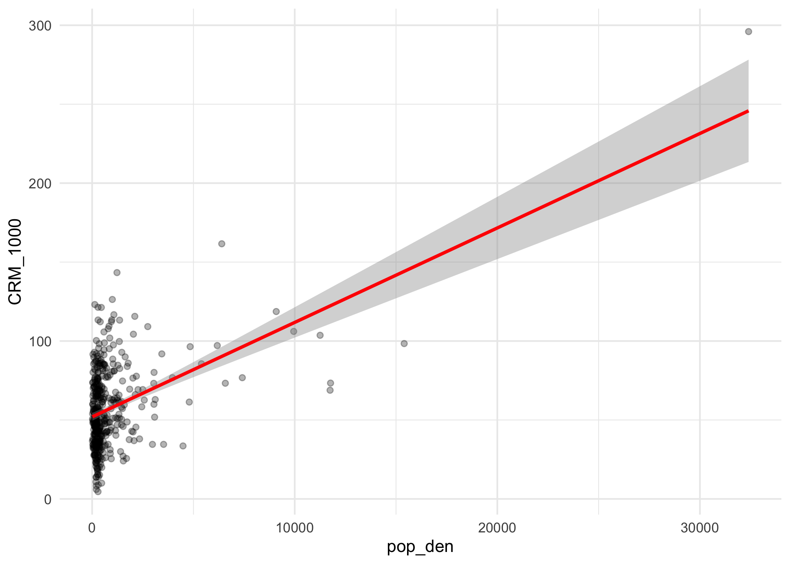
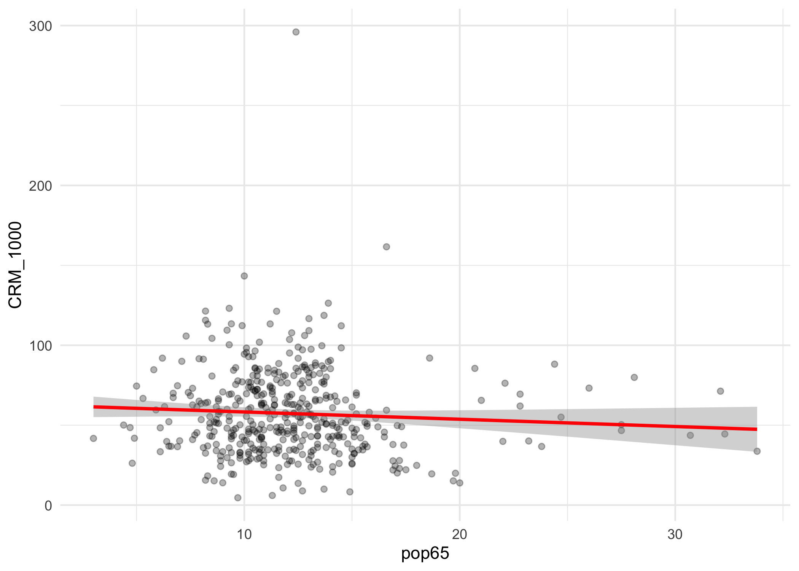
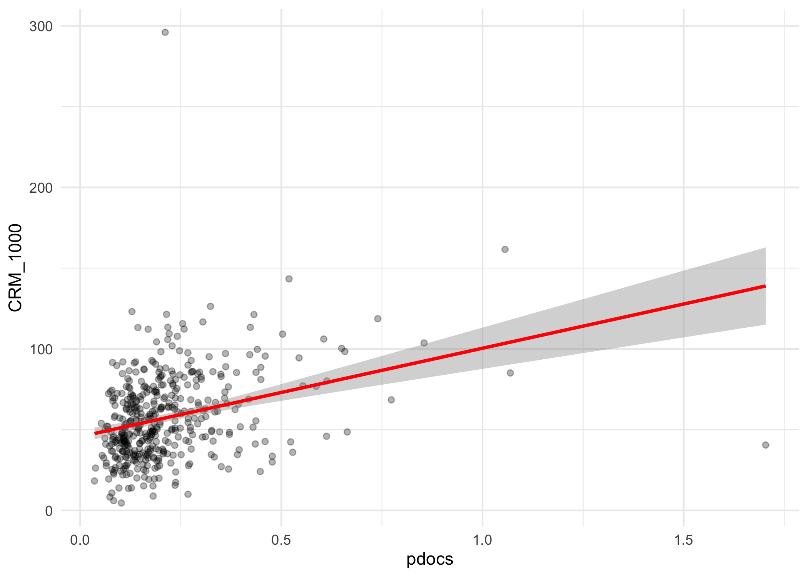
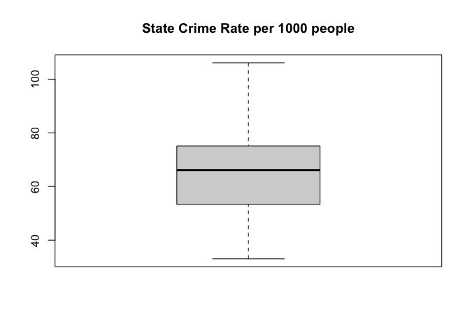
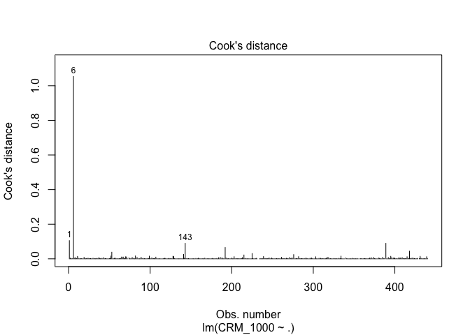

data\_exploration
================
Weiheng Zhang
2021/11/28

``` r
library(tidyverse)
library(lubridate)
library(dplyr)
library(leaflet)
library(corrplot)
library(MASS)
library(performance)
library(leaps)


theme_set(theme_minimal() + theme(legend.position = "bottom"))

options(
  ggplot2.continuous.colour = "viridis",
  ggplot2.continuous.fill = "viridis"
)

scale_colour_discrete = scale_color_viridis_d
scale_fill_discrete = scale_fill_viridis_d
```

## Data cleaning

``` r
cdi =
  read_csv("./data/cdi.csv") %>% 
  mutate(
    cty = as.factor(cty),
    state = as.factor(state),
    region = factor(region, levels = c("1", "2", "3", "4"),
                    labels = c("Northeast", "North_Central", "South", "West")),
    CRM_1000 = 1000*crimes/pop,
    pop_den = pop/area,
    pdocs = docs/pop,
    pbeds = beds/pop) %>%
  dplyr::select(-id, -area, -beds, -docs) %>%  # pop and crimes will be removed after detecting state outliers.
  relocate(CRM_1000)

cdi
```

    ## # A tibble: 440 × 17
    ##    CRM_1000 cty      state    pop pop18 pop65 crimes hsgrad bagrad poverty unemp
    ##       <dbl> <fct>    <fct>  <dbl> <dbl> <dbl>  <dbl>  <dbl>  <dbl>   <dbl> <dbl>
    ##  1     77.7 Los_Ange CA    8.86e6  32.1   9.7 688936   70     22.3    11.6   8  
    ##  2     85.6 Cook     IL    5.11e6  29.2  12.4 436936   73.4   22.8    11.1   7.2
    ##  3     90.0 Harris   TX    2.82e6  31.3   7.1 253526   74.9   25.4    12.5   5.7
    ##  4     69.6 San_Dieg CA    2.50e6  33.5  10.9 173821   81.9   25.3     8.1   6.1
    ##  5     60.0 Orange   CA    2.41e6  32.6   9.2 144524   81.2   27.8     5.2   4.8
    ##  6    296.  Kings    NY    2.30e6  28.3  12.4 680966   63.7   16.6    19.5   9.5
    ##  7     83.7 Maricopa AZ    2.12e6  29.2  12.5 177593   81.5   22.1     8.8   4.9
    ##  8     91.9 Wayne    MI    2.11e6  27.4  12.5 193978   70     13.7    16.9  10  
    ##  9    126.  Dade     FL    1.94e6  27.1  13.9 244725   65     18.8    14.2   8.7
    ## 10    116.  Dallas   TX    1.85e6  32.6   8.2 214258   77.1   26.3    10.4   6.1
    ## # … with 430 more rows, and 6 more variables: pcincome <dbl>, totalinc <dbl>,
    ## #   region <fct>, pop_den <dbl>, pdocs <dbl>, pbeds <dbl>

## Descriptive Statistics.

``` r
summary(cdi)
```

    ##     CRM_1000             cty          state          pop         
    ##  Min.   :  4.601   Jefferso:  7   CA     : 34   Min.   : 100043  
    ##  1st Qu.: 38.102   Montgome:  6   FL     : 29   1st Qu.: 139027  
    ##  Median : 52.429   Washingt:  5   PA     : 29   Median : 217280  
    ##  Mean   : 57.286   Cumberla:  4   TX     : 28   Mean   : 393011  
    ##  3rd Qu.: 72.597   Jackson :  4   OH     : 24   3rd Qu.: 436064  
    ##  Max.   :295.987   Lake    :  4   NY     : 22   Max.   :8863164  
    ##                    (Other) :410   (Other):274                    
    ##      pop18           pop65            crimes           hsgrad     
    ##  Min.   :16.40   Min.   : 3.000   Min.   :   563   Min.   :46.60  
    ##  1st Qu.:26.20   1st Qu.: 9.875   1st Qu.:  6220   1st Qu.:73.88  
    ##  Median :28.10   Median :11.750   Median : 11820   Median :77.70  
    ##  Mean   :28.57   Mean   :12.170   Mean   : 27112   Mean   :77.56  
    ##  3rd Qu.:30.02   3rd Qu.:13.625   3rd Qu.: 26280   3rd Qu.:82.40  
    ##  Max.   :49.70   Max.   :33.800   Max.   :688936   Max.   :92.90  
    ##                                                                   
    ##      bagrad         poverty           unemp           pcincome    
    ##  Min.   : 8.10   Min.   : 1.400   Min.   : 2.200   Min.   : 8899  
    ##  1st Qu.:15.28   1st Qu.: 5.300   1st Qu.: 5.100   1st Qu.:16118  
    ##  Median :19.70   Median : 7.900   Median : 6.200   Median :17759  
    ##  Mean   :21.08   Mean   : 8.721   Mean   : 6.597   Mean   :18561  
    ##  3rd Qu.:25.32   3rd Qu.:10.900   3rd Qu.: 7.500   3rd Qu.:20270  
    ##  Max.   :52.30   Max.   :36.300   Max.   :21.300   Max.   :37541  
    ##                                                                   
    ##     totalinc                region       pop_den             pdocs          
    ##  Min.   :  1141   Northeast    :103   Min.   :   13.26   Min.   :0.0003559  
    ##  1st Qu.:  2311   North_Central:108   1st Qu.:  192.34   1st Qu.:0.0012127  
    ##  Median :  3857   South        :152   Median :  335.91   Median :0.0017509  
    ##  Mean   :  7869   West         : 77   Mean   :  888.44   Mean   :0.0021230  
    ##  3rd Qu.:  8654                       3rd Qu.:  756.55   3rd Qu.:0.0024915  
    ##  Max.   :184230                       Max.   :32403.72   Max.   :0.0170377  
    ##                                                                             
    ##      pbeds          
    ##  Min.   :0.0001649  
    ##  1st Qu.:0.0021972  
    ##  Median :0.0033287  
    ##  Mean   :0.0036493  
    ##  3rd Qu.:0.0045649  
    ##  Max.   :0.0196982  
    ## 

``` r
sapply(cdi, function(x) sum(is.na(x)))
```

    ## CRM_1000      cty    state      pop    pop18    pop65   crimes   hsgrad 
    ##        0        0        0        0        0        0        0        0 
    ##   bagrad  poverty    unemp pcincome totalinc   region  pop_den    pdocs 
    ##        0        0        0        0        0        0        0        0 
    ##    pbeds 
    ##        0

``` r
map(cdi, ~sum(is.na(.)))
```

    ## $CRM_1000
    ## [1] 0
    ## 
    ## $cty
    ## [1] 0
    ## 
    ## $state
    ## [1] 0
    ## 
    ## $pop
    ## [1] 0
    ## 
    ## $pop18
    ## [1] 0
    ## 
    ## $pop65
    ## [1] 0
    ## 
    ## $crimes
    ## [1] 0
    ## 
    ## $hsgrad
    ## [1] 0
    ## 
    ## $bagrad
    ## [1] 0
    ## 
    ## $poverty
    ## [1] 0
    ## 
    ## $unemp
    ## [1] 0
    ## 
    ## $pcincome
    ## [1] 0
    ## 
    ## $totalinc
    ## [1] 0
    ## 
    ## $region
    ## [1] 0
    ## 
    ## $pop_den
    ## [1] 0
    ## 
    ## $pdocs
    ## [1] 0
    ## 
    ## $pbeds
    ## [1] 0

No missing values were found.

## Boxplot for each variable

``` r
par(mfrow = c(2, 3))
boxplot(cdi$CRM_1000, main = 'Crime Rate per 1000 people') # an obvious outlier around 300
boxplot(cdi$pop_den,main = 'Population Density')
boxplot(cdi$pop18, main = 'Percent of Population Aged 18-34')
boxplot(cdi$pop65, main = 'Percent of Population Aged 65+')
boxplot(cdi$pdocs, main = 'Per Capita Active Physicians')
boxplot(cdi$pbeds, main = 'Per Capita Hospital Beds')
```

<!-- -->

``` r
par(mfrow = c(2,3))
boxplot(cdi$hsgrad, main = 'Percent High School Graduates')
boxplot(cdi$bagrad, main = 'Percent Bachelor’s Degrees')
boxplot(cdi$poverty, main = 'Percent Below Poverty Level')
boxplot(cdi$unemp, main = 'Percent Unemployment')
boxplot(cdi$pcincome, main = 'Per Capita Income')
boxplot(cdi$totalinc, main = 'Total Personal Income')
```

<!-- -->

## Marginal correlation with CRM\_1000 of each variable

``` r
cdi %>% ggplot(aes(x = pop_den, y = CRM_1000)) + geom_point(alpha = 0.3) + geom_smooth(method = 'lm', se = TRUE, color = 'red')
```

<!-- -->

``` r
cdi %>% ggplot(aes(x = pop18, y = CRM_1000)) + geom_point(alpha = 0.3) + geom_smooth(method = 'lm', se = TRUE, color = 'red') # positive correlation
```

<!-- -->

``` r
cdi %>% ggplot(aes(x = pop65, y = CRM_1000)) + geom_point(alpha = 0.3) + geom_smooth(method = 'lm', se = TRUE, color = 'red')
```

<!-- -->

``` r
cdi %>% ggplot(aes(x = pdocs, y = CRM_1000)) + geom_point(alpha = 0.3) + geom_smooth(method = 'lm', se = TRUE, color = 'red')
```

<!-- -->

``` r
cdi %>% ggplot(aes(x = pbeds, y = CRM_1000)) + geom_point(alpha = 0.3) + geom_smooth(method = 'lm', se = TRUE, color = 'red')
```

<!-- -->

``` r
cdi %>% ggplot(aes(x = hsgrad, y = CRM_1000)) + geom_point(alpha = 0.3) + geom_smooth(method = 'lm', se = TRUE, color = 'red') #negative correlation
```

<!-- -->

``` r
cdi %>% ggplot(aes(x = bagrad, y = CRM_1000)) + geom_point(alpha = 0.3) + geom_smooth(method = 'lm', se = TRUE, color = 'red')
```

<!-- -->

``` r
cdi %>% ggplot(aes(x = poverty, y = CRM_1000)) + geom_point(alpha = 0.3) + geom_smooth(method = 'lm', se = TRUE, color = 'red') # positive correlation
```

<!-- -->

``` r
cdi %>% ggplot(aes(x = unemp, y = CRM_1000)) + geom_point(alpha = 0.3) + geom_smooth(method = 'lm', se = TRUE, color = 'red')
```

<!-- -->

``` r
cdi %>% ggplot(aes(x = pcincome, y = CRM_1000)) + geom_point(alpha = 0.3) + geom_smooth(method = 'lm', se = TRUE, color = 'red')
```

<!-- -->

``` r
cdi %>% ggplot(aes(x = totalinc, y = CRM_1000)) + geom_point(alpha = 0.3) + geom_smooth(method = 'lm', se = TRUE, color = 'red')
```

<!-- -->

``` r
cdi %>% ggplot(aes(x = region, y = CRM_1000)) + geom_point(alpha = 0.3) + geom_smooth(method = 'lm', se = TRUE, color = 'red')
```

<!-- -->

## Identify counties with unusual crime rates.

``` r
upper = quantile(cdi$CRM_1000, 0.75)
lower = quantile(cdi$CRM_1000, 0.25)
IQR = upper - lower

cdi %>% 
  filter(CRM_1000 > upper + 1.5*IQR,
         CRM_1000 > lower - 1.5*IQR) %>% 
  dplyr::select(cty, CRM_1000) %>%
  knitr::kable(digits = 2)
```

| cty       | CRM\_1000 |
|:----------|----------:|
| Kings     |    295.99 |
| Dade      |    126.34 |
| Fulton    |    143.35 |
| St.\_Loui |    161.60 |

## Group by states and check for outliers again.

``` r
cdi_state = 
  cdi %>% 
  group_by(state) %>% 
  summarise(state_pop = sum(pop),
            state_crimes = sum(crimes)) %>% 
  mutate(state_CRM_1000 = 1000*state_crimes/state_pop) %>% 
  relocate(state_CRM_1000)

cdi_state
```

    ## # A tibble: 48 × 4
    ##    state_CRM_1000 state state_pop state_crimes
    ##             <dbl> <fct>     <dbl>        <dbl>
    ##  1           71.6 AL      1844764       132007
    ##  2          105.  AR       463069        48526
    ##  3           80.2 AZ      3119969       250285
    ##  4           69.3 CA     28917875      2002790
    ##  5           65.8 CO      2625950       172695
    ##  6           50.9 CT      3287116       167208
    ##  7          106.  DC       606900        64393
    ##  8           60.7 DE       552939        33563
    ##  9           86.2 FL     11744171      1011989
    ## 10           93.0 GA      2913394       270900
    ## # … with 38 more rows

``` r
upper = quantile(cdi_state$state_CRM_1000, 0.75)
lower = quantile(cdi_state$state_CRM_1000, 0.25)
IQR = upper - lower

cdi_state %>% 
  filter(state_CRM_1000 > upper + 1.5*IQR,
         state_CRM_1000 > lower - 1.5*IQR) %>% 
  dplyr::select(state, state_CRM_1000) %>%
  knitr::kable(digits = 2)
```

| state | state\_CRM\_1000 |
|:------|-----------------:|

``` r
boxplot(cdi_state$state_CRM_1000, main = 'State Crime Rate per 1000 people')
```

<!-- -->

Surprisingly, if we look at the CRM\_1000 at state level, no outlier was
found.

## Remove Unnecessary Variables

``` r
cdi = 
  cdi %>% 
  dplyr::select(-pop, -crimes, -cty)
```

## Checking to Outliers and Influential Points

``` r
mult.fit1 = lm(CRM_1000 ~ ., data = cdi) 

# residuals vs leverage plot
plot(mult.fit1, which = 4)
```

<!-- -->

``` r
# remove influential points
cdiout = cdi[-c(6),]

# plot with and without influential points
plot(cdi$poverty, cdi$CRM_1000)
```

<!-- -->

``` r
plot(cdiout$poverty, cdiout$CRM_1000)
```

<!-- -->

``` r
# fit model with and without influential points
with = lm(CRM_1000 ~ ., data = cdi) 

without = lm(CRM_1000 ~ ., data = cdiout)

summary(with); summary(without) ##compare p values and r squared
```

    ## 
    ## Call:
    ## lm(formula = CRM_1000 ~ ., data = cdi)
    ## 
    ## Residuals:
    ##     Min      1Q  Median      3Q     Max 
    ## -48.599  -9.856  -0.416   9.458  62.448 
    ## 
    ## Coefficients: (3 not defined because of singularities)
    ##                       Estimate Std. Error t value Pr(>|t|)    
    ## (Intercept)         -4.720e+01  2.933e+01  -1.609 0.108409    
    ## stateAR              1.966e+01  1.338e+01   1.469 0.142587    
    ## stateAZ              1.026e+01  1.028e+01   0.998 0.318834    
    ## stateCA             -2.404e+00  7.587e+00  -0.317 0.751489    
    ## stateCO              7.856e+00  8.696e+00   0.903 0.366913    
    ## stateCT             -1.706e+01  9.262e+00  -1.842 0.066314 .  
    ## stateDC             -2.371e+01  1.838e+01  -1.289 0.198031    
    ## stateDE              3.238e+00  1.353e+01   0.239 0.810949    
    ## stateFL              1.970e+01  7.733e+00   2.548 0.011227 *  
    ## stateGA              1.595e+01  8.454e+00   1.886 0.060022 .  
    ## stateHI              1.476e+01  1.173e+01   1.258 0.208994    
    ## stateID             -3.649e+00  1.797e+01  -0.203 0.839153    
    ## stateIL             -1.270e+01  7.803e+00  -1.628 0.104432    
    ## stateIN             -1.710e+01  7.832e+00  -2.184 0.029586 *  
    ## stateKS              2.153e+01  1.062e+01   2.028 0.043234 *  
    ## stateKY             -1.338e+01  1.152e+01  -1.161 0.246413    
    ## stateLA             -4.184e+00  8.587e+00  -0.487 0.626366    
    ## stateMA             -2.724e+01  9.160e+00  -2.974 0.003126 ** 
    ## stateMD             -7.562e-01  8.687e+00  -0.087 0.930680    
    ## stateME             -1.604e+01  1.003e+01  -1.599 0.110669    
    ## stateMI             -3.209e+00  8.048e+00  -0.399 0.690277    
    ## stateMN             -1.789e+01  9.408e+00  -1.902 0.057949 .  
    ## stateMO             -7.457e+00  8.882e+00  -0.840 0.401656    
    ## stateMS             -4.061e+00  1.159e+01  -0.350 0.726163    
    ## stateMT             -2.463e+01  1.794e+01  -1.373 0.170490    
    ## stateNC              8.282e+00  7.643e+00   1.084 0.279201    
    ## stateND             -3.169e+01  1.797e+01  -1.764 0.078577 .  
    ## stateNE             -3.729e+00  1.176e+01  -0.317 0.751382    
    ## stateNH             -1.919e+01  1.089e+01  -1.762 0.078859 .  
    ## stateNJ             -1.388e+01  8.080e+00  -1.718 0.086620 .  
    ## stateNM              1.521e+01  1.364e+01   1.116 0.265233    
    ## stateNV              1.440e+01  1.365e+01   1.055 0.291938    
    ## stateNY             -1.578e+01  7.638e+00  -2.066 0.039474 *  
    ## stateOH             -1.741e+01  7.411e+00  -2.350 0.019296 *  
    ## stateOK              9.750e+00  1.061e+01   0.919 0.358781    
    ## stateOR              9.558e+00  9.748e+00   0.981 0.327419    
    ## statePA             -2.736e+01  7.374e+00  -3.710 0.000238 ***
    ## stateRI             -4.727e+00  1.197e+01  -0.395 0.693002    
    ## stateSC              1.691e+01  8.126e+00   2.081 0.038092 *  
    ## stateSD             -1.956e+01  1.798e+01  -1.088 0.277319    
    ## stateTN              1.234e+00  8.632e+00   0.143 0.886353    
    ## stateTX              1.460e+01  7.156e+00   2.040 0.042011 *  
    ## stateUT              6.852e-01  1.111e+01   0.062 0.950839    
    ## stateVA             -1.033e+01  8.843e+00  -1.168 0.243677    
    ## stateVT             -2.075e+01  1.813e+01  -1.145 0.252949    
    ## stateWA              5.525e+00  8.785e+00   0.629 0.529795    
    ## stateWI             -7.470e+00  8.386e+00  -0.891 0.373647    
    ## stateWV             -1.625e+01  1.780e+01  -0.913 0.361875    
    ## pop18                7.742e-01  3.448e-01   2.246 0.025308 *  
    ## pop65               -6.045e-01  3.594e-01  -1.682 0.093377 .  
    ## hsgrad               5.751e-01  2.967e-01   1.938 0.053347 .  
    ## bagrad              -5.174e-01  2.951e-01  -1.753 0.080414 .  
    ## poverty              1.666e+00  4.160e-01   4.003 7.50e-05 ***
    ## unemp                8.905e-01  6.578e-01   1.354 0.176590    
    ## pcincome             1.100e-03  5.319e-04   2.067 0.039384 *  
    ## totalinc             1.906e-04  7.366e-05   2.588 0.010015 *  
    ## regionNorth_Central         NA         NA      NA       NA    
    ## regionSouth                 NA         NA      NA       NA    
    ## regionWest                  NA         NA      NA       NA    
    ## pop_den              5.373e-03  4.450e-04  12.074  < 2e-16 ***
    ## pdocs               -8.185e+02  1.060e+03  -0.773 0.440288    
    ## pbeds                3.948e+03  8.560e+02   4.612 5.45e-06 ***
    ## ---
    ## Signif. codes:  0 '***' 0.001 '**' 0.01 '*' 0.05 '.' 0.1 ' ' 1
    ## 
    ## Residual standard error: 16.58 on 381 degrees of freedom
    ## Multiple R-squared:  0.6805, Adjusted R-squared:  0.6319 
    ## F-statistic: 13.99 on 58 and 381 DF,  p-value: < 2.2e-16

    ## 
    ## Call:
    ## lm(formula = CRM_1000 ~ ., data = cdiout)
    ## 
    ## Residuals:
    ##     Min      1Q  Median      3Q     Max 
    ## -40.289  -9.093  -0.302   9.194  54.618 
    ## 
    ## Coefficients: (3 not defined because of singularities)
    ##                       Estimate Std. Error t value Pr(>|t|)    
    ## (Intercept)         -5.651e+01  2.793e+01  -2.023 0.043788 *  
    ## stateAR              1.909e+01  1.273e+01   1.500 0.134424    
    ## stateAZ              1.239e+01  9.781e+00   1.267 0.205964    
    ## stateCA             -1.184e+00  7.218e+00  -0.164 0.869780    
    ## stateCO              1.075e+01  8.283e+00   1.297 0.195317    
    ## stateCT             -1.832e+01  8.811e+00  -2.079 0.038260 *  
    ## stateDC             -7.126e-01  1.785e+01  -0.040 0.968174    
    ## stateDE              4.141e+00  1.287e+01   0.322 0.747704    
    ## stateFL              2.044e+01  7.355e+00   2.779 0.005719 ** 
    ## stateGA              1.740e+01  8.044e+00   2.163 0.031160 *  
    ## stateHI              1.643e+01  1.116e+01   1.472 0.141737    
    ## stateID             -6.269e-01  1.709e+01  -0.037 0.970762    
    ## stateIL             -1.109e+01  7.426e+00  -1.493 0.136284    
    ## stateIN             -1.602e+01  7.451e+00  -2.151 0.032122 *  
    ## stateKS              2.302e+01  1.010e+01   2.280 0.023180 *  
    ## stateKY             -1.268e+01  1.096e+01  -1.157 0.247969    
    ## stateLA             -2.400e+00  8.172e+00  -0.294 0.769163    
    ## stateMA             -2.469e+01  8.720e+00  -2.832 0.004875 ** 
    ## stateMD              2.447e+00  8.277e+00   0.296 0.767660    
    ## stateME             -1.534e+01  9.540e+00  -1.608 0.108706    
    ## stateMI             -1.559e+00  7.658e+00  -0.204 0.838823    
    ## stateMN             -1.625e+01  8.951e+00  -1.815 0.070264 .  
    ## stateMO             -5.272e+00  8.454e+00  -0.624 0.533229    
    ## stateMS             -2.610e+00  1.102e+01  -0.237 0.812931    
    ## stateMT             -2.240e+01  1.706e+01  -1.312 0.190188    
    ## stateNC              7.860e+00  7.269e+00   1.081 0.280233    
    ## stateND             -3.164e+01  1.709e+01  -1.852 0.064846 .  
    ## stateNE             -4.080e-03  1.120e+01   0.000 0.999710    
    ## stateNH             -1.860e+01  1.036e+01  -1.795 0.073405 .  
    ## stateNJ             -1.083e+01  7.699e+00  -1.407 0.160197    
    ## stateNM              1.734e+01  1.297e+01   1.337 0.182143    
    ## stateNV              1.294e+01  1.298e+01   0.997 0.319451    
    ## stateNY             -1.806e+01  7.273e+00  -2.484 0.013431 *  
    ## stateOH             -1.483e+01  7.060e+00  -2.100 0.036399 *  
    ## stateOK              1.240e+01  1.010e+01   1.228 0.220249    
    ## stateOR              1.279e+01  9.284e+00   1.378 0.169090    
    ## statePA             -2.537e+01  7.020e+00  -3.614 0.000342 ***
    ## stateRI             -3.457e+00  1.138e+01  -0.304 0.761491    
    ## stateSC              1.699e+01  7.728e+00   2.198 0.028555 *  
    ## stateSD             -2.036e+01  1.710e+01  -1.190 0.234693    
    ## stateTN              1.525e+00  8.209e+00   0.186 0.852721    
    ## stateTX              1.592e+01  6.809e+00   2.338 0.019919 *  
    ## stateUT              7.587e+00  1.062e+01   0.715 0.475292    
    ## stateVA             -2.377e+00  8.501e+00  -0.280 0.779942    
    ## stateVT             -2.290e+01  1.724e+01  -1.328 0.184887    
    ## stateWA              8.498e+00  8.367e+00   1.016 0.310447    
    ## stateWI             -5.414e+00  7.982e+00  -0.678 0.498005    
    ## stateWV             -1.648e+01  1.693e+01  -0.973 0.331065    
    ## pop18                1.185e+00  3.341e-01   3.546 0.000440 ***
    ## pop65               -4.236e-01  3.429e-01  -1.235 0.217474    
    ## hsgrad               3.805e-01  2.838e-01   1.341 0.180817    
    ## bagrad              -6.454e-01  2.814e-01  -2.294 0.022359 *  
    ## poverty              1.704e+00  3.957e-01   4.305 2.13e-05 ***
    ## unemp                8.212e-01  6.257e-01   1.313 0.190124    
    ## pcincome             1.746e-03  5.158e-04   3.385 0.000785 ***
    ## totalinc             2.212e-04  7.021e-05   3.150 0.001762 ** 
    ## regionNorth_Central         NA         NA      NA       NA    
    ## regionSouth                 NA         NA      NA       NA    
    ## regionWest                  NA         NA      NA       NA    
    ## pop_den              2.125e-03  6.596e-04   3.222 0.001385 ** 
    ## pdocs               -7.029e+01  1.014e+03  -0.069 0.944792    
    ## pbeds                4.064e+03  8.143e+02   4.990 9.20e-07 ***
    ## ---
    ## Signif. codes:  0 '***' 0.001 '**' 0.01 '*' 0.05 '.' 0.1 ' ' 1
    ## 
    ## Residual standard error: 15.77 on 380 degrees of freedom
    ## Multiple R-squared:  0.651,  Adjusted R-squared:  0.5977 
    ## F-statistic: 12.22 on 58 and 380 DF,  p-value: < 2.2e-16

## Check for transformation

``` r
# fit multivariate model
mult.fit1 = lm(CRM_1000 ~ ., data = cdiout) 
summary(mult.fit1)
```

    ## 
    ## Call:
    ## lm(formula = CRM_1000 ~ ., data = cdiout)
    ## 
    ## Residuals:
    ##     Min      1Q  Median      3Q     Max 
    ## -40.289  -9.093  -0.302   9.194  54.618 
    ## 
    ## Coefficients: (3 not defined because of singularities)
    ##                       Estimate Std. Error t value Pr(>|t|)    
    ## (Intercept)         -5.651e+01  2.793e+01  -2.023 0.043788 *  
    ## stateAR              1.909e+01  1.273e+01   1.500 0.134424    
    ## stateAZ              1.239e+01  9.781e+00   1.267 0.205964    
    ## stateCA             -1.184e+00  7.218e+00  -0.164 0.869780    
    ## stateCO              1.075e+01  8.283e+00   1.297 0.195317    
    ## stateCT             -1.832e+01  8.811e+00  -2.079 0.038260 *  
    ## stateDC             -7.126e-01  1.785e+01  -0.040 0.968174    
    ## stateDE              4.141e+00  1.287e+01   0.322 0.747704    
    ## stateFL              2.044e+01  7.355e+00   2.779 0.005719 ** 
    ## stateGA              1.740e+01  8.044e+00   2.163 0.031160 *  
    ## stateHI              1.643e+01  1.116e+01   1.472 0.141737    
    ## stateID             -6.269e-01  1.709e+01  -0.037 0.970762    
    ## stateIL             -1.109e+01  7.426e+00  -1.493 0.136284    
    ## stateIN             -1.602e+01  7.451e+00  -2.151 0.032122 *  
    ## stateKS              2.302e+01  1.010e+01   2.280 0.023180 *  
    ## stateKY             -1.268e+01  1.096e+01  -1.157 0.247969    
    ## stateLA             -2.400e+00  8.172e+00  -0.294 0.769163    
    ## stateMA             -2.469e+01  8.720e+00  -2.832 0.004875 ** 
    ## stateMD              2.447e+00  8.277e+00   0.296 0.767660    
    ## stateME             -1.534e+01  9.540e+00  -1.608 0.108706    
    ## stateMI             -1.559e+00  7.658e+00  -0.204 0.838823    
    ## stateMN             -1.625e+01  8.951e+00  -1.815 0.070264 .  
    ## stateMO             -5.272e+00  8.454e+00  -0.624 0.533229    
    ## stateMS             -2.610e+00  1.102e+01  -0.237 0.812931    
    ## stateMT             -2.240e+01  1.706e+01  -1.312 0.190188    
    ## stateNC              7.860e+00  7.269e+00   1.081 0.280233    
    ## stateND             -3.164e+01  1.709e+01  -1.852 0.064846 .  
    ## stateNE             -4.080e-03  1.120e+01   0.000 0.999710    
    ## stateNH             -1.860e+01  1.036e+01  -1.795 0.073405 .  
    ## stateNJ             -1.083e+01  7.699e+00  -1.407 0.160197    
    ## stateNM              1.734e+01  1.297e+01   1.337 0.182143    
    ## stateNV              1.294e+01  1.298e+01   0.997 0.319451    
    ## stateNY             -1.806e+01  7.273e+00  -2.484 0.013431 *  
    ## stateOH             -1.483e+01  7.060e+00  -2.100 0.036399 *  
    ## stateOK              1.240e+01  1.010e+01   1.228 0.220249    
    ## stateOR              1.279e+01  9.284e+00   1.378 0.169090    
    ## statePA             -2.537e+01  7.020e+00  -3.614 0.000342 ***
    ## stateRI             -3.457e+00  1.138e+01  -0.304 0.761491    
    ## stateSC              1.699e+01  7.728e+00   2.198 0.028555 *  
    ## stateSD             -2.036e+01  1.710e+01  -1.190 0.234693    
    ## stateTN              1.525e+00  8.209e+00   0.186 0.852721    
    ## stateTX              1.592e+01  6.809e+00   2.338 0.019919 *  
    ## stateUT              7.587e+00  1.062e+01   0.715 0.475292    
    ## stateVA             -2.377e+00  8.501e+00  -0.280 0.779942    
    ## stateVT             -2.290e+01  1.724e+01  -1.328 0.184887    
    ## stateWA              8.498e+00  8.367e+00   1.016 0.310447    
    ## stateWI             -5.414e+00  7.982e+00  -0.678 0.498005    
    ## stateWV             -1.648e+01  1.693e+01  -0.973 0.331065    
    ## pop18                1.185e+00  3.341e-01   3.546 0.000440 ***
    ## pop65               -4.236e-01  3.429e-01  -1.235 0.217474    
    ## hsgrad               3.805e-01  2.838e-01   1.341 0.180817    
    ## bagrad              -6.454e-01  2.814e-01  -2.294 0.022359 *  
    ## poverty              1.704e+00  3.957e-01   4.305 2.13e-05 ***
    ## unemp                8.212e-01  6.257e-01   1.313 0.190124    
    ## pcincome             1.746e-03  5.158e-04   3.385 0.000785 ***
    ## totalinc             2.212e-04  7.021e-05   3.150 0.001762 ** 
    ## regionNorth_Central         NA         NA      NA       NA    
    ## regionSouth                 NA         NA      NA       NA    
    ## regionWest                  NA         NA      NA       NA    
    ## pop_den              2.125e-03  6.596e-04   3.222 0.001385 ** 
    ## pdocs               -7.029e+01  1.014e+03  -0.069 0.944792    
    ## pbeds                4.064e+03  8.143e+02   4.990 9.20e-07 ***
    ## ---
    ## Signif. codes:  0 '***' 0.001 '**' 0.01 '*' 0.05 '.' 0.1 ' ' 1
    ## 
    ## Residual standard error: 15.77 on 380 degrees of freedom
    ## Multiple R-squared:  0.651,  Adjusted R-squared:  0.5977 
    ## F-statistic: 12.22 on 58 and 380 DF,  p-value: < 2.2e-16

``` r
boxcox(mult.fit1)
```

<!-- -->

## a is close to 1/2. Perform sqrt transformation.

``` r
cdi_sqrt = 
  cdiout %>% 
  mutate(sqrt_CRM_1000 = sqrt(CRM_1000)) %>% 
  dplyr::select(-CRM_1000) %>% 
  relocate(sqrt_CRM_1000)

cdi_sqrt
```

    ## # A tibble: 439 × 14
    ##    sqrt_CRM_1000 state pop18 pop65 hsgrad bagrad poverty unemp pcincome totalinc
    ##            <dbl> <fct> <dbl> <dbl>  <dbl>  <dbl>   <dbl> <dbl>    <dbl>    <dbl>
    ##  1          8.82 CA     32.1   9.7   70     22.3    11.6   8      20786   184230
    ##  2          9.25 IL     29.2  12.4   73.4   22.8    11.1   7.2    21729   110928
    ##  3          9.48 TX     31.3   7.1   74.9   25.4    12.5   5.7    19517    55003
    ##  4          8.34 CA     33.5  10.9   81.9   25.3     8.1   6.1    19588    48931
    ##  5          7.74 CA     32.6   9.2   81.2   27.8     5.2   4.8    24400    58818
    ##  6          9.15 AZ     29.2  12.5   81.5   22.1     8.8   4.9    18042    38287
    ##  7          9.58 MI     27.4  12.5   70     13.7    16.9  10      17461    36872
    ##  8         11.2  FL     27.1  13.9   65     18.8    14.2   8.7    17823    34525
    ##  9         10.8  TX     32.6   8.2   77.1   26.3    10.4   6.1    21001    38911
    ## 10          8.30 PA     29.1  15.2   64.3   15.2    16.1   8      16721    26512
    ## # … with 429 more rows, and 4 more variables: region <fct>, pop_den <dbl>,
    ## #   pdocs <dbl>, pbeds <dbl>

``` r
mult.fit2 = lm(sqrt_CRM_1000 ~ ., data = cdi_sqrt) 

summary(mult.fit2) ##region returned NA, why?
```

    ## 
    ## Call:
    ## lm(formula = sqrt_CRM_1000 ~ ., data = cdi_sqrt)
    ## 
    ## Residuals:
    ##     Min      1Q  Median      3Q     Max 
    ## -3.5895 -0.5960  0.0000  0.6825  3.1749 
    ## 
    ## Coefficients: (3 not defined because of singularities)
    ##                       Estimate Std. Error t value Pr(>|t|)    
    ## (Intercept)         -7.751e-02  1.901e+00  -0.041 0.967498    
    ## stateAR              1.038e+00  8.660e-01   1.199 0.231273    
    ## stateAZ              8.428e-01  6.657e-01   1.266 0.206247    
    ## stateCA              3.459e-03  4.912e-01   0.007 0.994385    
    ## stateCO              8.345e-01  5.637e-01   1.480 0.139597    
    ## stateCT             -1.524e+00  5.996e-01  -2.541 0.011436 *  
    ## stateDC             -3.045e-01  1.215e+00  -0.251 0.802170    
    ## stateDE              4.005e-01  8.756e-01   0.457 0.647648    
    ## stateFL              1.248e+00  5.006e-01   2.493 0.013081 *  
    ## stateGA              1.036e+00  5.474e-01   1.892 0.059287 .  
    ## stateHI              1.208e+00  7.593e-01   1.591 0.112542    
    ## stateID              7.840e-02  1.163e+00   0.067 0.946303    
    ## stateIL             -7.056e-01  5.054e-01  -1.396 0.163459    
    ## stateIN             -1.210e+00  5.071e-01  -2.387 0.017475 *  
    ## stateKS              1.408e+00  6.874e-01   2.049 0.041179 *  
    ## stateKY             -7.065e-01  7.460e-01  -0.947 0.344187    
    ## stateLA             -1.875e-01  5.561e-01  -0.337 0.736149    
    ## stateMA             -1.877e+00  5.935e-01  -3.163 0.001689 ** 
    ## stateMD              1.509e-01  5.633e-01   0.268 0.788933    
    ## stateME             -1.008e+00  6.493e-01  -1.553 0.121184    
    ## stateMI             -1.406e-02  5.212e-01  -0.027 0.978491    
    ## stateMN             -9.763e-01  6.092e-01  -1.603 0.109864    
    ## stateMO             -5.616e-01  5.753e-01  -0.976 0.329626    
    ## stateMS             -2.257e-01  7.501e-01  -0.301 0.763676    
    ## stateMT             -1.505e+00  1.161e+00  -1.295 0.195943    
    ## stateNC              5.212e-01  4.947e-01   1.054 0.292773    
    ## stateND             -2.134e+00  1.163e+00  -1.835 0.067308 .  
    ## stateNE             -6.975e-03  7.623e-01  -0.009 0.992704    
    ## stateNH             -1.347e+00  7.051e-01  -1.911 0.056802 .  
    ## stateNJ             -7.910e-01  5.240e-01  -1.510 0.131982    
    ## stateNM              1.231e+00  8.828e-01   1.394 0.163999    
    ## stateNV              9.489e-01  8.833e-01   1.074 0.283381    
    ## stateNY             -1.224e+00  4.950e-01  -2.472 0.013856 *  
    ## stateOH             -1.226e+00  4.805e-01  -2.552 0.011102 *  
    ## stateOK              8.731e-01  6.874e-01   1.270 0.204825    
    ## stateOR              8.963e-01  6.318e-01   1.419 0.156861    
    ## statePA             -1.945e+00  4.778e-01  -4.071 5.69e-05 ***
    ## stateRI             -2.106e-01  7.746e-01  -0.272 0.785855    
    ## stateSC              1.180e+00  5.259e-01   2.243 0.025475 *  
    ## stateSD             -1.230e+00  1.164e+00  -1.057 0.291186    
    ## stateTN              1.490e-01  5.587e-01   0.267 0.789819    
    ## stateTX              1.012e+00  4.634e-01   2.183 0.029615 *  
    ## stateUT              5.793e-01  7.226e-01   0.802 0.423209    
    ## stateVA             -8.112e-02  5.785e-01  -0.140 0.888557    
    ## stateVT             -1.476e+00  1.173e+00  -1.258 0.209132    
    ## stateWA              6.679e-01  5.694e-01   1.173 0.241608    
    ## stateWI             -3.132e-01  5.432e-01  -0.576 0.564651    
    ## stateWV             -9.533e-01  1.152e+00  -0.827 0.408623    
    ## pop18                8.178e-02  2.274e-02   3.597 0.000364 ***
    ## pop65               -1.707e-02  2.334e-02  -0.731 0.465033    
    ## hsgrad               2.242e-02  1.932e-02   1.160 0.246579    
    ## bagrad              -3.975e-02  1.915e-02  -2.076 0.038573 *  
    ## poverty              1.077e-01  2.693e-02   4.000 7.62e-05 ***
    ## unemp                5.195e-02  4.258e-02   1.220 0.223221    
    ## pcincome             1.162e-04  3.510e-05   3.311 0.001018 ** 
    ## totalinc             1.485e-05  4.778e-06   3.108 0.002027 ** 
    ## regionNorth_Central         NA         NA      NA       NA    
    ## regionSouth                 NA         NA      NA       NA    
    ## regionWest                  NA         NA      NA       NA    
    ## pop_den              1.351e-04  4.489e-05   3.010 0.002784 ** 
    ## pdocs               -2.809e+01  6.904e+01  -0.407 0.684362    
    ## pbeds                2.671e+02  5.542e+01   4.819 2.09e-06 ***
    ## ---
    ## Signif. codes:  0 '***' 0.001 '**' 0.01 '*' 0.05 '.' 0.1 ' ' 1
    ## 
    ## Residual standard error: 1.073 on 380 degrees of freedom
    ## Multiple R-squared:  0.6438, Adjusted R-squared:  0.5894 
    ## F-statistic: 11.84 on 58 and 380 DF,  p-value: < 2.2e-16

``` r
boxcox(mult.fit2) 
```

<!-- -->

## check for multicollinearity

``` r
cdi_cor = 
  cdi_sqrt %>%
  mutate(
    state = as.numeric(state),
    region = as.numeric(region)
  ) %>% 
  dplyr::select(-sqrt_CRM_1000)

pairs(cdi_cor)
```

<!-- -->

``` r
# Correlation matrix for all variables
cor(cdi_cor) %>% 
  knitr::kable()
```

|          |      state |      pop18 |      pop65 |     hsgrad |     bagrad |    poverty |      unemp |   pcincome |   totalinc |     region |   pop\_den |      pdocs |      pbeds |
|:---------|-----------:|-----------:|-----------:|-----------:|-----------:|-----------:|-----------:|-----------:|-----------:|-----------:|-----------:|-----------:|-----------:|
| state    |  1.0000000 |  0.0458336 | -0.1390971 | -0.0083831 | -0.0477500 |  0.0047524 | -0.1390343 | -0.1103026 | -0.1258578 | -0.2562575 |  0.0089099 | -0.0488717 | -0.0224824 |
| pop18    |  0.0458336 |  1.0000000 | -0.6163064 |  0.2514195 |  0.4561921 |  0.0345260 | -0.2788381 | -0.0317187 |  0.0719820 |  0.0523271 |  0.1753505 |  0.2370282 |  0.0295423 |
| pop65    | -0.1390971 | -0.6163064 |  1.0000000 | -0.2691950 | -0.3392857 |  0.0063125 |  0.2365637 |  0.0186518 | -0.0231996 | -0.1735022 |  0.0375186 |  0.0186097 |  0.2471372 |
| hsgrad   | -0.0083831 |  0.2514195 | -0.2691950 |  1.0000000 |  0.7085868 | -0.6885900 | -0.5916743 |  0.5234917 |  0.0547361 | -0.0165421 | -0.0541694 |  0.1433871 | -0.2115757 |
| bagrad   | -0.0477500 |  0.4561921 | -0.3392857 |  0.7085868 |  1.0000000 | -0.4079919 | -0.5404104 |  0.6952038 |  0.2269968 |  0.0184593 |  0.2403729 |  0.4412101 | -0.0452782 |
| poverty  |  0.0047524 |  0.0345260 |  0.0063125 | -0.6885900 | -0.4079919 |  1.0000000 |  0.4338054 | -0.6032654 | -0.0520255 |  0.2808142 |  0.0700113 |  0.0641332 |  0.3730669 |
| unemp    | -0.1390343 | -0.2788381 |  0.2365637 | -0.5916743 | -0.5404104 |  0.4338054 |  1.0000000 | -0.3215515 | -0.0409915 | -0.0505757 | -0.0247810 | -0.2483054 | -0.0629361 |
| pcincome | -0.1103026 | -0.0317187 |  0.0186518 |  0.5234917 |  0.6952038 | -0.6032654 | -0.3215515 |  1.0000000 |  0.3524250 | -0.2244520 |  0.3401884 |  0.3601164 | -0.0534450 |
| totalinc | -0.1258578 |  0.0719820 | -0.0231996 |  0.0547361 |  0.2269968 | -0.0520255 | -0.0409915 |  0.3524250 |  1.0000000 |  0.0457996 |  0.3291187 |  0.2004509 |  0.0057142 |
| region   | -0.2562575 |  0.0523271 | -0.1735022 | -0.0165421 |  0.0184593 |  0.2808142 | -0.0505757 | -0.2244520 |  0.0457996 |  1.0000000 | -0.0947031 | -0.0400175 | -0.1135005 |
| pop\_den |  0.0089099 |  0.1753505 |  0.0375186 | -0.0541694 |  0.2403729 |  0.0700113 | -0.0247810 |  0.3401884 |  0.3291187 | -0.0947031 |  1.0000000 |  0.4374799 |  0.2784009 |
| pdocs    | -0.0488717 |  0.2370282 |  0.0186097 |  0.1433871 |  0.4412101 |  0.0641332 | -0.2483054 |  0.3601164 |  0.2004509 | -0.0400175 |  0.4374799 |  1.0000000 |  0.6667072 |
| pbeds    | -0.0224824 |  0.0295423 |  0.2471372 | -0.2115757 | -0.0452782 |  0.3730669 | -0.0629361 | -0.0534450 |  0.0057142 | -0.1135005 |  0.2784009 |  0.6667072 |  1.0000000 |

``` r
corrplot(cor(cdi_cor), type = "upper", diag = FALSE)
```

<!-- -->

``` r
corrplot(cor(cdi_cor), 
         method = "color", 
         type = "upper", ## order = "hclust",
         addCoef.col = "black", 
         number.cex = 0.6,
         diag = FALSE) 
```

<!-- -->

## Model Selection

Fit a linear model after removing highly correlated variables.

``` r
new_cdi =
  cdi_sqrt %>% 
  mutate(
    state = as.factor(state),
    region = as.factor(region)) %>% 
  dplyr::select(-bagrad, -pdocs, -totalinc)

mult.fit = lm(sqrt_CRM_1000 ~ ., data = new_cdi)
summary(mult.fit)
```

    ## 
    ## Call:
    ## lm(formula = sqrt_CRM_1000 ~ ., data = new_cdi)
    ## 
    ## Residuals:
    ##     Min      1Q  Median      3Q     Max 
    ## -3.5387 -0.6564  0.0000  0.6710  3.4132 
    ## 
    ## Coefficients: (3 not defined because of singularities)
    ##                       Estimate Std. Error t value Pr(>|t|)    
    ## (Intercept)          2.538e+00  1.623e+00   1.564 0.118704    
    ## stateAR              1.062e+00  8.807e-01   1.206 0.228674    
    ## stateAZ              9.548e-01  6.636e-01   1.439 0.151039    
    ## stateCA              2.460e-01  4.879e-01   0.504 0.614482    
    ## stateCO              8.822e-01  5.693e-01   1.550 0.122059    
    ## stateCT             -1.429e+00  6.021e-01  -2.373 0.018140 *  
    ## stateDC             -6.713e-01  1.231e+00  -0.545 0.585930    
    ## stateDE              4.967e-01  8.860e-01   0.561 0.575422    
    ## stateFL              1.359e+00  5.034e-01   2.700 0.007237 ** 
    ## stateGA              1.112e+00  5.541e-01   2.007 0.045412 *  
    ## stateHI              1.309e+00  7.649e-01   1.711 0.087845 .  
    ## stateID              2.043e-01  1.181e+00   0.173 0.862719    
    ## stateIL             -4.534e-01  5.089e-01  -0.891 0.373521    
    ## stateIN             -1.093e+00  5.130e-01  -2.130 0.033795 *  
    ## stateKS              1.516e+00  6.942e-01   2.184 0.029555 *  
    ## stateKY             -6.585e-01  7.573e-01  -0.870 0.385086    
    ## stateLA             -1.319e-01  5.648e-01  -0.233 0.815507    
    ## stateMA             -1.786e+00  5.957e-01  -2.998 0.002893 ** 
    ## stateMD              1.486e-01  5.628e-01   0.264 0.791966    
    ## stateME             -8.909e-01  6.570e-01  -1.356 0.175922    
    ## stateMI              2.379e-01  5.198e-01   0.458 0.647385    
    ## stateMN             -8.472e-01  6.055e-01  -1.399 0.162593    
    ## stateMO             -4.186e-01  5.833e-01  -0.718 0.473413    
    ## stateMS             -1.747e-01  7.618e-01  -0.229 0.818769    
    ## stateMT             -1.379e+00  1.180e+00  -1.169 0.243269    
    ## stateNC              5.102e-01  4.955e-01   1.030 0.303803    
    ## stateND             -2.014e+00  1.182e+00  -1.704 0.089204 .  
    ## stateNE              1.421e-01  7.734e-01   0.184 0.854337    
    ## stateNH             -1.262e+00  7.149e-01  -1.765 0.078301 .  
    ## stateNJ             -7.161e-01  5.271e-01  -1.359 0.175078    
    ## stateNM              1.149e+00  8.912e-01   1.290 0.197975    
    ## stateNV              1.354e+00  8.803e-01   1.538 0.124856    
    ## stateNY             -1.085e+00  4.962e-01  -2.187 0.029324 *  
    ## stateOH             -1.035e+00  4.803e-01  -2.155 0.031808 *  
    ## stateOK              1.025e+00  6.969e-01   1.471 0.142136    
    ## stateOR              9.748e-01  6.328e-01   1.541 0.124262    
    ## statePA             -1.835e+00  4.813e-01  -3.814 0.000159 ***
    ## stateRI             -2.992e-01  7.833e-01  -0.382 0.702709    
    ## stateSC              1.124e+00  5.325e-01   2.111 0.035382 *  
    ## stateSD             -1.029e+00  1.181e+00  -0.872 0.383894    
    ## stateTN              1.916e-01  5.671e-01   0.338 0.735661    
    ## stateTX              1.055e+00  4.702e-01   2.245 0.025346 *  
    ## stateUT              6.566e-01  7.278e-01   0.902 0.367539    
    ## stateVA             -1.260e-01  5.849e-01  -0.215 0.829549    
    ## stateVT             -1.642e+00  1.180e+00  -1.392 0.164822    
    ## stateWA              8.674e-01  5.678e-01   1.528 0.127378    
    ## stateWI             -1.252e-01  5.415e-01  -0.231 0.817244    
    ## stateWV             -9.321e-01  1.172e+00  -0.795 0.426879    
    ## pop18                6.276e-02  2.024e-02   3.101 0.002073 ** 
    ## pop65               -1.727e-02  2.357e-02  -0.733 0.464309    
    ## hsgrad              -5.641e-03  1.721e-02  -0.328 0.743320    
    ## poverty              9.091e-02  2.561e-02   3.549 0.000434 ***
    ## unemp                5.176e-02  4.252e-02   1.217 0.224296    
    ## pcincome             8.428e-05  2.393e-05   3.522 0.000480 ***
    ## regionNorth_Central         NA         NA      NA       NA    
    ## regionSouth                 NA         NA      NA       NA    
    ## regionWest                  NA         NA      NA       NA    
    ## pop_den              1.625e-04  4.453e-05   3.650 0.000299 ***
    ## pbeds                2.485e+02  3.909e+01   6.356 5.88e-10 ***
    ## ---
    ## Signif. codes:  0 '***' 0.001 '**' 0.01 '*' 0.05 '.' 0.1 ' ' 1
    ## 
    ## Residual standard error: 1.091 on 383 degrees of freedom
    ## Multiple R-squared:  0.6286, Adjusted R-squared:  0.5753 
    ## F-statistic: 11.79 on 55 and 383 DF,  p-value: < 2.2e-16

``` r
#不确定是否加interaction
#mult.fit_inter = lm(sqrt_CRM_1000 ~ state + pop18 + grad + pcincome + hsgrad + pop65 + bagrad + #poverty + unemp + totalinc + region + pop_den + pbeds + hsgrad*bagrad + hsgrad*poverty + #pop18*pop65 + bagrad*pcincome + pbeds*pdocs, data = new_cdi)
#summary(mult.fit_new)
```

Fit a linear model with interactions terms

``` r
mult.fit_inter = lm(sqrt_CRM_1000 ~ state + pop18 + pop65 + hsgrad + poverty + unemp + pcincome + region + pop_den + pbeds + pop65 * region + poverty * region + pcincome * region, data = new_cdi)
summary(mult.fit_inter)
```

    ## 
    ## Call:
    ## lm(formula = sqrt_CRM_1000 ~ state + pop18 + pop65 + hsgrad + 
    ##     poverty + unemp + pcincome + region + pop_den + pbeds + pop65 * 
    ##     region + poverty * region + pcincome * region, data = new_cdi)
    ## 
    ## Residuals:
    ##     Min      1Q  Median      3Q     Max 
    ## -3.6958 -0.6257 -0.0121  0.6979  3.3319 
    ## 
    ## Coefficients: (3 not defined because of singularities)
    ##                                Estimate Std. Error t value Pr(>|t|)    
    ## (Intercept)                   2.715e+00  1.668e+00   1.627  0.10452    
    ## stateAR                       1.101e+00  8.742e-01   1.260  0.20846    
    ## stateAZ                       3.530e+00  1.683e+00   2.097  0.03664 *  
    ## stateCA                       2.781e+00  1.609e+00   1.729  0.08470 .  
    ## stateCO                       3.223e+00  1.551e+00   2.079  0.03832 *  
    ## stateCT                      -1.393e+00  1.461e+00  -0.953  0.34118    
    ## stateDC                      -8.244e-01  1.252e+00  -0.659  0.51056    
    ## stateDE                       5.276e-01  1.516e+00   0.348  0.72811    
    ## stateFL                       1.400e+00  5.087e-01   2.752  0.00622 ** 
    ## stateGA                       9.598e-01  5.543e-01   1.731  0.08421 .  
    ## stateHI                       3.662e+00  1.627e+00   2.251  0.02498 *  
    ## stateID                       2.504e+00  1.818e+00   1.377  0.16921    
    ## stateIL                      -2.904e+00  1.546e+00  -1.878  0.06114 .  
    ## stateIN                      -3.441e+00  1.472e+00  -2.337  0.01995 *  
    ## stateKS                      -9.754e-01  1.617e+00  -0.603  0.54664    
    ## stateKY                      -7.110e-01  7.518e-01  -0.946  0.34491    
    ## stateLA                      -5.732e-02  5.639e-01  -0.102  0.91909    
    ## stateMA                      -1.783e+00  1.493e+00  -1.194  0.23334    
    ## stateMD                      -2.424e-01  5.774e-01  -0.420  0.67486    
    ## stateME                      -8.730e-01  1.409e+00  -0.620  0.53595    
    ## stateMI                      -2.214e+00  1.520e+00  -1.457  0.14604    
    ## stateMN                      -3.051e+00  1.521e+00  -2.006  0.04561 *  
    ## stateMO                      -2.745e+00  1.518e+00  -1.808  0.07139 .  
    ## stateMS                      -5.432e-02  7.570e-01  -0.072  0.94283    
    ## stateMT                       1.152e+00  1.875e+00   0.614  0.53956    
    ## stateNC                       4.006e-01  4.942e-01   0.811  0.41811    
    ## stateND                      -4.029e+00  1.736e+00  -2.321  0.02083 *  
    ## stateNE                      -1.878e+00  1.508e+00  -1.245  0.21392    
    ## stateNH                      -1.131e+00  1.401e+00  -0.807  0.41997    
    ## stateNJ                      -6.382e-01  1.467e+00  -0.435  0.66387    
    ## stateNM                       3.534e+00  1.779e+00   1.987  0.04767 *  
    ## stateNV                       3.731e+00  1.692e+00   2.205  0.02804 *  
    ## stateNY                      -1.080e+00  1.394e+00  -0.775  0.43881    
    ## stateOH                      -3.479e+00  1.476e+00  -2.357  0.01893 *  
    ## stateOK                       9.963e-01  6.923e-01   1.439  0.15093    
    ## stateOR                       3.436e+00  1.588e+00   2.164  0.03109 *  
    ## statePA                      -1.956e+00  1.396e+00  -1.401  0.16196    
    ## stateRI                      -3.838e-01  1.493e+00  -0.257  0.79726    
    ## stateSC                       1.054e+00  5.293e-01   1.991  0.04721 *  
    ## stateSD                      -3.127e+00  1.801e+00  -1.736  0.08332 .  
    ## stateTN                       1.393e-01  5.629e-01   0.247  0.80470    
    ## stateTX                       1.001e+00  4.682e-01   2.138  0.03315 *  
    ## stateUT                       2.629e+00  1.430e+00   1.838  0.06684 .  
    ## stateVA                      -4.577e-01  5.953e-01  -0.769  0.44249    
    ## stateVT                      -1.398e+00  1.669e+00  -0.838  0.40271    
    ## stateWA                       3.223e+00  1.530e+00   2.107  0.03579 *  
    ## stateWI                      -2.424e+00  1.494e+00  -1.622  0.10554    
    ## stateWV                      -8.052e-01  1.164e+00  -0.692  0.48942    
    ## pop18                         6.819e-02  2.077e-02   3.283  0.00113 ** 
    ## pop65                         2.669e-02  4.985e-02   0.535  0.59269    
    ## hsgrad                       -1.232e-02  1.771e-02  -0.696  0.48693    
    ## poverty                       9.869e-02  5.674e-02   1.739  0.08280 .  
    ## unemp                         3.802e-02  4.490e-02   0.847  0.39761    
    ## pcincome                      7.361e-05  4.031e-05   1.826  0.06866 .  
    ## regionNorth_Central                  NA         NA      NA       NA    
    ## regionSouth                          NA         NA      NA       NA    
    ## regionWest                           NA         NA      NA       NA    
    ## pop_den                       1.570e-04  4.843e-05   3.243  0.00129 ** 
    ## pbeds                         2.126e+02  4.058e+01   5.238 2.72e-07 ***
    ## pop65:regionNorth_Central     1.660e-02  7.498e-02   0.221  0.82489    
    ## pop65:regionSouth            -5.970e-02  5.223e-02  -1.143  0.25380    
    ## pop65:regionWest             -9.876e-02  7.513e-02  -1.315  0.18947    
    ## poverty:regionNorth_Central   7.827e-02  6.944e-02   1.127  0.26044    
    ## poverty:regionSouth          -1.501e-02  5.792e-02  -0.259  0.79559    
    ## poverty:regionWest           -5.217e-02  7.175e-02  -0.727  0.46760    
    ## pcincome:regionNorth_Central  8.879e-05  5.945e-05   1.493  0.13616    
    ## pcincome:regionSouth          5.270e-05  4.884e-05   1.079  0.28126    
    ## pcincome:regionWest          -4.490e-05  5.754e-05  -0.780  0.43566    
    ## ---
    ## Signif. codes:  0 '***' 0.001 '**' 0.01 '*' 0.05 '.' 0.1 ' ' 1
    ## 
    ## Residual standard error: 1.082 on 374 degrees of freedom
    ## Multiple R-squared:  0.6435, Adjusted R-squared:  0.5825 
    ## F-statistic: 10.55 on 64 and 374 DF,  p-value: < 2.2e-16

Backward Elimination

``` r
# No region, becasue the original mulitiple linear fit, the region has NA
step1 = update(mult.fit_inter, . ~ . -region)
summary(step1)
```

    ## 
    ## Call:
    ## lm(formula = sqrt_CRM_1000 ~ state + pop18 + pop65 + hsgrad + 
    ##     poverty + unemp + pcincome + pop_den + pbeds + pop65:region + 
    ##     poverty:region + pcincome:region, data = new_cdi)
    ## 
    ## Residuals:
    ##     Min      1Q  Median      3Q     Max 
    ## -3.6958 -0.6257 -0.0121  0.6979  3.3319 
    ## 
    ## Coefficients:
    ##                                Estimate Std. Error t value Pr(>|t|)    
    ## (Intercept)                   2.715e+00  1.668e+00   1.627  0.10452    
    ## stateAR                       1.101e+00  8.742e-01   1.260  0.20846    
    ## stateAZ                       3.530e+00  1.683e+00   2.097  0.03664 *  
    ## stateCA                       2.781e+00  1.609e+00   1.729  0.08470 .  
    ## stateCO                       3.223e+00  1.551e+00   2.079  0.03832 *  
    ## stateCT                      -1.393e+00  1.461e+00  -0.953  0.34118    
    ## stateDC                      -8.244e-01  1.252e+00  -0.659  0.51056    
    ## stateDE                       5.276e-01  1.516e+00   0.348  0.72811    
    ## stateFL                       1.400e+00  5.087e-01   2.752  0.00622 ** 
    ## stateGA                       9.598e-01  5.543e-01   1.731  0.08421 .  
    ## stateHI                       3.662e+00  1.627e+00   2.251  0.02498 *  
    ## stateID                       2.504e+00  1.818e+00   1.377  0.16921    
    ## stateIL                      -2.904e+00  1.546e+00  -1.878  0.06114 .  
    ## stateIN                      -3.441e+00  1.472e+00  -2.337  0.01995 *  
    ## stateKS                      -9.754e-01  1.617e+00  -0.603  0.54664    
    ## stateKY                      -7.110e-01  7.518e-01  -0.946  0.34491    
    ## stateLA                      -5.732e-02  5.639e-01  -0.102  0.91909    
    ## stateMA                      -1.783e+00  1.493e+00  -1.194  0.23334    
    ## stateMD                      -2.424e-01  5.774e-01  -0.420  0.67486    
    ## stateME                      -8.730e-01  1.409e+00  -0.620  0.53595    
    ## stateMI                      -2.214e+00  1.520e+00  -1.457  0.14604    
    ## stateMN                      -3.051e+00  1.521e+00  -2.006  0.04561 *  
    ## stateMO                      -2.745e+00  1.518e+00  -1.808  0.07139 .  
    ## stateMS                      -5.432e-02  7.570e-01  -0.072  0.94283    
    ## stateMT                       1.152e+00  1.875e+00   0.614  0.53956    
    ## stateNC                       4.006e-01  4.942e-01   0.811  0.41811    
    ## stateND                      -4.029e+00  1.736e+00  -2.321  0.02083 *  
    ## stateNE                      -1.878e+00  1.508e+00  -1.245  0.21392    
    ## stateNH                      -1.131e+00  1.401e+00  -0.807  0.41997    
    ## stateNJ                      -6.382e-01  1.467e+00  -0.435  0.66387    
    ## stateNM                       3.534e+00  1.779e+00   1.987  0.04767 *  
    ## stateNV                       3.731e+00  1.692e+00   2.205  0.02804 *  
    ## stateNY                      -1.080e+00  1.394e+00  -0.775  0.43881    
    ## stateOH                      -3.479e+00  1.476e+00  -2.357  0.01893 *  
    ## stateOK                       9.963e-01  6.923e-01   1.439  0.15093    
    ## stateOR                       3.436e+00  1.588e+00   2.164  0.03109 *  
    ## statePA                      -1.956e+00  1.396e+00  -1.401  0.16196    
    ## stateRI                      -3.838e-01  1.493e+00  -0.257  0.79726    
    ## stateSC                       1.054e+00  5.293e-01   1.991  0.04721 *  
    ## stateSD                      -3.127e+00  1.801e+00  -1.736  0.08332 .  
    ## stateTN                       1.393e-01  5.629e-01   0.247  0.80470    
    ## stateTX                       1.001e+00  4.682e-01   2.138  0.03315 *  
    ## stateUT                       2.629e+00  1.430e+00   1.838  0.06684 .  
    ## stateVA                      -4.577e-01  5.953e-01  -0.769  0.44249    
    ## stateVT                      -1.398e+00  1.669e+00  -0.838  0.40271    
    ## stateWA                       3.223e+00  1.530e+00   2.107  0.03579 *  
    ## stateWI                      -2.424e+00  1.494e+00  -1.622  0.10554    
    ## stateWV                      -8.052e-01  1.164e+00  -0.692  0.48942    
    ## pop18                         6.819e-02  2.077e-02   3.283  0.00113 ** 
    ## pop65                         2.669e-02  4.985e-02   0.535  0.59269    
    ## hsgrad                       -1.232e-02  1.771e-02  -0.696  0.48693    
    ## poverty                       9.869e-02  5.674e-02   1.739  0.08280 .  
    ## unemp                         3.802e-02  4.490e-02   0.847  0.39761    
    ## pcincome                      7.361e-05  4.031e-05   1.826  0.06866 .  
    ## pop_den                       1.570e-04  4.843e-05   3.243  0.00129 ** 
    ## pbeds                         2.126e+02  4.058e+01   5.238 2.72e-07 ***
    ## pop65:regionNorth_Central     1.660e-02  7.498e-02   0.221  0.82489    
    ## pop65:regionSouth            -5.970e-02  5.223e-02  -1.143  0.25380    
    ## pop65:regionWest             -9.876e-02  7.513e-02  -1.315  0.18947    
    ## poverty:regionNorth_Central   7.827e-02  6.944e-02   1.127  0.26044    
    ## poverty:regionSouth          -1.501e-02  5.792e-02  -0.259  0.79559    
    ## poverty:regionWest           -5.217e-02  7.175e-02  -0.727  0.46760    
    ## pcincome:regionNorth_Central  8.879e-05  5.945e-05   1.493  0.13616    
    ## pcincome:regionSouth          5.270e-05  4.884e-05   1.079  0.28126    
    ## pcincome:regionWest          -4.490e-05  5.754e-05  -0.780  0.43566    
    ## ---
    ## Signif. codes:  0 '***' 0.001 '**' 0.01 '*' 0.05 '.' 0.1 ' ' 1
    ## 
    ## Residual standard error: 1.082 on 374 degrees of freedom
    ## Multiple R-squared:  0.6435, Adjusted R-squared:  0.5825 
    ## F-statistic: 10.55 on 64 and 374 DF,  p-value: < 2.2e-16

``` r
# No state 
step2 = update(step1, . ~ . -state)
summary(step2)
```

    ## 
    ## Call:
    ## lm(formula = sqrt_CRM_1000 ~ pop18 + pop65 + hsgrad + poverty + 
    ##     unemp + pcincome + pop_den + pbeds + pop65:region + poverty:region + 
    ##     pcincome:region, data = new_cdi)
    ## 
    ## Residuals:
    ##     Min      1Q  Median      3Q     Max 
    ## -4.3170 -0.6585 -0.0072  0.7648  4.1540 
    ## 
    ## Coefficients:
    ##                                Estimate Std. Error t value Pr(>|t|)    
    ## (Intercept)                   2.199e+00  1.442e+00   1.524  0.12815    
    ## pop18                         5.083e-02  1.979e-02   2.569  0.01054 *  
    ## pop65                        -8.189e-02  4.375e-02  -1.872  0.06193 .  
    ## hsgrad                        2.833e-03  1.502e-02   0.189  0.85043    
    ## poverty                       1.197e-01  5.261e-02   2.276  0.02335 *  
    ## unemp                         3.354e-02  3.616e-02   0.927  0.35423    
    ## pcincome                      7.492e-05  2.618e-05   2.862  0.00442 ** 
    ## pop_den                       1.284e-04  4.674e-05   2.746  0.00629 ** 
    ## pbeds                         1.923e+02  3.878e+01   4.960 1.02e-06 ***
    ## pop65:regionNorth_Central     2.896e-03  6.677e-02   0.043  0.96542    
    ## pop65:regionSouth             9.505e-02  4.357e-02   2.181  0.02971 *  
    ## pop65:regionWest              7.350e-02  6.266e-02   1.173  0.24150    
    ## poverty:regionNorth_Central   7.200e-02  6.354e-02   1.133  0.25784    
    ## poverty:regionSouth          -9.364e-03  4.846e-02  -0.193  0.84686    
    ## poverty:regionWest            1.965e-02  5.687e-02   0.346  0.72989    
    ## pcincome:regionNorth_Central  1.976e-06  3.001e-05   0.066  0.94753    
    ## pcincome:regionSouth          3.820e-05  2.346e-05   1.628  0.10419    
    ## pcincome:regionWest           2.633e-05  2.910e-05   0.905  0.36612    
    ## ---
    ## Signif. codes:  0 '***' 0.001 '**' 0.01 '*' 0.05 '.' 0.1 ' ' 1
    ## 
    ## Residual standard error: 1.187 on 421 degrees of freedom
    ## Multiple R-squared:  0.5176, Adjusted R-squared:  0.4981 
    ## F-statistic: 26.57 on 17 and 421 DF,  p-value: < 2.2e-16

``` r
# No pop65
step3 = update(step2, . ~ . -pop65 * region)
summary(step3)
```

    ## 
    ## Call:
    ## lm(formula = sqrt_CRM_1000 ~ pop18 + hsgrad + poverty + unemp + 
    ##     pcincome + pop_den + pbeds + poverty:region + pcincome:region, 
    ##     data = new_cdi)
    ## 
    ## Residuals:
    ##     Min      1Q  Median      3Q     Max 
    ## -4.3620 -0.6835  0.0390  0.7613  4.1663 
    ## 
    ## Coefficients:
    ##                               Estimate Std. Error t value Pr(>|t|)    
    ## (Intercept)                  1.695e+00  1.265e+00   1.340 0.181079    
    ## pop18                        5.627e-02  1.587e-02   3.545 0.000436 ***
    ## hsgrad                       3.928e-03  1.471e-02   0.267 0.789599    
    ## poverty                      6.420e-02  4.329e-02   1.483 0.138842    
    ## unemp                        3.611e-02  3.587e-02   1.006 0.314781    
    ## pcincome                     5.099e-05  2.181e-05   2.338 0.019870 *  
    ## pop_den                      1.398e-04  4.612e-05   3.031 0.002590 ** 
    ## pbeds                        1.861e+02  3.663e+01   5.079 5.68e-07 ***
    ## poverty:regionNorth_Central  8.556e-02  4.195e-02   2.039 0.042027 *  
    ## poverty:regionSouth          5.599e-02  3.605e-02   1.553 0.121158    
    ## poverty:regionWest           8.130e-02  4.018e-02   2.023 0.043667 *  
    ## pcincome:regionNorth_Central 8.403e-06  1.712e-05   0.491 0.623790    
    ## pcincome:regionSouth         7.982e-05  1.429e-05   5.585 4.17e-08 ***
    ## pcincome:regionWest          5.575e-05  1.726e-05   3.230 0.001335 ** 
    ## ---
    ## Signif. codes:  0 '***' 0.001 '**' 0.01 '*' 0.05 '.' 0.1 ' ' 1
    ## 
    ## Residual standard error: 1.19 on 425 degrees of freedom
    ## Multiple R-squared:  0.5101, Adjusted R-squared:  0.4951 
    ## F-statistic: 34.04 on 13 and 425 DF,  p-value: < 2.2e-16

``` r
# No pdocs
step4 = update(step3, . ~ . -hsgrad)
summary(step4)
```

    ## 
    ## Call:
    ## lm(formula = sqrt_CRM_1000 ~ pop18 + poverty + unemp + pcincome + 
    ##     pop_den + pbeds + poverty:region + pcincome:region, data = new_cdi)
    ## 
    ## Residuals:
    ##     Min      1Q  Median      3Q     Max 
    ## -4.3787 -0.6897  0.0264  0.7653  4.1425 
    ## 
    ## Coefficients:
    ##                               Estimate Std. Error t value Pr(>|t|)    
    ## (Intercept)                  1.964e+00  7.620e-01   2.577 0.010295 *  
    ## pop18                        5.778e-02  1.481e-02   3.901 0.000111 ***
    ## poverty                      6.246e-02  4.275e-02   1.461 0.144775    
    ## unemp                        3.276e-02  3.357e-02   0.976 0.329793    
    ## pcincome                     5.255e-05  2.099e-05   2.503 0.012690 *  
    ## pop_den                      1.370e-04  4.491e-05   3.051 0.002425 ** 
    ## pbeds                        1.860e+02  3.659e+01   5.082 5.59e-07 ***
    ## poverty:regionNorth_Central  8.507e-02  4.187e-02   2.032 0.042781 *  
    ## poverty:regionSouth          5.529e-02  3.592e-02   1.539 0.124451    
    ## poverty:regionWest           8.099e-02  4.012e-02   2.019 0.044147 *  
    ## pcincome:regionNorth_Central 9.062e-06  1.692e-05   0.536 0.592549    
    ## pcincome:regionSouth         8.006e-05  1.425e-05   5.619 3.47e-08 ***
    ## pcincome:regionWest          5.659e-05  1.695e-05   3.338 0.000918 ***
    ## ---
    ## Signif. codes:  0 '***' 0.001 '**' 0.01 '*' 0.05 '.' 0.1 ' ' 1
    ## 
    ## Residual standard error: 1.189 on 426 degrees of freedom
    ## Multiple R-squared:   0.51,  Adjusted R-squared:  0.4962 
    ## F-statistic: 36.95 on 12 and 426 DF,  p-value: < 2.2e-16

``` r
# No pop18
step5 = update(step4, . ~ . -pcincome * region)
summary(step5)
```

    ## 
    ## Call:
    ## lm(formula = sqrt_CRM_1000 ~ pop18 + poverty + unemp + pop_den + 
    ##     pbeds + poverty:region, data = new_cdi)
    ## 
    ## Residuals:
    ##     Min      1Q  Median      3Q     Max 
    ## -4.2460 -0.7844 -0.0327  0.7950  4.2647 
    ## 
    ## Coefficients:
    ##                               Estimate Std. Error t value Pr(>|t|)    
    ## (Intercept)                  4.384e+00  5.350e-01   8.196 2.89e-15 ***
    ## pop18                        4.767e-02  1.534e-02   3.107 0.002013 ** 
    ## poverty                     -1.060e-01  3.155e-02  -3.361 0.000846 ***
    ## unemp                        1.882e-02  3.412e-02   0.552 0.581527    
    ## pop_den                      2.538e-04  4.030e-05   6.298 7.47e-10 ***
    ## pbeds                        2.223e+02  3.747e+01   5.933 6.11e-09 ***
    ## poverty:regionNorth_Central  1.221e-01  2.333e-02   5.232 2.63e-07 ***
    ## poverty:regionSouth          2.148e-01  2.291e-02   9.374  < 2e-16 ***
    ## poverty:regionWest           2.208e-01  2.438e-02   9.058  < 2e-16 ***
    ## ---
    ## Signif. codes:  0 '***' 0.001 '**' 0.01 '*' 0.05 '.' 0.1 ' ' 1
    ## 
    ## Residual standard error: 1.246 on 430 degrees of freedom
    ## Multiple R-squared:  0.4569, Adjusted R-squared:  0.4468 
    ## F-statistic: 45.22 on 8 and 430 DF,  p-value: < 2.2e-16

``` r
# No unemp
step6 = update(step5, . ~ . -unemp)
summary(step6)
```

    ## 
    ## Call:
    ## lm(formula = sqrt_CRM_1000 ~ pop18 + poverty + pop_den + pbeds + 
    ##     poverty:region, data = new_cdi)
    ## 
    ## Residuals:
    ##     Min      1Q  Median      3Q     Max 
    ## -4.2567 -0.8083 -0.0335  0.7952  4.2987 
    ## 
    ## Coefficients:
    ##                               Estimate Std. Error t value Pr(>|t|)    
    ## (Intercept)                  4.548e+00  4.449e-01  10.222  < 2e-16 ***
    ## pop18                        4.503e-02  1.457e-02   3.092 0.002119 ** 
    ## poverty                     -9.634e-02  2.619e-02  -3.679 0.000264 ***
    ## pop_den                      2.539e-04  4.026e-05   6.306 7.11e-10 ***
    ## pbeds                        2.163e+02  3.578e+01   6.044 3.26e-09 ***
    ## poverty:regionNorth_Central  1.195e-01  2.286e-02   5.229 2.67e-07 ***
    ## poverty:regionSouth          2.100e-01  2.122e-02   9.900  < 2e-16 ***
    ## poverty:regionWest           2.183e-01  2.394e-02   9.120  < 2e-16 ***
    ## ---
    ## Signif. codes:  0 '***' 0.001 '**' 0.01 '*' 0.05 '.' 0.1 ' ' 1
    ## 
    ## Residual standard error: 1.245 on 431 degrees of freedom
    ## Multiple R-squared:  0.4565, Adjusted R-squared:  0.4477 
    ## F-statistic: 51.72 on 7 and 431 DF,  p-value: < 2.2e-16

``` r
multi_fit_back1 = lm(sqrt_CRM_1000 ~ pop18 + poverty + pop_den + pbeds + poverty * region, data = new_cdi)
summary(multi_fit_back1)
```

    ## 
    ## Call:
    ## lm(formula = sqrt_CRM_1000 ~ pop18 + poverty + pop_den + pbeds + 
    ##     poverty * region, data = new_cdi)
    ## 
    ## Residuals:
    ##     Min      1Q  Median      3Q     Max 
    ## -4.4945 -0.7278 -0.0008  0.7728  4.4456 
    ## 
    ## Coefficients:
    ##                               Estimate Std. Error t value Pr(>|t|)    
    ## (Intercept)                  3.696e+00  4.875e-01   7.583 2.12e-13 ***
    ## pop18                        4.710e-02  1.403e-02   3.357 0.000858 ***
    ## poverty                      1.757e-02  3.957e-02   0.444 0.657293    
    ## pop_den                      2.235e-04  3.910e-05   5.716 2.05e-08 ***
    ## pbeds                        1.999e+02  3.466e+01   5.766 1.55e-08 ***
    ## regionNorth_Central         -2.028e-01  4.044e-01  -0.502 0.616186    
    ## regionSouth                  1.605e+00  3.439e-01   4.667 4.09e-06 ***
    ## regionWest                   1.420e+00  4.362e-01   3.255 0.001222 ** 
    ## poverty:regionNorth_Central  1.238e-01  5.214e-02   2.374 0.018013 *  
    ## poverty:regionSouth          4.317e-02  4.281e-02   1.009 0.313771    
    ## poverty:regionWest           5.259e-02  5.209e-02   1.010 0.313280    
    ## ---
    ## Signif. codes:  0 '***' 0.001 '**' 0.01 '*' 0.05 '.' 0.1 ' ' 1
    ## 
    ## Residual standard error: 1.198 on 428 degrees of freedom
    ## Multiple R-squared:  0.5002, Adjusted R-squared:  0.4886 
    ## F-statistic: 42.84 on 10 and 428 DF,  p-value: < 2.2e-16

``` r
# multi_fit_back1: adjusted r squared is 0.4477 

# just use one function for backward 
step(mult.fit_inter, direction = 'backward')
```

    ## Start:  AIC=128.96
    ## sqrt_CRM_1000 ~ state + pop18 + pop65 + hsgrad + poverty + unemp + 
    ##     pcincome + region + pop_den + pbeds + pop65 * region + poverty * 
    ##     region + pcincome * region
    ## 
    ##                   Df Sum of Sq    RSS    AIC
    ## - pop65:region     3     3.860 441.82 126.81
    ## - hsgrad           1     0.567 438.53 127.53
    ## - poverty:region   3     4.676 442.64 127.62
    ## - unemp            1     0.840 438.80 127.80
    ## <none>                         437.96 128.96
    ## - pcincome:region  3     6.134 444.09 129.07
    ## - pop_den          1    12.312 450.27 139.13
    ## - pop18            1    12.619 450.58 139.43
    ## - state           44   128.608 566.57 153.99
    ## - pbeds            1    32.126 470.09 158.03
    ## 
    ## Step:  AIC=126.81
    ## sqrt_CRM_1000 ~ state + pop18 + pop65 + hsgrad + poverty + unemp + 
    ##     pcincome + region + pop_den + pbeds + poverty:region + pcincome:region
    ## 
    ##                   Df Sum of Sq    RSS    AIC
    ## - hsgrad           1     0.704 442.52 125.51
    ## - unemp            1     1.120 442.94 125.92
    ## - pop65            1     1.220 443.04 126.02
    ## <none>                         441.82 126.81
    ## - pcincome:region  3     6.109 447.93 126.84
    ## - poverty:region   3    10.213 452.03 130.84
    ## - pop_den          1    11.217 453.04 135.82
    ## - pop18            1    12.269 454.09 136.84
    ## - state           44   127.917 569.74 150.44
    ## - pbeds            1    33.838 475.66 157.21
    ## 
    ## Step:  AIC=125.51
    ## sqrt_CRM_1000 ~ state + pop18 + pop65 + poverty + unemp + pcincome + 
    ##     region + pop_den + pbeds + poverty:region + pcincome:region
    ## 
    ##                   Df Sum of Sq    RSS    AIC
    ## - pop65            1     1.046 443.57 124.55
    ## - pcincome:region  3     5.750 448.28 125.18
    ## - unemp            1     1.951 444.48 125.44
    ## <none>                         442.52 125.51
    ## - poverty:region   3     9.785 452.31 129.11
    ## - pop18            1    11.617 454.14 134.89
    ## - pop_den          1    13.632 456.16 136.83
    ## - state           44   127.320 569.84 148.52
    ## - pbeds            1    33.728 476.25 155.76
    ## 
    ## Step:  AIC=124.55
    ## sqrt_CRM_1000 ~ state + pop18 + poverty + unemp + pcincome + 
    ##     region + pop_den + pbeds + poverty:region + pcincome:region
    ## 
    ##                   Df Sum of Sq    RSS    AIC
    ## - pcincome:region  3     5.812 449.38 124.26
    ## <none>                         443.57 124.55
    ## - unemp            1     2.057 445.63 124.58
    ## - poverty:region   3     9.617 453.19 127.96
    ## - pop_den          1    13.034 456.61 135.26
    ## - state           44   126.327 569.90 146.56
    ## - pop18            1    25.495 469.07 147.08
    ## - pbeds            1    33.401 476.97 154.42
    ## 
    ## Step:  AIC=124.26
    ## sqrt_CRM_1000 ~ state + pop18 + poverty + unemp + pcincome + 
    ##     region + pop_den + pbeds + poverty:region
    ## 
    ##                  Df Sum of Sq    RSS    AIC
    ## <none>                        449.38 124.26
    ## - unemp           1     2.145 451.53 124.35
    ## - poverty:region  3     7.630 457.01 125.65
    ## - pop_den         1    12.016 461.40 133.85
    ## - pcincome        1    19.434 468.82 140.85
    ## - pop18           1    25.247 474.63 146.26
    ## - state          44   134.735 584.12 151.38
    ## - pbeds           1    35.779 485.16 155.89

    ## 
    ## Call:
    ## lm(formula = sqrt_CRM_1000 ~ state + pop18 + poverty + unemp + 
    ##     pcincome + region + pop_den + pbeds + poverty:region, data = new_cdi)
    ## 
    ## Coefficients:
    ##                 (Intercept)                      stateAR  
    ##                   1.772e+00                    1.088e+00  
    ##                     stateAZ                      stateCA  
    ##                   5.794e-01                   -1.228e-01  
    ##                     stateCO                      stateCT  
    ##                   5.356e-01                   -2.006e+00  
    ##                     stateDC                      stateDE  
    ##                  -5.713e-01                   -9.167e-02  
    ##                     stateFL                      stateGA  
    ##                   1.119e+00                    1.078e+00  
    ##                     stateHI                      stateID  
    ##                   9.970e-01                   -1.395e-01  
    ##                     stateIL                      stateIN  
    ##                  -1.354e+00                   -2.005e+00  
    ##                     stateKS                      stateKY  
    ##                   5.714e-01                   -6.745e-01  
    ##                     stateLA                      stateMA  
    ##                  -2.136e-02                   -2.448e+00  
    ##                     stateMD                      stateME  
    ##                  -1.029e-01                   -1.458e+00  
    ##                     stateMI                      stateMN  
    ##                  -8.206e-01                   -1.607e+00  
    ##                     stateMO                      stateMS  
    ##                  -1.274e+00                   -1.012e-01  
    ##                     stateMT                      stateNC  
    ##                  -1.648e+00                    4.089e-01  
    ##                     stateND                      stateNE  
    ##                  -2.833e+00                   -6.048e-01  
    ##                     stateNH                      stateNJ  
    ##                  -1.778e+00                   -1.252e+00  
    ##                     stateNM                      stateNV  
    ##                   8.154e-01                    1.030e+00  
    ##                     stateNY                      stateOH  
    ##                  -1.676e+00                   -2.035e+00  
    ##                     stateOK                      stateOR  
    ##                   9.304e-01                    6.128e-01  
    ##                     statePA                      stateRI  
    ##                  -2.424e+00                   -8.645e-01  
    ##                     stateSC                      stateSD  
    ##                   1.075e+00                   -1.626e+00  
    ##                     stateTN                      stateTX  
    ##                   1.583e-01                    1.040e+00  
    ##                     stateUT                      stateVA  
    ##                   3.849e-01                   -3.245e-01  
    ##                     stateVT                      stateWA  
    ##                  -2.143e+00                    5.043e-01  
    ##                     stateWI                      stateWV  
    ##                  -9.426e-01                   -9.192e-01  
    ##                       pop18                      poverty  
    ##                   7.178e-02                    1.366e-01  
    ##                       unemp                     pcincome  
    ##                   5.703e-02                    9.626e-05  
    ##         regionNorth_Central                  regionSouth  
    ##                          NA                           NA  
    ##                  regionWest                      pop_den  
    ##                          NA                    1.446e-04  
    ##                       pbeds  poverty:regionNorth_Central  
    ##                   2.093e+02                    4.359e-02  
    ##         poverty:regionSouth           poverty:regionWest  
    ##                  -5.625e-02                   -3.729e-02

``` r
multi_fit_back2 = lm(sqrt_CRM_1000 ~ state + pop18 + poverty + unemp + pcincome + pop_den + pbeds + poverty * region, data = new_cdi)
summary(multi_fit_back2)
```

    ## 
    ## Call:
    ## lm(formula = sqrt_CRM_1000 ~ state + pop18 + poverty + unemp + 
    ##     pcincome + pop_den + pbeds + poverty * region, data = new_cdi)
    ## 
    ## Residuals:
    ##     Min      1Q  Median      3Q     Max 
    ## -3.7689 -0.6149  0.0000  0.7061  3.3473 
    ## 
    ## Coefficients: (3 not defined because of singularities)
    ##                               Estimate Std. Error t value Pr(>|t|)    
    ## (Intercept)                  1.772e+00  9.458e-01   1.874 0.061754 .  
    ## stateAR                      1.088e+00  8.754e-01   1.243 0.214584    
    ## stateAZ                      5.794e-01  8.288e-01   0.699 0.484889    
    ## stateCA                     -1.228e-01  6.134e-01  -0.200 0.841462    
    ## stateCO                      5.356e-01  6.872e-01   0.779 0.436232    
    ## stateCT                     -2.006e+00  6.633e-01  -3.024 0.002665 ** 
    ## stateDC                     -5.713e-01  1.226e+00  -0.466 0.641345    
    ## stateDE                     -9.167e-02  9.495e-01  -0.097 0.923144    
    ## stateFL                      1.119e+00  4.719e-01   2.371 0.018212 *  
    ## stateGA                      1.078e+00  5.504e-01   1.959 0.050819 .  
    ## stateHI                      9.970e-01  8.538e-01   1.168 0.243654    
    ## stateID                     -1.395e-01  1.211e+00  -0.115 0.908343    
    ## stateIL                     -1.354e+00  6.103e-01  -2.218 0.027130 *  
    ## stateIN                     -2.005e+00  6.219e-01  -3.225 0.001370 ** 
    ## stateKS                      5.714e-01  7.770e-01   0.735 0.462513    
    ## stateKY                     -6.745e-01  7.529e-01  -0.896 0.370875    
    ## stateLA                     -2.136e-02  5.559e-01  -0.038 0.969374    
    ## stateMA                     -2.448e+00  6.791e-01  -3.604 0.000355 ***
    ## stateMD                     -1.029e-01  5.690e-01  -0.181 0.856583    
    ## stateME                     -1.458e+00  7.407e-01  -1.968 0.049783 *  
    ## stateMI                     -8.206e-01  6.512e-01  -1.260 0.208379    
    ## stateMN                     -1.607e+00  6.610e-01  -2.431 0.015531 *  
    ## stateMO                     -1.274e+00  6.731e-01  -1.892 0.059202 .  
    ## stateMS                     -1.012e-01  7.509e-01  -0.135 0.892814    
    ## stateMT                     -1.648e+00  1.233e+00  -1.337 0.182101    
    ## stateNC                      4.089e-01  4.903e-01   0.834 0.404867    
    ## stateND                     -2.833e+00  1.214e+00  -2.333 0.020166 *  
    ## stateNE                     -6.048e-01  8.176e-01  -0.740 0.459889    
    ## stateNH                     -1.778e+00  7.533e-01  -2.360 0.018788 *  
    ## stateNJ                     -1.252e+00  6.077e-01  -2.059 0.040136 *  
    ## stateNM                      8.154e-01  1.090e+00   0.748 0.454907    
    ## stateNV                      1.030e+00  9.380e-01   1.099 0.272643    
    ## stateNY                     -1.676e+00  6.049e-01  -2.770 0.005879 ** 
    ## stateOH                     -2.035e+00  6.154e-01  -3.308 0.001030 ** 
    ## stateOK                      9.304e-01  6.829e-01   1.362 0.173867    
    ## stateOR                      6.128e-01  7.160e-01   0.856 0.392572    
    ## statePA                     -2.424e+00  5.965e-01  -4.063 5.88e-05 ***
    ## stateRI                     -8.645e-01  8.264e-01  -1.046 0.296177    
    ## stateSC                      1.075e+00  5.276e-01   2.037 0.042334 *  
    ## stateSD                     -1.626e+00  1.200e+00  -1.355 0.176344    
    ## stateTN                      1.583e-01  5.637e-01   0.281 0.778994    
    ## stateTX                      1.040e+00  4.655e-01   2.233 0.026097 *  
    ## stateUT                      3.849e-01  7.909e-01   0.487 0.626755    
    ## stateVA                     -3.245e-01  5.815e-01  -0.558 0.577166    
    ## stateVT                     -2.143e+00  1.208e+00  -1.774 0.076827 .  
    ## stateWA                      5.043e-01  6.584e-01   0.766 0.444209    
    ## stateWI                     -9.426e-01  6.220e-01  -1.515 0.130481    
    ## stateWV                     -9.192e-01  1.164e+00  -0.790 0.430001    
    ## pop18                        7.178e-02  1.550e-02   4.633 4.96e-06 ***
    ## poverty                      1.366e-01  4.836e-02   2.824 0.004991 ** 
    ## unemp                        5.703e-02  4.223e-02   1.350 0.177662    
    ## pcincome                     9.626e-05  2.368e-05   4.065 5.85e-05 ***
    ## pop_den                      1.446e-04  4.525e-05   3.196 0.001510 ** 
    ## pbeds                        2.093e+02  3.795e+01   5.515 6.44e-08 ***
    ## regionNorth_Central                 NA         NA      NA       NA    
    ## regionSouth                         NA         NA      NA       NA    
    ## regionWest                          NA         NA      NA       NA    
    ## poverty:regionNorth_Central  4.359e-02  5.194e-02   0.839 0.401787    
    ## poverty:regionSouth         -5.625e-02  4.556e-02  -1.235 0.217730    
    ## poverty:regionWest          -3.729e-02  5.391e-02  -0.692 0.489612    
    ## ---
    ## Signif. codes:  0 '***' 0.001 '**' 0.01 '*' 0.05 '.' 0.1 ' ' 1
    ## 
    ## Residual standard error: 1.085 on 382 degrees of freedom
    ## Multiple R-squared:  0.6342, Adjusted R-squared:  0.5806 
    ## F-statistic: 11.83 on 56 and 382 DF,  p-value: < 2.2e-16

``` r
# multi_fit_back2: Adjusted R-squared is 0.5806 and AIC=124.26
```

# Diagnostic Plots for Backward Elimination 1

``` r
par(mfrow=c(2,2))
plot(multi_fit_back1)
```

<!-- -->

# Diagnostic Plots for Backward Elimination 2

``` r
par(mfrow=c(2,2))
plot(multi_fit_back2)
```

    ## Warning: not plotting observations with leverage one:
    ##   72, 231, 338, 355, 387, 428

    ## Warning in sqrt(crit * p * (1 - hh)/hh): NaNs produced

    ## Warning in sqrt(crit * p * (1 - hh)/hh): NaNs produced

<!-- -->

Forward Selection

``` r
step(mult.fit_inter, direction = 'forward')
```

    ## Start:  AIC=128.96
    ## sqrt_CRM_1000 ~ state + pop18 + pop65 + hsgrad + poverty + unemp + 
    ##     pcincome + region + pop_den + pbeds + pop65 * region + poverty * 
    ##     region + pcincome * region

    ## 
    ## Call:
    ## lm(formula = sqrt_CRM_1000 ~ state + pop18 + pop65 + hsgrad + 
    ##     poverty + unemp + pcincome + region + pop_den + pbeds + pop65 * 
    ##     region + poverty * region + pcincome * region, data = new_cdi)
    ## 
    ## Coefficients:
    ##                  (Intercept)                       stateAR  
    ##                    2.715e+00                     1.101e+00  
    ##                      stateAZ                       stateCA  
    ##                    3.530e+00                     2.781e+00  
    ##                      stateCO                       stateCT  
    ##                    3.223e+00                    -1.393e+00  
    ##                      stateDC                       stateDE  
    ##                   -8.244e-01                     5.276e-01  
    ##                      stateFL                       stateGA  
    ##                    1.400e+00                     9.598e-01  
    ##                      stateHI                       stateID  
    ##                    3.662e+00                     2.504e+00  
    ##                      stateIL                       stateIN  
    ##                   -2.904e+00                    -3.441e+00  
    ##                      stateKS                       stateKY  
    ##                   -9.754e-01                    -7.110e-01  
    ##                      stateLA                       stateMA  
    ##                   -5.732e-02                    -1.783e+00  
    ##                      stateMD                       stateME  
    ##                   -2.424e-01                    -8.730e-01  
    ##                      stateMI                       stateMN  
    ##                   -2.214e+00                    -3.051e+00  
    ##                      stateMO                       stateMS  
    ##                   -2.745e+00                    -5.432e-02  
    ##                      stateMT                       stateNC  
    ##                    1.152e+00                     4.006e-01  
    ##                      stateND                       stateNE  
    ##                   -4.029e+00                    -1.878e+00  
    ##                      stateNH                       stateNJ  
    ##                   -1.131e+00                    -6.382e-01  
    ##                      stateNM                       stateNV  
    ##                    3.534e+00                     3.731e+00  
    ##                      stateNY                       stateOH  
    ##                   -1.080e+00                    -3.479e+00  
    ##                      stateOK                       stateOR  
    ##                    9.963e-01                     3.436e+00  
    ##                      statePA                       stateRI  
    ##                   -1.956e+00                    -3.838e-01  
    ##                      stateSC                       stateSD  
    ##                    1.054e+00                    -3.127e+00  
    ##                      stateTN                       stateTX  
    ##                    1.393e-01                     1.001e+00  
    ##                      stateUT                       stateVA  
    ##                    2.629e+00                    -4.577e-01  
    ##                      stateVT                       stateWA  
    ##                   -1.398e+00                     3.223e+00  
    ##                      stateWI                       stateWV  
    ##                   -2.424e+00                    -8.052e-01  
    ##                        pop18                         pop65  
    ##                    6.819e-02                     2.669e-02  
    ##                       hsgrad                       poverty  
    ##                   -1.232e-02                     9.869e-02  
    ##                        unemp                      pcincome  
    ##                    3.802e-02                     7.361e-05  
    ##          regionNorth_Central                   regionSouth  
    ##                           NA                            NA  
    ##                   regionWest                       pop_den  
    ##                           NA                     1.570e-04  
    ##                        pbeds     pop65:regionNorth_Central  
    ##                    2.126e+02                     1.660e-02  
    ##            pop65:regionSouth              pop65:regionWest  
    ##                   -5.970e-02                    -9.876e-02  
    ##  poverty:regionNorth_Central           poverty:regionSouth  
    ##                    7.827e-02                    -1.501e-02  
    ##           poverty:regionWest  pcincome:regionNorth_Central  
    ##                   -5.217e-02                     8.879e-05  
    ##         pcincome:regionSouth           pcincome:regionWest  
    ##                    5.270e-05                    -4.490e-05

``` r
multi_fit_forward = lm(sqrt_CRM_1000 ~ state + pop18 + pop65 + hsgrad + poverty + unemp + pcincome + region + pop_den + pbeds + pop65 * region + poverty * region + pcincome * region, data = new_cdi)
summary(multi_fit_forward)
```

    ## 
    ## Call:
    ## lm(formula = sqrt_CRM_1000 ~ state + pop18 + pop65 + hsgrad + 
    ##     poverty + unemp + pcincome + region + pop_den + pbeds + pop65 * 
    ##     region + poverty * region + pcincome * region, data = new_cdi)
    ## 
    ## Residuals:
    ##     Min      1Q  Median      3Q     Max 
    ## -3.6958 -0.6257 -0.0121  0.6979  3.3319 
    ## 
    ## Coefficients: (3 not defined because of singularities)
    ##                                Estimate Std. Error t value Pr(>|t|)    
    ## (Intercept)                   2.715e+00  1.668e+00   1.627  0.10452    
    ## stateAR                       1.101e+00  8.742e-01   1.260  0.20846    
    ## stateAZ                       3.530e+00  1.683e+00   2.097  0.03664 *  
    ## stateCA                       2.781e+00  1.609e+00   1.729  0.08470 .  
    ## stateCO                       3.223e+00  1.551e+00   2.079  0.03832 *  
    ## stateCT                      -1.393e+00  1.461e+00  -0.953  0.34118    
    ## stateDC                      -8.244e-01  1.252e+00  -0.659  0.51056    
    ## stateDE                       5.276e-01  1.516e+00   0.348  0.72811    
    ## stateFL                       1.400e+00  5.087e-01   2.752  0.00622 ** 
    ## stateGA                       9.598e-01  5.543e-01   1.731  0.08421 .  
    ## stateHI                       3.662e+00  1.627e+00   2.251  0.02498 *  
    ## stateID                       2.504e+00  1.818e+00   1.377  0.16921    
    ## stateIL                      -2.904e+00  1.546e+00  -1.878  0.06114 .  
    ## stateIN                      -3.441e+00  1.472e+00  -2.337  0.01995 *  
    ## stateKS                      -9.754e-01  1.617e+00  -0.603  0.54664    
    ## stateKY                      -7.110e-01  7.518e-01  -0.946  0.34491    
    ## stateLA                      -5.732e-02  5.639e-01  -0.102  0.91909    
    ## stateMA                      -1.783e+00  1.493e+00  -1.194  0.23334    
    ## stateMD                      -2.424e-01  5.774e-01  -0.420  0.67486    
    ## stateME                      -8.730e-01  1.409e+00  -0.620  0.53595    
    ## stateMI                      -2.214e+00  1.520e+00  -1.457  0.14604    
    ## stateMN                      -3.051e+00  1.521e+00  -2.006  0.04561 *  
    ## stateMO                      -2.745e+00  1.518e+00  -1.808  0.07139 .  
    ## stateMS                      -5.432e-02  7.570e-01  -0.072  0.94283    
    ## stateMT                       1.152e+00  1.875e+00   0.614  0.53956    
    ## stateNC                       4.006e-01  4.942e-01   0.811  0.41811    
    ## stateND                      -4.029e+00  1.736e+00  -2.321  0.02083 *  
    ## stateNE                      -1.878e+00  1.508e+00  -1.245  0.21392    
    ## stateNH                      -1.131e+00  1.401e+00  -0.807  0.41997    
    ## stateNJ                      -6.382e-01  1.467e+00  -0.435  0.66387    
    ## stateNM                       3.534e+00  1.779e+00   1.987  0.04767 *  
    ## stateNV                       3.731e+00  1.692e+00   2.205  0.02804 *  
    ## stateNY                      -1.080e+00  1.394e+00  -0.775  0.43881    
    ## stateOH                      -3.479e+00  1.476e+00  -2.357  0.01893 *  
    ## stateOK                       9.963e-01  6.923e-01   1.439  0.15093    
    ## stateOR                       3.436e+00  1.588e+00   2.164  0.03109 *  
    ## statePA                      -1.956e+00  1.396e+00  -1.401  0.16196    
    ## stateRI                      -3.838e-01  1.493e+00  -0.257  0.79726    
    ## stateSC                       1.054e+00  5.293e-01   1.991  0.04721 *  
    ## stateSD                      -3.127e+00  1.801e+00  -1.736  0.08332 .  
    ## stateTN                       1.393e-01  5.629e-01   0.247  0.80470    
    ## stateTX                       1.001e+00  4.682e-01   2.138  0.03315 *  
    ## stateUT                       2.629e+00  1.430e+00   1.838  0.06684 .  
    ## stateVA                      -4.577e-01  5.953e-01  -0.769  0.44249    
    ## stateVT                      -1.398e+00  1.669e+00  -0.838  0.40271    
    ## stateWA                       3.223e+00  1.530e+00   2.107  0.03579 *  
    ## stateWI                      -2.424e+00  1.494e+00  -1.622  0.10554    
    ## stateWV                      -8.052e-01  1.164e+00  -0.692  0.48942    
    ## pop18                         6.819e-02  2.077e-02   3.283  0.00113 ** 
    ## pop65                         2.669e-02  4.985e-02   0.535  0.59269    
    ## hsgrad                       -1.232e-02  1.771e-02  -0.696  0.48693    
    ## poverty                       9.869e-02  5.674e-02   1.739  0.08280 .  
    ## unemp                         3.802e-02  4.490e-02   0.847  0.39761    
    ## pcincome                      7.361e-05  4.031e-05   1.826  0.06866 .  
    ## regionNorth_Central                  NA         NA      NA       NA    
    ## regionSouth                          NA         NA      NA       NA    
    ## regionWest                           NA         NA      NA       NA    
    ## pop_den                       1.570e-04  4.843e-05   3.243  0.00129 ** 
    ## pbeds                         2.126e+02  4.058e+01   5.238 2.72e-07 ***
    ## pop65:regionNorth_Central     1.660e-02  7.498e-02   0.221  0.82489    
    ## pop65:regionSouth            -5.970e-02  5.223e-02  -1.143  0.25380    
    ## pop65:regionWest             -9.876e-02  7.513e-02  -1.315  0.18947    
    ## poverty:regionNorth_Central   7.827e-02  6.944e-02   1.127  0.26044    
    ## poverty:regionSouth          -1.501e-02  5.792e-02  -0.259  0.79559    
    ## poverty:regionWest           -5.217e-02  7.175e-02  -0.727  0.46760    
    ## pcincome:regionNorth_Central  8.879e-05  5.945e-05   1.493  0.13616    
    ## pcincome:regionSouth          5.270e-05  4.884e-05   1.079  0.28126    
    ## pcincome:regionWest          -4.490e-05  5.754e-05  -0.780  0.43566    
    ## ---
    ## Signif. codes:  0 '***' 0.001 '**' 0.01 '*' 0.05 '.' 0.1 ' ' 1
    ## 
    ## Residual standard error: 1.082 on 374 degrees of freedom
    ## Multiple R-squared:  0.6435, Adjusted R-squared:  0.5825 
    ## F-statistic: 10.55 on 64 and 374 DF,  p-value: < 2.2e-16

``` r
# our Adjusted R-squared is 0.5825 and AIC=128.96
```

# Diagnostic Plots for Forward Selection

``` r
par(mfrow=c(2,2))
plot(multi_fit_forward)
```

    ## Warning: not plotting observations with leverage one:
    ##   72, 231, 338, 355, 387, 428

    ## Warning in sqrt(crit * p * (1 - hh)/hh): NaNs produced

    ## Warning in sqrt(crit * p * (1 - hh)/hh): NaNs produced

<!-- -->

use both selection

``` r
step(mult.fit_inter, direction = 'both')
```

    ## Start:  AIC=128.96
    ## sqrt_CRM_1000 ~ state + pop18 + pop65 + hsgrad + poverty + unemp + 
    ##     pcincome + region + pop_den + pbeds + pop65 * region + poverty * 
    ##     region + pcincome * region
    ## 
    ##                   Df Sum of Sq    RSS    AIC
    ## - pop65:region     3     3.860 441.82 126.81
    ## - hsgrad           1     0.567 438.53 127.53
    ## - poverty:region   3     4.676 442.64 127.62
    ## - unemp            1     0.840 438.80 127.80
    ## <none>                         437.96 128.96
    ## - pcincome:region  3     6.134 444.09 129.07
    ## - pop_den          1    12.312 450.27 139.13
    ## - pop18            1    12.619 450.58 139.43
    ## - state           44   128.608 566.57 153.99
    ## - pbeds            1    32.126 470.09 158.03
    ## 
    ## Step:  AIC=126.81
    ## sqrt_CRM_1000 ~ state + pop18 + pop65 + hsgrad + poverty + unemp + 
    ##     pcincome + region + pop_den + pbeds + poverty:region + pcincome:region
    ## 
    ##                   Df Sum of Sq    RSS    AIC
    ## - hsgrad           1     0.704 442.52 125.51
    ## - unemp            1     1.120 442.94 125.92
    ## - pop65            1     1.220 443.04 126.02
    ## <none>                         441.82 126.81
    ## - pcincome:region  3     6.109 447.93 126.84
    ## + pop65:region     3     3.860 437.96 128.96
    ## - poverty:region   3    10.213 452.03 130.84
    ## - pop_den          1    11.217 453.04 135.82
    ## - pop18            1    12.269 454.09 136.84
    ## - state           44   127.917 569.74 150.44
    ## - pbeds            1    33.838 475.66 157.21
    ## 
    ## Step:  AIC=125.51
    ## sqrt_CRM_1000 ~ state + pop18 + pop65 + poverty + unemp + pcincome + 
    ##     region + pop_den + pbeds + poverty:region + pcincome:region
    ## 
    ##                   Df Sum of Sq    RSS    AIC
    ## - pop65            1     1.046 443.57 124.55
    ## - pcincome:region  3     5.750 448.28 125.18
    ## - unemp            1     1.951 444.48 125.44
    ## <none>                         442.52 125.51
    ## + hsgrad           1     0.704 441.82 126.81
    ## + pop65:region     3     3.997 438.53 127.53
    ## - poverty:region   3     9.785 452.31 129.11
    ## - pop18            1    11.617 454.14 134.89
    ## - pop_den          1    13.632 456.16 136.83
    ## - state           44   127.320 569.84 148.52
    ## - pbeds            1    33.728 476.25 155.76
    ## 
    ## Step:  AIC=124.55
    ## sqrt_CRM_1000 ~ state + pop18 + poverty + unemp + pcincome + 
    ##     region + pop_den + pbeds + poverty:region + pcincome:region
    ## 
    ##                   Df Sum of Sq    RSS    AIC
    ## - pcincome:region  3     5.812 449.38 124.26
    ## <none>                         443.57 124.55
    ## - unemp            1     2.057 445.63 124.58
    ## + pop65            1     1.046 442.52 125.51
    ## + hsgrad           1     0.530 443.04 126.02
    ## - poverty:region   3     9.617 453.19 127.96
    ## - pop_den          1    13.034 456.61 135.26
    ## - state           44   126.327 569.90 146.56
    ## - pop18            1    25.495 469.07 147.08
    ## - pbeds            1    33.401 476.97 154.42
    ## 
    ## Step:  AIC=124.26
    ## sqrt_CRM_1000 ~ state + pop18 + poverty + unemp + pcincome + 
    ##     region + pop_den + pbeds + poverty:region
    ## 
    ##                   Df Sum of Sq    RSS    AIC
    ## <none>                         449.38 124.26
    ## - unemp            1     2.145 451.53 124.35
    ## + pcincome:region  3     5.812 443.57 124.55
    ## + pop65            1     1.108 448.28 125.18
    ## - poverty:region   3     7.630 457.01 125.65
    ## + hsgrad           1     0.224 449.16 126.04
    ## - pop_den          1    12.016 461.40 133.85
    ## - pcincome         1    19.434 468.82 140.85
    ## - pop18            1    25.247 474.63 146.26
    ## - state           44   134.735 584.12 151.38
    ## - pbeds            1    35.779 485.16 155.89

    ## 
    ## Call:
    ## lm(formula = sqrt_CRM_1000 ~ state + pop18 + poverty + unemp + 
    ##     pcincome + region + pop_den + pbeds + poverty:region, data = new_cdi)
    ## 
    ## Coefficients:
    ##                 (Intercept)                      stateAR  
    ##                   1.772e+00                    1.088e+00  
    ##                     stateAZ                      stateCA  
    ##                   5.794e-01                   -1.228e-01  
    ##                     stateCO                      stateCT  
    ##                   5.356e-01                   -2.006e+00  
    ##                     stateDC                      stateDE  
    ##                  -5.713e-01                   -9.167e-02  
    ##                     stateFL                      stateGA  
    ##                   1.119e+00                    1.078e+00  
    ##                     stateHI                      stateID  
    ##                   9.970e-01                   -1.395e-01  
    ##                     stateIL                      stateIN  
    ##                  -1.354e+00                   -2.005e+00  
    ##                     stateKS                      stateKY  
    ##                   5.714e-01                   -6.745e-01  
    ##                     stateLA                      stateMA  
    ##                  -2.136e-02                   -2.448e+00  
    ##                     stateMD                      stateME  
    ##                  -1.029e-01                   -1.458e+00  
    ##                     stateMI                      stateMN  
    ##                  -8.206e-01                   -1.607e+00  
    ##                     stateMO                      stateMS  
    ##                  -1.274e+00                   -1.012e-01  
    ##                     stateMT                      stateNC  
    ##                  -1.648e+00                    4.089e-01  
    ##                     stateND                      stateNE  
    ##                  -2.833e+00                   -6.048e-01  
    ##                     stateNH                      stateNJ  
    ##                  -1.778e+00                   -1.252e+00  
    ##                     stateNM                      stateNV  
    ##                   8.154e-01                    1.030e+00  
    ##                     stateNY                      stateOH  
    ##                  -1.676e+00                   -2.035e+00  
    ##                     stateOK                      stateOR  
    ##                   9.304e-01                    6.128e-01  
    ##                     statePA                      stateRI  
    ##                  -2.424e+00                   -8.645e-01  
    ##                     stateSC                      stateSD  
    ##                   1.075e+00                   -1.626e+00  
    ##                     stateTN                      stateTX  
    ##                   1.583e-01                    1.040e+00  
    ##                     stateUT                      stateVA  
    ##                   3.849e-01                   -3.245e-01  
    ##                     stateVT                      stateWA  
    ##                  -2.143e+00                    5.043e-01  
    ##                     stateWI                      stateWV  
    ##                  -9.426e-01                   -9.192e-01  
    ##                       pop18                      poverty  
    ##                   7.178e-02                    1.366e-01  
    ##                       unemp                     pcincome  
    ##                   5.703e-02                    9.626e-05  
    ##         regionNorth_Central                  regionSouth  
    ##                          NA                           NA  
    ##                  regionWest                      pop_den  
    ##                          NA                    1.446e-04  
    ##                       pbeds  poverty:regionNorth_Central  
    ##                   2.093e+02                    4.359e-02  
    ##         poverty:regionSouth           poverty:regionWest  
    ##                  -5.625e-02                   -3.729e-02

``` r
multi_fit_both = lm(sqrt_CRM_1000 ~ state + pop18 + poverty + unemp + pcincome + region + pop_den + pbeds + poverty * region, data = new_cdi)
summary(multi_fit_both)
```

    ## 
    ## Call:
    ## lm(formula = sqrt_CRM_1000 ~ state + pop18 + poverty + unemp + 
    ##     pcincome + region + pop_den + pbeds + poverty * region, data = new_cdi)
    ## 
    ## Residuals:
    ##     Min      1Q  Median      3Q     Max 
    ## -3.7689 -0.6149  0.0000  0.7061  3.3473 
    ## 
    ## Coefficients: (3 not defined because of singularities)
    ##                               Estimate Std. Error t value Pr(>|t|)    
    ## (Intercept)                  1.772e+00  9.458e-01   1.874 0.061754 .  
    ## stateAR                      1.088e+00  8.754e-01   1.243 0.214584    
    ## stateAZ                      5.794e-01  8.288e-01   0.699 0.484889    
    ## stateCA                     -1.228e-01  6.134e-01  -0.200 0.841462    
    ## stateCO                      5.356e-01  6.872e-01   0.779 0.436232    
    ## stateCT                     -2.006e+00  6.633e-01  -3.024 0.002665 ** 
    ## stateDC                     -5.713e-01  1.226e+00  -0.466 0.641345    
    ## stateDE                     -9.167e-02  9.495e-01  -0.097 0.923144    
    ## stateFL                      1.119e+00  4.719e-01   2.371 0.018212 *  
    ## stateGA                      1.078e+00  5.504e-01   1.959 0.050819 .  
    ## stateHI                      9.970e-01  8.538e-01   1.168 0.243654    
    ## stateID                     -1.395e-01  1.211e+00  -0.115 0.908343    
    ## stateIL                     -1.354e+00  6.103e-01  -2.218 0.027130 *  
    ## stateIN                     -2.005e+00  6.219e-01  -3.225 0.001370 ** 
    ## stateKS                      5.714e-01  7.770e-01   0.735 0.462513    
    ## stateKY                     -6.745e-01  7.529e-01  -0.896 0.370875    
    ## stateLA                     -2.136e-02  5.559e-01  -0.038 0.969374    
    ## stateMA                     -2.448e+00  6.791e-01  -3.604 0.000355 ***
    ## stateMD                     -1.029e-01  5.690e-01  -0.181 0.856583    
    ## stateME                     -1.458e+00  7.407e-01  -1.968 0.049783 *  
    ## stateMI                     -8.206e-01  6.512e-01  -1.260 0.208379    
    ## stateMN                     -1.607e+00  6.610e-01  -2.431 0.015531 *  
    ## stateMO                     -1.274e+00  6.731e-01  -1.892 0.059202 .  
    ## stateMS                     -1.012e-01  7.509e-01  -0.135 0.892814    
    ## stateMT                     -1.648e+00  1.233e+00  -1.337 0.182101    
    ## stateNC                      4.089e-01  4.903e-01   0.834 0.404867    
    ## stateND                     -2.833e+00  1.214e+00  -2.333 0.020166 *  
    ## stateNE                     -6.048e-01  8.176e-01  -0.740 0.459889    
    ## stateNH                     -1.778e+00  7.533e-01  -2.360 0.018788 *  
    ## stateNJ                     -1.252e+00  6.077e-01  -2.059 0.040136 *  
    ## stateNM                      8.154e-01  1.090e+00   0.748 0.454907    
    ## stateNV                      1.030e+00  9.380e-01   1.099 0.272643    
    ## stateNY                     -1.676e+00  6.049e-01  -2.770 0.005879 ** 
    ## stateOH                     -2.035e+00  6.154e-01  -3.308 0.001030 ** 
    ## stateOK                      9.304e-01  6.829e-01   1.362 0.173867    
    ## stateOR                      6.128e-01  7.160e-01   0.856 0.392572    
    ## statePA                     -2.424e+00  5.965e-01  -4.063 5.88e-05 ***
    ## stateRI                     -8.645e-01  8.264e-01  -1.046 0.296177    
    ## stateSC                      1.075e+00  5.276e-01   2.037 0.042334 *  
    ## stateSD                     -1.626e+00  1.200e+00  -1.355 0.176344    
    ## stateTN                      1.583e-01  5.637e-01   0.281 0.778994    
    ## stateTX                      1.040e+00  4.655e-01   2.233 0.026097 *  
    ## stateUT                      3.849e-01  7.909e-01   0.487 0.626755    
    ## stateVA                     -3.245e-01  5.815e-01  -0.558 0.577166    
    ## stateVT                     -2.143e+00  1.208e+00  -1.774 0.076827 .  
    ## stateWA                      5.043e-01  6.584e-01   0.766 0.444209    
    ## stateWI                     -9.426e-01  6.220e-01  -1.515 0.130481    
    ## stateWV                     -9.192e-01  1.164e+00  -0.790 0.430001    
    ## pop18                        7.178e-02  1.550e-02   4.633 4.96e-06 ***
    ## poverty                      1.366e-01  4.836e-02   2.824 0.004991 ** 
    ## unemp                        5.703e-02  4.223e-02   1.350 0.177662    
    ## pcincome                     9.626e-05  2.368e-05   4.065 5.85e-05 ***
    ## regionNorth_Central                 NA         NA      NA       NA    
    ## regionSouth                         NA         NA      NA       NA    
    ## regionWest                          NA         NA      NA       NA    
    ## pop_den                      1.446e-04  4.525e-05   3.196 0.001510 ** 
    ## pbeds                        2.093e+02  3.795e+01   5.515 6.44e-08 ***
    ## poverty:regionNorth_Central  4.359e-02  5.194e-02   0.839 0.401787    
    ## poverty:regionSouth         -5.625e-02  4.556e-02  -1.235 0.217730    
    ## poverty:regionWest          -3.729e-02  5.391e-02  -0.692 0.489612    
    ## ---
    ## Signif. codes:  0 '***' 0.001 '**' 0.01 '*' 0.05 '.' 0.1 ' ' 1
    ## 
    ## Residual standard error: 1.085 on 382 degrees of freedom
    ## Multiple R-squared:  0.6342, Adjusted R-squared:  0.5806 
    ## F-statistic: 11.83 on 56 and 382 DF,  p-value: < 2.2e-16

``` r
# our Adjusted R-squared is 0.5806 and AIC=124.26
```

# Diagnostic Plots for Both Selection 一样的？？

``` r
par(mfrow=c(2,2))
plot(multi_fit_both)
```

    ## Warning: not plotting observations with leverage one:
    ##   72, 231, 338, 355, 387, 428

    ## Warning in sqrt(crit * p * (1 - hh)/hh): NaNs produced

    ## Warning in sqrt(crit * p * (1 - hh)/hh): NaNs produced

<!-- -->

``` r
#```{r}
##Step 1:  Fit simple linear regressions for all variables,look for the variable with lowest p-value
#fit1 = lm(sqrt_CRM_1000 ~ state, data = new_cdi)
#summary(fit1) 
#fit2 = lm(sqrt_CRM_1000 ~ region, data = new_cdi)
#summary(fit2) 
#fit3 = lm(sqrt_CRM_1000 ~ totalinc, data = new_cdi)
#summary(fit3) 
#fit4 = lm(sqrt_CRM_1000 ~ pop18, data = new_cdi)
#summary(fit4)
#fit5 = lm(sqrt_CRM_1000 ~ pop65, data = new_cdi)
#summary(fit5) 
#fit6 = lm(sqrt_CRM_1000 ~ pdocs, data = new_cdi)
#summary(fit6) 
#fit7 = lm(sqrt_CRM_1000 ~ pbeds, data = new_cdi)
#summary(fit7) 
#fit8 = lm(sqrt_CRM_1000 ~ bagrad, data = new_cdi)
#summary(fit8) 
#fit9 = lm(sqrt_CRM_1000 ~ poverty, data = new_cdi)
#summary(fit9) 
#fit10 = lm(sqrt_CRM_1000 ~ unemp, data = new_cdi)
#summary(fit10) 
#fit11 = lm(sqrt_CRM_1000 ~ pop_den, data = new_cdi)
#summary(fit11) 
#
#
#
## Enter first the one with the lowest p-value: poverty
#forward1 = lm(sqrt_CRM_1000 ~ poverty, data = new_cdi)
#summary(forward1)
#
#### Step 2: Enter the one with the lowest p-value in the rest 
#fit1 = update(forward1, . ~ . +state)
#summary(fit1)
#fit2 = update(forward1, . ~ . +region)
#summary(fit2)
#fit3 = update(forward1, . ~ . +totalinc)
#summary(fit3)
#fit4 = update(forward1, . ~ . +pop18)
#summary(fit4)
#fit5 = update(forward1, . ~ . +pop65)
#summary(fit5)
#fit6 = update(forward1, . ~ . +pdocs)
#summary(fit6)
#fit7 = update(forward1, . ~ . +pbeds)
#summary(fit7)
#fit8 = update(forward1, . ~ . +bagrad)
#summary(fit8)
#fit9 = update(forward1, . ~ . +unemp)
#summary(fit9)
#fit10 = update(forward1, . ~ . +pop_den)
#summary(fit10) 
#
#
#
## Enter the one with the lowest p-value: beds
#forward2 = update(forward1, . ~ . + beds)
#summary(forward2)
#
#### Step 3: Enter the one with the lowest p-value in the rest 
#fit1 = update(forward2, . ~ . +state)
#summary(fit1)
#fit2 = update(forward2, . ~ . +area)
#summary(fit2)
#fit3 = update(forward2, . ~ . +pop)
#summary(fit3)
#fit4 = update(forward2, . ~ . +pop18)
#summary(fit4)
#fit5 = update(forward2, . ~ . +pop65)
#summary(fit5)
#fit6 = update(forward2, . ~ . +docs)
#summary(fit6)
#fit7 = update(forward2, . ~ . +hsgrad)
#summary(fit7)
#fit8 = update(forward2, . ~ . +bagrad)
#summary(fit8)
#fit9 = update(forward2, . ~ . +unemp)
#summary(fit9)
#fit10 = update(forward2, . ~ . +pcincome)
#summary(fit10)
#fit11 = update(forward2, . ~ . +totalinc)
#summary(fit11)
#
#
## Enter the one with the lowest p-value: bagrad
#forward3 = update(forward2, . ~ . + bagrad)
#summary(forward3)
#
#### Step 4: Enter the one with the lowest p-value in the rest 
#fit1 = update(forward2, . ~ . +state)
#summary(fit1)
#fit2 = update(forward2, . ~ . +area)
#summary(fit2)
#fit3 = update(forward2, . ~ . +pop)
#summary(fit3)
#fit4 = update(forward2, . ~ . +pop18)
#summary(fit4)
#fit5 = update(forward2, . ~ . +pop65)
#summary(fit5)
#fit6 = update(forward2, . ~ . +docs)
#summary(fit6)
#fit7 = update(forward2, . ~ . +hsgrad)
#summary(fit7)
#fit8 = update(forward2, . ~ . +unemp)
#summary(fit8)
#fit9 = update(forward2, . ~ . +pcincome)
#summary(fit9)
#fit10 = update(forward2, . ~ . +totalinc)
#summary(fit10)
#
#
## Enter the one with the lowest p-value: unemp
#forward4 = update(forward3, . ~ . + unemp)
#summary(forward4)
#
#
#### Step 5: Enter the one with the lowest p-value in the rest 
#fit1 = update(forward2, . ~ . +state)
#summary(fit1)
#fit2 = update(forward2, . ~ . +area)
#summary(fit2)
#fit3 = update(forward2, . ~ . +pop)
#summary(fit3)
#fit4 = update(forward2, . ~ . +pop18)
#summary(fit4)
#fit5 = update(forward2, . ~ . +pop65)
#summary(fit5)
#fit6 = update(forward2, . ~ . +docs)
#summary(fit6)
#fit7 = update(forward2, . ~ . +hsgrad)
#summary(fit7)
#fit8 = update(forward2, . ~ . +pcincome)
#summary(fit8)
#fit9 = update(forward2, . ~ . +totalinc)
#summary(fit9)
#
## Enter the one with the lowest p-value: pop18
#
#forward5 = update(forward4, . ~ . + pop18)
#summary(forward5)
```

Test based procedure

``` r
cdi_test = 
  new_cdi %>% 
  mutate(state = as.numeric(state),
         region = as.numeric(region))

mat = as.matrix(cdi_test)
# Printing the 2 best models of each size, using the Cp criterion:
leaps(x = mat[,2:11], y = mat[,1], nbest = 2, method = "Cp")
```

    ## $which
    ##        1     2     3     4     5     6     7     8     9     A
    ## 1  FALSE FALSE FALSE FALSE  TRUE FALSE FALSE FALSE FALSE FALSE
    ## 1  FALSE FALSE FALSE FALSE FALSE FALSE FALSE  TRUE FALSE FALSE
    ## 2  FALSE FALSE FALSE FALSE FALSE FALSE FALSE  TRUE FALSE  TRUE
    ## 2  FALSE FALSE FALSE FALSE  TRUE FALSE FALSE  TRUE FALSE FALSE
    ## 3  FALSE FALSE FALSE FALSE FALSE FALSE FALSE  TRUE  TRUE  TRUE
    ## 3  FALSE FALSE FALSE FALSE  TRUE FALSE FALSE  TRUE FALSE  TRUE
    ## 4  FALSE FALSE FALSE FALSE  TRUE FALSE FALSE  TRUE  TRUE  TRUE
    ## 4  FALSE FALSE FALSE FALSE  TRUE FALSE  TRUE  TRUE FALSE  TRUE
    ## 5  FALSE  TRUE FALSE FALSE  TRUE FALSE  TRUE  TRUE FALSE  TRUE
    ## 5  FALSE  TRUE FALSE FALSE  TRUE FALSE FALSE  TRUE  TRUE  TRUE
    ## 6  FALSE  TRUE FALSE FALSE  TRUE FALSE  TRUE  TRUE  TRUE  TRUE
    ## 6  FALSE  TRUE FALSE  TRUE  TRUE FALSE  TRUE  TRUE FALSE  TRUE
    ## 7  FALSE  TRUE FALSE  TRUE  TRUE FALSE  TRUE  TRUE  TRUE  TRUE
    ## 7  FALSE  TRUE  TRUE FALSE  TRUE FALSE  TRUE  TRUE  TRUE  TRUE
    ## 8   TRUE  TRUE FALSE  TRUE  TRUE FALSE  TRUE  TRUE  TRUE  TRUE
    ## 8  FALSE  TRUE  TRUE  TRUE  TRUE FALSE  TRUE  TRUE  TRUE  TRUE
    ## 9   TRUE  TRUE  TRUE  TRUE  TRUE FALSE  TRUE  TRUE  TRUE  TRUE
    ## 9   TRUE  TRUE FALSE  TRUE  TRUE  TRUE  TRUE  TRUE  TRUE  TRUE
    ## 10  TRUE  TRUE  TRUE  TRUE  TRUE  TRUE  TRUE  TRUE  TRUE  TRUE
    ## 
    ## $label
    ##  [1] "(Intercept)" "1"           "2"           "3"           "4"          
    ##  [6] "5"           "6"           "7"           "8"           "9"          
    ## [11] "A"          
    ## 
    ## $size
    ##  [1]  2  2  3  3  4  4  5  5  6  6  7  7  8  8  9  9 10 10 11
    ## 
    ## $Cp
    ##  [1] 231.248849 242.075171  95.281421 144.759370  59.727388  69.339829
    ##  [7]  32.742775  34.434026  11.929695  20.345930   5.239230  10.193026
    ## [13]   5.451604   6.923779   7.218521   7.325918   9.010215   9.201080
    ## [19]  11.000000

``` r
# Printing the 2 best models of each size, using the adjusted R^2 criterion:
leaps(x = mat[,2:11], y = mat[,1], nbest = 2, method = "adjr2")
```

    ## $which
    ##        1     2     3     4     5     6     7     8     9     A
    ## 1  FALSE FALSE FALSE FALSE  TRUE FALSE FALSE FALSE FALSE FALSE
    ## 1  FALSE FALSE FALSE FALSE FALSE FALSE FALSE  TRUE FALSE FALSE
    ## 2  FALSE FALSE FALSE FALSE FALSE FALSE FALSE  TRUE FALSE  TRUE
    ## 2  FALSE FALSE FALSE FALSE  TRUE FALSE FALSE  TRUE FALSE FALSE
    ## 3  FALSE FALSE FALSE FALSE FALSE FALSE FALSE  TRUE  TRUE  TRUE
    ## 3  FALSE FALSE FALSE FALSE  TRUE FALSE FALSE  TRUE FALSE  TRUE
    ## 4  FALSE FALSE FALSE FALSE  TRUE FALSE FALSE  TRUE  TRUE  TRUE
    ## 4  FALSE FALSE FALSE FALSE  TRUE FALSE  TRUE  TRUE FALSE  TRUE
    ## 5  FALSE  TRUE FALSE FALSE  TRUE FALSE  TRUE  TRUE FALSE  TRUE
    ## 5  FALSE  TRUE FALSE FALSE  TRUE FALSE FALSE  TRUE  TRUE  TRUE
    ## 6  FALSE  TRUE FALSE FALSE  TRUE FALSE  TRUE  TRUE  TRUE  TRUE
    ## 6  FALSE  TRUE FALSE  TRUE  TRUE FALSE  TRUE  TRUE FALSE  TRUE
    ## 7  FALSE  TRUE FALSE  TRUE  TRUE FALSE  TRUE  TRUE  TRUE  TRUE
    ## 7  FALSE  TRUE  TRUE FALSE  TRUE FALSE  TRUE  TRUE  TRUE  TRUE
    ## 8   TRUE  TRUE FALSE  TRUE  TRUE FALSE  TRUE  TRUE  TRUE  TRUE
    ## 8  FALSE  TRUE  TRUE  TRUE  TRUE FALSE  TRUE  TRUE  TRUE  TRUE
    ## 9   TRUE  TRUE  TRUE  TRUE  TRUE FALSE  TRUE  TRUE  TRUE  TRUE
    ## 9   TRUE  TRUE FALSE  TRUE  TRUE  TRUE  TRUE  TRUE  TRUE  TRUE
    ## 10  TRUE  TRUE  TRUE  TRUE  TRUE  TRUE  TRUE  TRUE  TRUE  TRUE
    ## 
    ## $label
    ##  [1] "(Intercept)" "1"           "2"           "3"           "4"          
    ##  [6] "5"           "6"           "7"           "8"           "9"          
    ## [11] "A"          
    ## 
    ## $size
    ##  [1]  2  2  3  3  4  4  5  5  6  6  7  7  8  8  9  9 10 10 11
    ## 
    ## $adjr2
    ##  [1] 0.2038944 0.1909580 0.3673049 0.3080477 0.4109303 0.3993915 0.4444463
    ##  [8] 0.4424115 0.4706747 0.4605251 0.4799538 0.4739660 0.4809130 0.4791294
    ## [15] 0.4799889 0.4798585 0.4790303 0.4787980 0.4778255

``` r
# Function regsubsets() performs a subset selection by identifying the "best" model that contains
# a certain number of predictors. By default "best" is chosen using SSE/RSS (smaller is better)
b = regsubsets(sqrt_CRM_1000 ~ ., data = cdi_test)
rs = summary(b)

# plot of Cp and Adj-R2 as functions of parameters
par(mfrow = c(1,2))

plot(2:9, rs$cp, xlab = "No of parameters", ylab = "Cp Statistic")
abline(0,1)

plot(2:9, rs$adjr2, xlab = "No of parameters", ylab = "Adj R2")
```

<!-- -->

``` r
multi_fit_test = lm(sqrt_CRM_1000 ~ pop18 + hsgrad + poverty + pcincome + region + pop_den + pbeds + poverty * region, data = cdi_test)
summary(multi_fit_test)
```

    ## 
    ## Call:
    ## lm(formula = sqrt_CRM_1000 ~ pop18 + hsgrad + poverty + pcincome + 
    ##     region + pop_den + pbeds + poverty * region, data = cdi_test)
    ## 
    ## Residuals:
    ##     Min      1Q  Median      3Q     Max 
    ## -4.4336 -0.7237 -0.0206  0.7634  3.7380 
    ## 
    ## Coefficients:
    ##                  Estimate Std. Error t value Pr(>|t|)    
    ## (Intercept)     8.450e-01  1.095e+00   0.772 0.440730    
    ## pop18           7.182e-02  1.565e-02   4.588 5.87e-06 ***
    ## hsgrad         -2.120e-02  1.355e-02  -1.565 0.118419    
    ## poverty         1.924e-01  5.439e-02   3.537 0.000449 ***
    ## pcincome        1.060e-04  2.268e-05   4.673 3.98e-06 ***
    ## region          9.126e-01  1.393e-01   6.551 1.64e-10 ***
    ## pop_den         9.193e-05  4.597e-05   2.000 0.046174 *  
    ## pbeds           2.090e+02  3.437e+01   6.081 2.63e-09 ***
    ## poverty:region -2.786e-02  1.672e-02  -1.667 0.096335 .  
    ## ---
    ## Signif. codes:  0 '***' 0.001 '**' 0.01 '*' 0.05 '.' 0.1 ' ' 1
    ## 
    ## Residual standard error: 1.204 on 430 degrees of freedom
    ## Multiple R-squared:  0.4925, Adjusted R-squared:  0.483 
    ## F-statistic: 52.16 on 8 and 430 DF,  p-value: < 2.2e-16

# Diagnostic Plots for Test based procedure

``` r
par(mfrow=c(2,2))
plot(multi_fit_test)
```

<!-- -->
